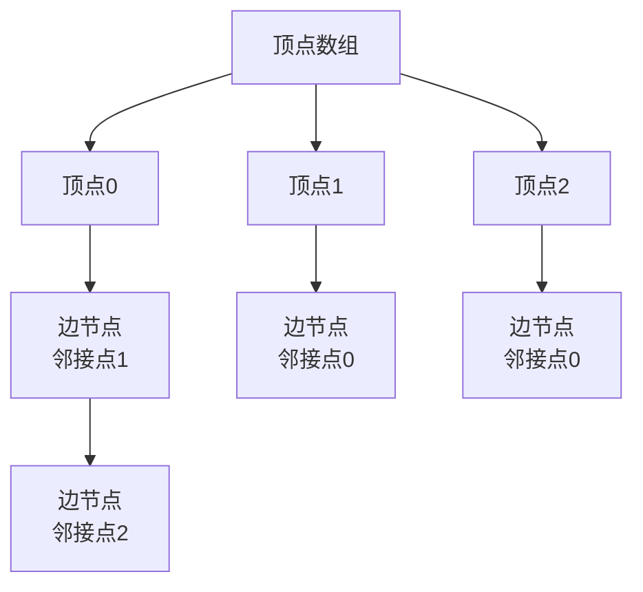

## 本节概述：邻接表是什么

上节课学了邻接矩阵——n × n 二维数组，查边 O(1)，但稀疏图浪费空间。

这节课学**邻接表（Adjacency List）**——每个顶点维护一个列表，只存跟自己相连的顶点，稀疏图特别省空间。

## 邻接表的定义

邻接表 = 对图中的每个顶点，维护一个与其相连的顶点组成的列表。

- 顶点本身存在一个**顺序表**里（头节点数组）
- 每个顶点的邻居存在一个**链表**里（或 vector / 数组）

> 简单说：**顺序表存顶点，每个顶点挂一条链表存邻居。**
> 严格来说是"顺序表 + 链表"的混合结构。

### 邻接表结构



## 两种实现方式

### 方式一：顺序表实现（数组版）

用二维数组存：`adj[i][j]` 表示从顶点 i 出发的第 j 个邻居。

```
adjSize[i] = 顶点 i 的出度（有多少条出边）
adj[i][0..adjSize[i]-1] = 顶点 i 的所有邻居
```

C 语言静态数组版的问题：
- 得开 `n × n` 的二维数组才保险
- 空间复杂度还是 O(n²)
- 跟邻接矩阵没区别了，白忙活

> 所以 C 语言静态数组实现邻接表只适合**小图**（顶点 1000 左右）。
>
> **C++ 的 vector 就不一样了**——每个顶点的 vector 按需增长，只存实际的边，支持百万量级。
> 这也是实际中最常用的写法。

### 方式二：链式存储（链表版）

每个顶点的邻居用链表存，有多少存多少，一点不浪费。

举个例子，4 个顶点的有向图：

```
0 → 3
0 → 2
1 → 0
2 → （无出边）
3 → 1
```

邻接表长这样：

```
  0  → [3] → [2] → NULL
  1  → [0] → NULL
  2  → NULL
  3  → [1] → NULL
```

> 头节点 0、1、2、3 存在顺序表里，每个头节点后面挂一条链表。
> 链表最后一个节点的 next 是 NULL。

> [!TIP]
> **带权图怎么办？**
> 链表节点里多存一个权值字段就行。
> 无权图存 `to`（目标顶点），带权图存 `to + weight`。
> 结构是一样的，就是多了个数据而已。

## 邻接表 vs 邻接矩阵

| 对比项 | 邻接矩阵 | 邻接表 |
|---|---|---|
| **空间复杂度** | O(n²) | O(n + m) |
| **查边 (u, v)** | O(1)，直接索引 | O(度)，要扫链表 |
| **找所有邻居** | O(n)，扫一整行 | O(度)，直接遍历链表 |
| **适合稀疏图** | ❌ 浪费严重 | ✅ 只存实际边 |
| **适合稠密图** | ✅ | ❌ 链表太长效率低 |
| **代码实现** | 简单，二维数组 | 稍复杂，链表操作 |

> n = 顶点数，m = 边数。
> 稀疏图 m 远小于 n²，邻接表优势巨大。

## 邻接表的优点

1. **空间利用率高** — 只存实际存在的边，稀疏图特别省
2. **遍历邻居快** — 遍历一个顶点的所有邻居，时间跟度成正比
3. **应用广泛** — DFS、BFS、最短路、最小生成树、拓扑排序等几乎所有图算法都用邻接表

> 实际刷题和工程中，邻接表比邻接矩阵用得多得多——因为大多数图都是稀疏的。

## 邻接表的缺点

1. **不适合稠密图** — 每个顶点链表都很长，存储和访问效率都低
2. **代码稍复杂** — 链表的增删改查比数组麻烦
3. **查任意两点之间有没有边慢** — 要遍历整条链表，O(度)，邻接矩阵 O(1)

## 邻接表的应用场景

几乎所有图算法都基于邻接表：

| 算法类别 | 代表算法 |
|---|---|
| 图的遍历 | DFS 深度优先、BFS 广度优先 |
| 最短路径 | Dijkstra、Bellman-Ford、SPFA |
| 最小生成树 | Prim |
| 拓扑排序 | Kahn 算法 |
| 强连通分量 | Tarjan、Kosaraju |
| 网络流 / 二分图 | 各种匹配算法 |

> 可以说：**学会了邻接表，才算真正入门图论算法。**

## 本章小结

**邻接表** = 顺序表存顶点 + 每个顶点挂一条链表（或 vector）存邻居。

**两种实现**：
- **顺序表版** — 二维数组，C 语言静态数组还是 O(n²)；C++ vector 才是真·省空间
- **链式版** — 每个顶点一条链表，有多少存多少，最经典的写法

**核心优势**：空间 O(n + m)，稀疏图特别省，遍历邻居快。
**劣势**：查边要遍历链表，不适合稠密图，代码稍复杂。

**应用**：DFS/BFS、最短路、最小生成树、拓扑排序、强连通分量……几乎所有图算法都用它。
