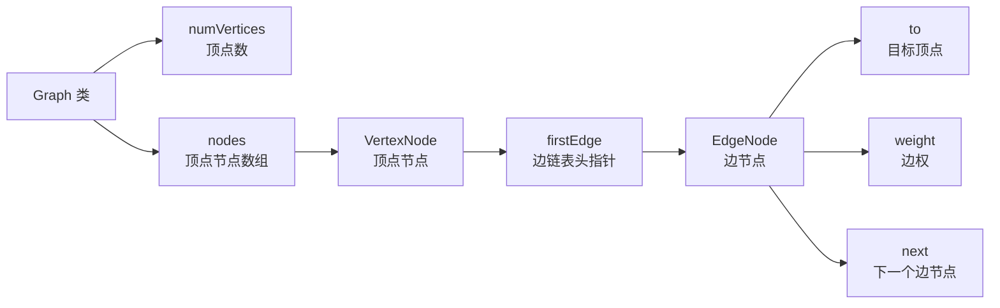

## 本节概述：手写 Graph 邻接表类

上节课讲了邻接表的概念——顺序表存顶点，每个顶点挂一条链表存邻居，稀疏图省空间。

这节课用 C++ 写一个链式存储的邻接表图类。

## 整体架构



> 三层结构：
> 1. **Graph** — 整棵图，管顶点数和顶点数组
> 2. **VertexNode** — 顶点节点，存链表头指针
> 3. **EdgeNode** — 边节点，存目标顶点 + 权值 + next 指针

## 第一步：边节点 EdgeNode

每条边对应一个边节点，存在链表上。

```cpp
struct EdgeNode {
    int to;         // 弧尾（目标顶点编号）
    int weight;     // 边权
    EdgeNode* next; // 下一个边节点

    EdgeNode(int t, int w) : to(t), weight(w), next(NULL) {}
};
```

> 三个字段：
> - **to** — 这条边指向哪个顶点（弧尾）
> - **weight** — 边的权重
> - **next** — 同一条链表的下一个边节点
>
> 构造函数：传目标顶点和权值，next 初始化为空。

## 第二步：顶点节点 VertexNode

每个顶点对应一个顶点节点，存在顺序表里。

```cpp
struct VertexNode {
    EdgeNode* firstEdge;   // 第一条边（链表头）

    VertexNode() : firstEdge(NULL) {}
};
```

> 只存一个字段：**firstEdge** — 边链表的头指针。
> 没有出边的话就是 NULL。

## 第三步：Graph 类定义

```cpp
class Graph {
private:
    int numVertices;       // 顶点总数
    VertexNode* nodes;     // 顶点节点数组（顺序表）

public:
    Graph(int vertices);   // 构造函数
    ~Graph();              // 析构函数

    void addEdge(int u, int v, int w);   // 添加 u→v 权为 w 的边
    void printGraph();                   // 打印邻接表
};
```

> 两个核心操作：加边 + 打印。
> 跟邻接矩阵的接口一样，但内部实现完全不同。

## 构造函数

两步：申请顶点数组 + 每个顶点初始化（链表头置空）。

```cpp
Graph::Graph(int vertices) {
    numVertices = vertices;

    // 1. 申请顶点节点数组
    nodes = new VertexNode[numVertices];

    // 2. 每个顶点的边链表头初始化为空
    for (int i = 0; i < numVertices; i++) {
        nodes[i].firstEdge = NULL;
    }
}
```

> 初始状态：所有顶点都没有出边，所有 firstEdge 都是 NULL。

## 析构函数

两步：先释放每个顶点的边链表，再释放顶点数组本身。

```cpp
Graph::~Graph() {
    // 1. 遍历每个顶点，释放它的边链表
    for (int i = 0; i < numVertices; i++) {
        EdgeNode* curr = nodes[i].firstEdge;
        while (curr != NULL) {
            EdgeNode* temp = curr;       // 先存当前节点
            curr = curr->next;           // 移到下一个
            delete temp;                 // 释放当前节点
        }
    }

    // 2. 释放顶点数组
    delete[] nodes;
}
```

> [!WARNING]
> 释放链表的标准操作：**先存后跳再释放**。
> - 先把当前节点地址存到 temp
> - curr 移到下一个
> - 再 delete temp
>
> 顺序不能反——要是先 delete curr 了，curr->next 就取不出来了。

## 添加边 addEdge

**头插法** — 新节点插在链表最前面，O(1)。

```cpp
void Graph::addEdge(int u, int v, int w) {
    // 1. 新建边节点
    EdgeNode* newNode = new EdgeNode(v, w);

    // 2. 头插法插入到 u 的链表中
    newNode->next = nodes[u].firstEdge;
    nodes[u].firstEdge = newNode;
}
```

> 头插法两步走：
> 1. 新节点的 next 指向原来的头
> 2. 头指针指向新节点
>
> 顺序不能反！先改新节点的 next，再改头指针。
> 反了的话原来的链表就丢了。

> [!TIP]
> 为什么用头插法不用尾插法？
> - 头插 O(1)，直接插
> - 尾插要遍历到末尾，O(度)
>
> 反正邻接表里边的顺序不影响图的正确性，头插最快最方便。

## 打印邻接表 printGraph

两层：外层遍历每个顶点，内层遍历它的边链表。

```cpp
void Graph::printGraph() {
    for (int i = 0; i < numVertices; i++) {
        cout << "顶点 " << i << ": ";

        EdgeNode* curr = nodes[i].firstEdge;
        while (curr != NULL) {
            cout << "→ " << curr->to << "(" << curr->weight << ") ";
            curr = curr->next;
        }

        cout << endl;
    }
}
```

> 打印格式：`顶点 u: → v1(w1) → v2(w2) ...`
> 箭头表示方向，括号里是权值，一目了然。

## 完整代码汇总

```cpp
#include <iostream>
using namespace std;

// ====== 边节点 ======
struct EdgeNode {
    int to;
    int weight;
    EdgeNode* next;

    EdgeNode(int t, int w) : to(t), weight(w), next(NULL) {}
};

// ====== 顶点节点 ======
struct VertexNode {
    EdgeNode* firstEdge;

    VertexNode() : firstEdge(NULL) {}
};

// ====== 图类（邻接表） ======
class Graph {
private:
    int numVertices;
    VertexNode* nodes;

public:
    Graph(int vertices);
    ~Graph();

    void addEdge(int u, int v, int w);
    void printGraph();
};

// 构造函数
Graph::Graph(int vertices) {
    numVertices = vertices;
    nodes = new VertexNode[numVertices];
    for (int i = 0; i < numVertices; i++) {
        nodes[i].firstEdge = NULL;
    }
}

// 析构函数
Graph::~Graph() {
    for (int i = 0; i < numVertices; i++) {
        EdgeNode* curr = nodes[i].firstEdge;
        while (curr != NULL) {
            EdgeNode* temp = curr;
            curr = curr->next;
            delete temp;
        }
    }
    delete[] nodes;
}

// 添加边（头插法）
void Graph::addEdge(int u, int v, int w) {
    EdgeNode* newNode = new EdgeNode(v, w);
    newNode->next = nodes[u].firstEdge;
    nodes[u].firstEdge = newNode;
}

// 打印邻接表
void Graph::printGraph() {
    for (int i = 0; i < numVertices; i++) {
        cout << "顶点 " << i << ": ";
        EdgeNode* curr = nodes[i].firstEdge;
        while (curr != NULL) {
            cout << "→ " << curr->to << "(" << curr->weight << ") ";
            curr = curr->next;
        }
        cout << endl;
    }
}
```

## main 函数测试

构建一个 5 个顶点的有向带权图：

```
0→1 (权4)
0→2 (权2)
1→2 (权3)
2→3 (权4)
3→4 (权2)
```

```cpp
int main() {
    Graph g(5);   // 5 个顶点

    // 添加 5 条边
    g.addEdge(0, 1, 4);
    g.addEdge(0, 2, 2);
    g.addEdge(1, 2, 3);
    g.addEdge(2, 3, 4);
    g.addEdge(3, 4, 2);

    // 打印邻接表
    g.printGraph();

    return 0;
}
```

运行结果（因为头插，顺序跟插入顺序相反）：

```
顶点 0: → 2(2) → 1(4)
顶点 1: → 2(3)
顶点 2: → 3(4)
顶点 3: → 4(2)
顶点 4:
```

> 来验证一下：
> - 顶点 0 有两条出边：→1(4) 和 →2(2) ✅（头插所以 2 在前面）
> - 顶点 1 有一条出边：→2(3) ✅
> - 顶点 2 有一条出边：→3(4) ✅
> - 顶点 3 有一条出边：→4(2) ✅
> - 顶点 4 没有出边 ✅
>
> 全部正确！

> [!NOTE]
> **头插导致边的顺序是反的**——后插入的边在链表前面。
> 但这不影响图的正确性，只是打印出来顺序不一样而已。
> 如果要保持插入顺序，用尾插法（需要维护尾指针）。

## 易错点总结

> [!WARNING]
> 1. **头插法顺序不能反** — 先让新节点 next 指向旧头，再让头指针指向新节点，反了链表就断了
> 2. **析构释放链表要先存后跳再删** — temp 存当前，curr 跳下一个，再 delete temp，不能先删再跳
> 3. **结构体要写构造函数** — EdgeNode 和 VertexNode 的指针都要初始化为 NULL，野指针崩给你看
> 4. **顶点编号从 0 开始** — nodes 数组下标就是顶点编号，别越界
> 5. **无向图要双向加边** — 有向图只加一次，无向图要 `addEdge(u,v,w)` + `addEdge(v,u,w)` 各一次
> 6. **带权图只多了个 weight** — 无权图把 weight 去掉就行，结构完全一样

## 本章小结

**邻接表图类** = 顶点数组（VertexNode）+ 每条边链表（EdgeNode）+ 头插法加边。

**三层结构**：
- **EdgeNode** — to + weight + next，链表节点
- **VertexNode** — firstEdge 头指针，存在顺序表里
- **Graph** — numVertices + nodes 数组

**核心操作**：
- **构造** — 申请顶点数组，所有链表头置空
- **析构** — 每个顶点的链表逐个释放，最后释放顶点数组
- **addEdge** — 新建边节点，头插法插入，O(1)
- **printGraph** — 外层遍历顶点，内层遍历边链表

**设计要点**：
- 头插法最快最方便，边的顺序不影响正确性
- 带权图只比无权图多一个 weight 字段
- 无向图就是双向加边
