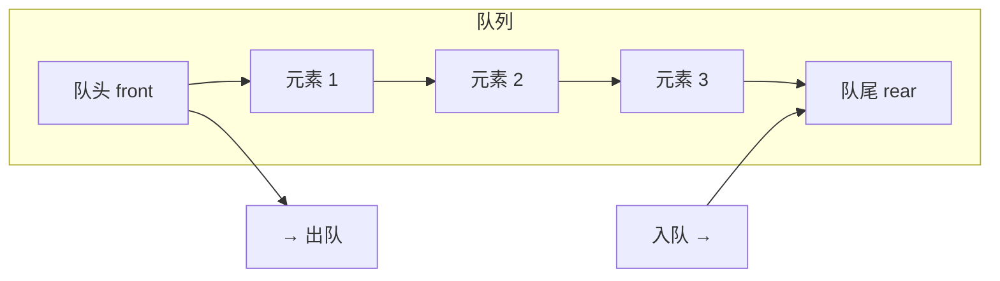
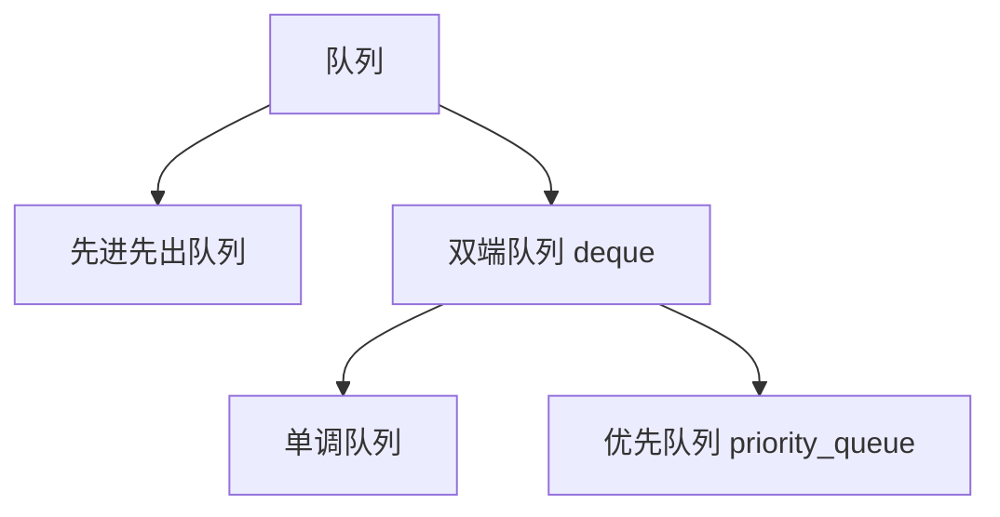
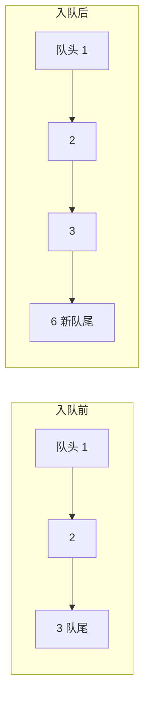
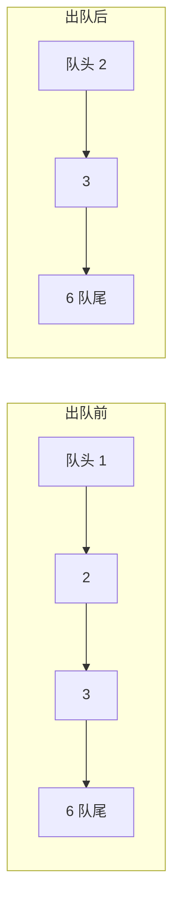
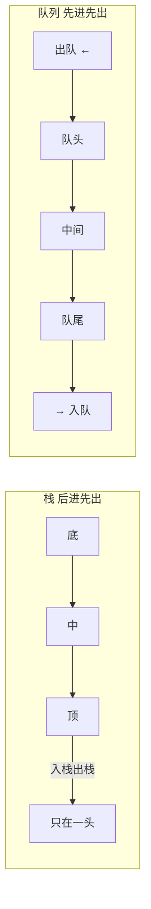

## 本节概述：先进先出的队列

队列（Queue）是另一种**特殊的线性表**——跟栈不一样，栈是只在一头操作，队列是两头操作：一头进，一头出。

- **队尾（rear）** — 只进不出，新元素从这里进来
- **队头（front）** — 只出不进，元素从这里出去

> 队列的核心原则：**先进先出**（First In First Out，简称 **FIFO**）。
>
> 最先排队的最先走——就像排队买饭，先来的先买，后来的排在后面。

## 队列的种类

队列家族有好几个成员：

我们这里讲的是最基础的——**先进先出队列**。后面会学到双端队列和优先队列。

## 队列可以用什么实现

跟栈一样，队列也是一种逻辑结构，底层两种实现：

| 实现方式 | 优点 | 缺点 |
|---|---|---|
| 顺序表实现 | 随机访问快，缓存友好 | 头部删除要挪元素（需要用循环队列优化） |
| 链表实现 | 灵活，头删尾插都方便 | 每个节点多一个指针的开销 |

> 顺序表实现队列有个小坑——如果直接在头部删除，每次都要把后面所有元素往前挪一格，变成 O(n) 了。
>
> 解决办法是用**循环队列**（环形数组），后面代码篇会讲。

## 操作一：入队（enqueue）

往队列里加元素，叫**入队**。只能从队尾加。

举个例子：队列里有 1、2、3，入队 6。

### 入队两步走

1. **把新元素放到队尾**
   - 顺序表实现：尾部加一个元素
   - 链表实现：尾插一个节点

2. **更新队尾指针/索引，大小加一**

> 链表实现的话，需要一个尾指针（rear），直接尾插 O(1) 搞定。
> 顺序表实现的话，队尾是个数组下标。

## 操作二：出队（dequeue）

从队列里删元素，叫**出队**。只能删队头的元素。

举个例子：队列里有 1、2、3、6，出队一次。

### 出队三步走

1. **删掉队头元素**
2. **更新队头指针/索引**（指向新的队头）
3. **大小减一**

> 链表实现：头删，O(1)。
> 顺序表实现：直接头删要挪元素 O(n)，所以要用循环队列优化。

## 操作三：获取队头（front / peek）

获取队头元素的值——只是看看，不拿走。

- 顺序表实现：返回第一个元素
- 链表实现：返回头节点的数据

不管哪种实现，都是直接拿，**时间复杂度 O(1)**。

> [!TIP]
> 注意区分：
> - **front / peek** — 看队头，队列不变（只是查）
> - **dequeue / pop** — 拿队头，队列变小了（是删）
>
> 跟栈的 top 和 pop 类似，一个看看一个拿走。

## 队列的操作时间复杂度

| 操作 | 时间复杂度 | 说明 |
|---|---|---|
| 入队 enqueue | O(1) | 只在队尾操作 |
| 出队 dequeue | O(1) | 只在队头操作（链表/循环队列） |
| 看队头 front | O(1) | 直接拿 |
| 判空 empty | O(1) | 看 size 就行 |
| 获取大小 size | O(1) | 直接拿 |

队列的常用操作也全是 O(1)——因为一头插一头删，两头各管各的，互不干扰。

> [!NOTE]
> 这里说的 O(1) 是指**链表实现**或者**循环队列实现**。
>
> 如果用普通数组直接头删，那出队就是 O(n) 了——所以顺序表实现队列一定要用循环队列。

## 队列的应用场景

凡是"先来先服务"的场景，都用队列：

1. **排队系统** — 银行叫号、食堂排队，先来的先处理
2. **任务调度** — 操作系统的进程调度，按顺序来
3. **消息队列** — 消息先到先发，保证顺序
4. **广度优先搜索 BFS** — 一层一层遍历，用队列存待访问节点
5. **打印任务** — 先点打印的先打
6. **进程间通信** — 消息传递按顺序来

> 简单说：凡是"先来后到"的场景，用队列就对了。

## 栈 vs 队列对比

| 对比项 | 栈 Stack | 队列 Queue |
|---|---|---|
| 原则 | 后进先出 LIFO | 先进先出 FIFO |
| 操作端 | 只在栈顶（一头） | 队尾进、队头出（两头） |
| 插入 | push 入栈 | enqueue 入队 |
| 删除 | pop 出栈 | dequeue 出队 |
| 查看 | top 看栈顶 | front 看队头 |
| 比喻 | 一摞盘子 | 排队买饭 |
| 典型应用 | 括号匹配、递归、后退 | BFS、任务调度、消息队列 |

## 本章小结

**队列**是特殊的线性表，队尾进、队头出，遵循**先进先出（FIFO）**原则。

**三大操作**：
1. **入队 enqueue** — 往队尾加元素，O(1)
2. **出队 dequeue** — 从队头删元素，O(1)
3. **看队头 front** — 获取队头元素但不删，O(1)

**两种实现**：顺序表实现（要用循环队列优化）、链表实现。

**跟栈的区别**：栈是一头操作后进先出，队列是两头操作先进先出。

