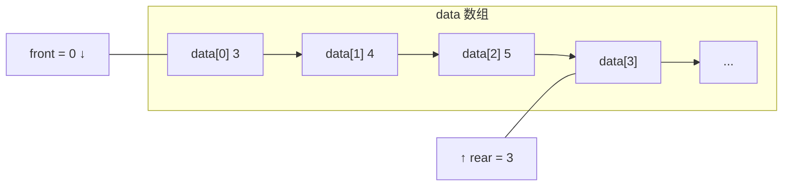

## 本节概述：用顺序表实现队列

上节课说了队列的概念——队尾进，队头出，先进先出。

这节课用**顺序表（动态数组）**来实现一个队列。核心思路：用两个下标（front 和 rear）来标记队头和队尾的位置。

## 设计思路

先搞清楚两个指针的含义，这个很重要：

- **front** — 指向**队头元素**的下标
- **rear** — 指向**队尾元素的下一个位置**的下标（不是队尾元素本身！）



> 为什么 rear 指向队尾的下一个位置？
> - 这样空队列的判断就是 **front == rear**，很简洁
> - 入队直接 `data[rear++] = 元素`，一步到位
> - 队列大小就是 **rear - front**，不用额外存 size

## 类的定义

```cpp
#include <iostream>
#include <string>
#include <stdexcept>
using namespace std;

template <typename T>
class Queue {
private:
    T* data;        // 动态数组首地址
    int front;      // 队头元素的下标
    int rear;       // 队尾元素下一个位置的下标
    int capacity;   // 数组容量
    void resize();  // 扩容函数

public:
    Queue();          // 构造函数
    ~Queue();         // 析构函数

    void enqueue(T element);   // 入队
    T dequeue();               // 出队
    T getFront() const;        // 获取队头元素
    int getSize() const;       // 获取队列大小
};
```

> [!TIP]
> 三个要点：
> 1. **front 指向队头元素** — 直接 `data[front]` 就是队头
> 2. **rear 指向队尾的下一个位置** — 入队直接放 `data[rear]`
> 3. **没有 size 变量** — 大小直接用 `rear - front` 算出来

## 构造函数

空队列——front 和 rear 都指向 0。

```cpp
template <typename T>
Queue<T>::Queue() : capacity(10) {
    data = new T[capacity];
    front = 0;
    rear = 0;
}
```

> 用初始化列表给 capacity 赋初值，避免某些编译器报错。

## 扩容函数 resize

当 rear 到了数组末尾（rear == capacity），说明装不下了，要扩容。

```cpp
template <typename T>
void Queue<T>::resize() {
    T* newData = new T[capacity * 2];       // 申请两倍大的新数组
    for (int i = 0; i < rear; i++) {        // 复制数据（从 0 到 rear-1）
        newData[i] = data[i];
    }
    delete[] data;                           // 释放旧数组
    data = newData;                          // 指向新数组
    capacity *= 2;                           // 更新容量
}
```

> 扩容跟顺序表、栈的扩容套路一样——**申请新内存 → 复制数据 → 释放旧内存 → 换指针**。

## 析构函数

释放数组内存。

```cpp
template <typename T>
Queue<T>::~Queue() {
    delete[] data;
}
```

## 入队 enqueue

把元素放到队尾，rear 往后移一位。满了就先扩容。

```cpp
template <typename T>
void Queue<T>::enqueue(T element) {
    if (rear == capacity) {    // 队尾到了数组末尾，装不下了
        resize();              // 先扩容
    }
    data[rear] = element;      // 放到队尾位置
    rear++;                    // rear 后移一位
}
```

```mermaid
flowchart LR
    subgraph 入队前 front=0 rear=3
        A0["3"] --> A1["4"] --> A2["5"] --> A3["空"]
        F0["front"] --- A0
        R0["rear"] --- A3
    end

    subgraph 入队 6 后 front=0 rear=4
        B0["3"] --> B1["4"] --> B2["5"] --> B3["6"] --> B4["空"]
        F1["front"] --- B0
        R1["rear"] --- B4
    end
```

> 入队只动 rear，不动 front——队头没变，队尾往后挪了一格。

## 出队 dequeue

把队头元素弹出来，front 往后移一位。空队列不能出队。

```cpp
template <typename T>
T Queue<T>::dequeue() {
    if (front == rear) {                             // 空队列
        throw underflow_error("Queue is empty");     // 抛出下溢异常
    }
    T result = data[front];      // 先存队头元素的值
    front++;                     // front 后移一位（相当于删除了队头）
    return result;               // 返回弹出的值
}
```

```mermaid
flowchart LR
    subgraph 出队前 front=0 rear=3
        A0["3 队头"] --> A1["4"] --> A2["5"] --> A3["空"]
        F0["front"] --- A0
        R0["rear"] --- A3
    end

    subgraph 出队后 front=1 rear=3
        B0["(已出队)"] --> B1["4 队头"] --> B2["5"] --> B3["空"]
        F1["front"] --- B1
        R1["rear"] --- B3
    end
```

> 出队只动 front，不动 rear——队尾没变，队头往后挪了一格。
>
> 注意：元素其实还在数组里，只是 front 跳过它了——逻辑上删掉了，物理上还占着位置。

## 获取队头 getFront

只是看看队头元素，不删，front 不动。

```cpp
template <typename T>
T Queue<T>::getFront() const {
    if (front == rear) {
        throw underflow_error("Queue is empty");
    }
    return data[front];    // 直接返回队头元素
}
```

> getFront() 和 dequeue() 的区别：
> - **getFront** — 看一眼，队列不变（只读），front 不动
> - **dequeue** — 拿走，队列变小了（删），front++

## 获取大小 getSize

直接用 rear 减 front，就是元素个数。

```cpp
template <typename T>
int Queue<T>::getSize() const {
    return rear - front;
}
```

> 验证一下：
> - 空队列：front=0, rear=0 → 0-0 = 0 ✓
> - 入队一个：front=0, rear=1 → 1-0 = 1 ✓
> - 出队一个：front=1, rear=1 → 1-1 = 0 ✓
> - 入队三个出队一个：front=1, rear=3 → 3-1 = 2 ✓

## 完整代码汇总

```cpp
#include <iostream>
#include <string>
#include <stdexcept>
using namespace std;

template <typename T>
class Queue {
private:
    T* data;
    int front;
    int rear;
    int capacity;
    void resize();

public:
    Queue();
    ~Queue();

    void enqueue(T element);
    T dequeue();
    T getFront() const;
    int getSize() const;
};

// 构造函数
template <typename T>
Queue<T>::Queue() : capacity(10) {
    data = new T[capacity];
    front = 0;
    rear = 0;
}

// 析构函数
template <typename T>
Queue<T>::~Queue() {
    delete[] data;
}

// 扩容
template <typename T>
void Queue<T>::resize() {
    T* newData = new T[capacity * 2];
    for (int i = 0; i < rear; i++) {
        newData[i] = data[i];
    }
    delete[] data;
    data = newData;
    capacity *= 2;
}

// 入队
template <typename T>
void Queue<T>::enqueue(T element) {
    if (rear == capacity) {
        resize();
    }
    data[rear] = element;
    rear++;
}

// 出队
template <typename T>
T Queue<T>::dequeue() {
    if (front == rear) {
        throw underflow_error("Queue is empty");
    }
    T result = data[front];
    front++;
    return result;
}

// 获取队头
template <typename T>
T Queue<T>::getFront() const {
    if (front == rear) {
        throw underflow_error("Queue is empty");
    }
    return data[front];
}

// 获取大小
template <typename T>
int Queue<T>::getSize() const {
    return rear - front;
}
```

## main 函数测试

```cpp
int main() {
    Queue<int> q;

    // 入队：3、4
    q.enqueue(3);
    q.enqueue(4);

    cout << "队头：" << q.getFront() << endl;   // 3
    cout << "大小：" << q.getSize() << endl;     // 2

    // 再入队一个 5
    q.enqueue(5);
    cout << "队头：" << q.getFront() << endl;   // 3（队头没变）

    // 出队一次
    q.dequeue();    // 弹出 3
    cout << "出队后队头：" << q.getFront() << endl;  // 4
    cout << "大小：" << q.getSize() << endl;         // 2

    return 0;
}
```

运行结果：

```
队头：3
大小：2
队头：3
出队后队头：4
大小：2
```

## 一个小问题：空间浪费

> [!WARNING]
> 这个实现有个小问题——**出队后，front 前面的空间就浪费了**。
>
> 比如数组容量 10，一直入队一直出队，rear 走到 10 了要扩容，但其实 front 前面可能已经空了 8 个位置没用。
>
> 这叫**"假溢出"**——数组其实还有空间，但 rear 到末尾了就认为满了。
>
> 解决办法是用**循环队列**（环形数组），让 rear 到末尾后绕回开头，重复利用前面的空间。后面的课程会讲。

## 易错点总结

> [!WARNING]
> 1. **rear 指向队尾的下一个位置** — 不是队尾元素本身，别搞混了
> 2. **空队列判断是 front == rear** — 不是 rear == 0，出队后 front 会变
> 3. **大小是 rear - front** — 不是 rear，因为前面可能已经出队了一些
> 4. **扩容要检查 rear == capacity** — 不是看 size，直接看 rear 到没到数组末尾
> 5. **出队后元素还在数组里** — 只是 front 跳过了，逻辑删除不是物理删除
> 6. **空队列不能 dequeue 和 getFront** — 要抛异常，否则越界

## 本章小结

**顺序表实现队列**的核心：用两个下标 front 和 rear 分别标记队头和队尾。

- **front** — 指向队头元素
- **rear** — 指向队尾元素的下一个位置
- **空队列** — front == rear
- **大小** — rear - front

**核心函数**：
- **enqueue** — 放 data[rear]，rear++，满了扩容，O(1) 均摊
- **dequeue** — 取 data[front]，front++，空队列抛异常，O(1)
- **getFront** — 返回 data[front]，O(1)
- **getSize** — 返回 rear - front，O(1)

**小缺陷**：出队后 front 前面的空间浪费了（假溢出），进阶版用循环队列解决。

