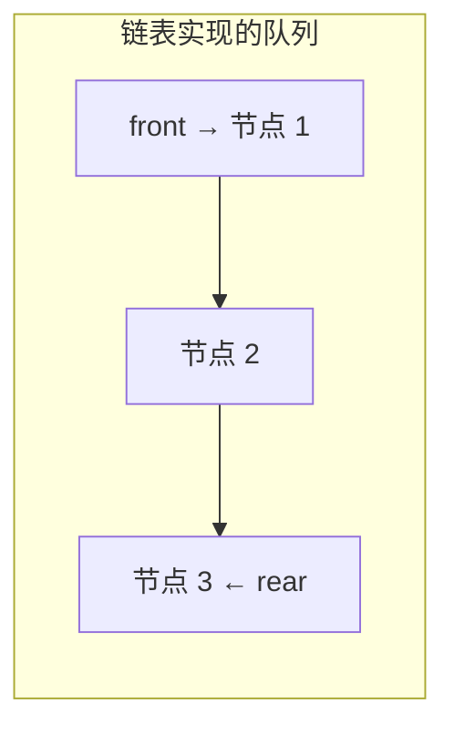
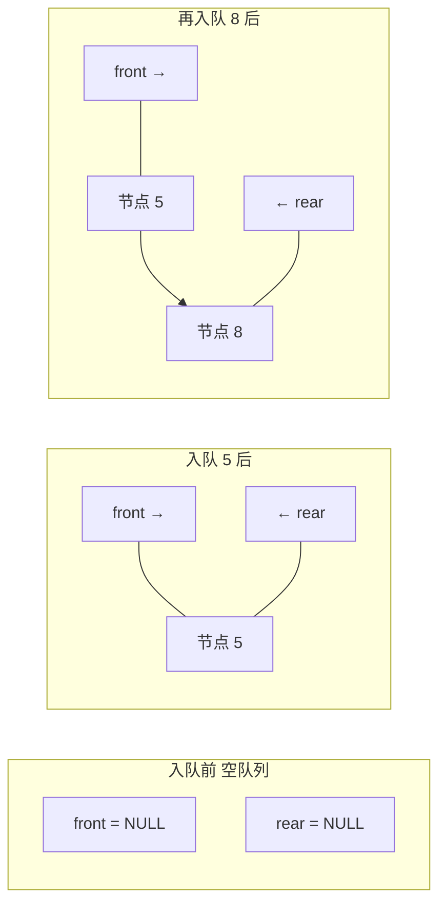

## 本节概述：用链表实现队列

上节课用顺序表实现了队列，这节课换一种——用**链表**实现。

链表实现队列需要两个指针：
- **front** — 指向队头节点（链表头）
- **rear** — 指向队尾节点（链表尾）



> 为什么要两个指针？因为入队要在尾部，出队要在头部——各管一头，两头都是 O(1)。
>
> 只有头指针的话，入队要遍历到尾部，变成 O(n) 了。

## 类的定义

节点结构体定义在类的私有部分，跟链表实现栈一样。

```cpp
#include <iostream>
#include <string>
#include <stdexcept>
using namespace std;

template <typename T>
class Queue {
private:
    // 链表节点结构体
    struct Node {
        T data;       // 数据域
        Node* next;   // 指针域
        Node(T d) : data(d), next(NULL) {}  // 构造函数
    };

    Node* front;   // 队头指针（链表头）
    Node* rear;    // 队尾指针（链表尾）
    int size;      // 元素个数

public:
    Queue();          // 构造函数
    ~Queue();         // 析构函数

    void enqueue(T element);   // 入队
    T dequeue();               // 出队
    T getFront() const;        // 获取队头元素
    int getSize() const;       // 获取队列大小
};
```

> [!TIP]
> 三个要点：
> 1. **Node 定义在 private 里** — 内部细节，外部看不到
> 2. **front 和 rear 两个指针** — 分别管队头和队尾
> 3. **有 size 变量** — 链表算大小不方便，直接存一个

## 构造函数

空队列——front 和 rear 都为 NULL，size 为 0。

```cpp
template <typename T>
Queue<T>::Queue() {
    front = NULL;
    rear = NULL;
    size = 0;
}
```

## 析构函数

从头节点开始，逐个释放。

```cpp
template <typename T>
Queue<T>::~Queue() {
    while (front != NULL) {      // 只要还有节点
        Node* temp = front;      // 存下当前头节点
        front = front->next;     // 头指针往后移
        delete temp;             // 释放旧节点
    }
}
```

> 跟链表栈的析构一模一样——从头删到尾。

## 入队 enqueue

入队在尾部——新节点接在 rear 后面，然后 rear 往后移。

要分两种情况：**空队列** 和 **非空队列**。

```cpp
template <typename T>
void Queue<T>::enqueue(T element) {
    Node* newNode = new Node(element);  // 新建节点

    if (rear == NULL) {                 // 情况一：空队列
        front = newNode;                // 队头队尾都指向新节点
        rear = newNode;
    } else {                            // 情况二：非空队列
        rear->next = newNode;           // 队尾节点的 next 指向新节点
        rear = newNode;                 // rear 移到新节点
    }

    size++;                             // 大小加一
}
```



> 空队列时，第一个节点既是队头也是队尾——front 和 rear 都指向它。
>
> 非空时，只用改 rear，front 不动。

## 出队 dequeue

出队在头部——删掉头节点，front 往后移。

空队列不能出队，要抛异常。

```cpp
template <typename T>
T Queue<T>::dequeue() {
    if (front == NULL) {                          // 空队列不能出队
        throw underflow_error("Queue is empty");
    }

    T result = front->data;                       // 先存队头元素的值
    Node* temp = front;                           // 存下旧头节点地址
    front = front->next;                          // front 往后移
    delete temp;                                  // 释放旧头节点
    size--;                                       // 大小减一

    if (front == NULL) {                          // 删完变成空队列了
        rear = NULL;                              // rear 也要置空，防止野指针
    }

    return result;                                // 返回弹出的值
}
```

> [!WARNING]
> 两个容易漏的点：
> 1. **size-- 别忘了** — 老师视频里就踩过这个坑
> 2. **删完变空时 rear 要置 NULL** — 不然 rear 指向已经释放的内存，变成野指针，下次入队就崩了
>
> 因为最后一个节点被删了，front 变成 NULL，但 rear 还指着那个已经被 delete 的节点——必须把 rear 也置空。

## 获取队头 getFront

直接返回 front 的数据，不删节点。

```cpp
template <typename T>
T Queue<T>::getFront() const {
    if (front == NULL) {
        throw underflow_error("Queue is empty");
    }
    return front->data;
}
```

## 获取大小 getSize

直接返回 size。

```cpp
template <typename T>
int Queue<T>::getSize() const {
    return size;
}
```

## 完整代码汇总

```cpp
#include <iostream>
#include <string>
#include <stdexcept>
using namespace std;

template <typename T>
class Queue {
private:
    struct Node {
        T data;
        Node* next;
        Node(T d) : data(d), next(NULL) {}
    };

    Node* front;
    Node* rear;
    int size;

public:
    Queue();
    ~Queue();

    void enqueue(T element);
    T dequeue();
    T getFront() const;
    int getSize() const;
};

// 构造函数
template <typename T>
Queue<T>::Queue() {
    front = NULL;
    rear = NULL;
    size = 0;
}

// 析构函数
template <typename T>
Queue<T>::~Queue() {
    while (front != NULL) {
        Node* temp = front;
        front = front->next;
        delete temp;
    }
}

// 入队
template <typename T>
void Queue<T>::enqueue(T element) {
    Node* newNode = new Node(element);

    if (rear == NULL) {          // 空队列
        front = newNode;
        rear = newNode;
    } else {                      // 非空队列
        rear->next = newNode;
        rear = newNode;
    }

    size++;
}

// 出队
template <typename T>
T Queue<T>::dequeue() {
    if (front == NULL) {
        throw underflow_error("Queue is empty");
    }

    T result = front->data;
    Node* temp = front;
    front = front->next;
    delete temp;
    size--;

    if (front == NULL) {          // 删完变空了，rear 也要置空
        rear = NULL;
    }

    return result;
}

// 获取队头
template <typename T>
T Queue<T>::getFront() const {
    if (front == NULL) {
        throw underflow_error("Queue is empty");
    }
    return front->data;
}

// 获取大小
template <typename T>
int Queue<T>::getSize() const {
    return size;
}
```

## main 函数测试

```cpp
int main() {
    Queue<int> q;

    // 入队：3、4
    q.enqueue(3);
    q.enqueue(4);

    cout << "队头：" << q.getFront() << endl;   // 3
    cout << "大小：" << q.getSize() << endl;     // 2

    // 再入队一个 5
    q.enqueue(5);
    cout << "队头：" << q.getFront() << endl;   // 3（队头没变）

    // 出队一次
    q.dequeue();    // 弹出 3
    cout << "出队后队头：" << q.getFront() << endl;  // 4
    cout << "大小：" << q.getSize() << endl;         // 2

    return 0;
}
```

运行结果：

```
队头：3
大小：2
队头：3
出队后队头：4
大小：2
```

## 易错点总结

> [!WARNING]
> 1. **入队要分空和非空** — 空队列时 front 和 rear 都要指向新节点
> 2. **出队别忘了 size--** — 老师视频里就漏了这个
> 3. **出队删完变空时 rear 要置 NULL** — 防止野指针，下次入队会崩
> 4. **空队列判断用 front == NULL** — 别用 rear，rear 可能是野指针
> 5. **两个指针各管一头** — front 只管出队，rear 只管入队，别搞混
> 6. **析构要从头逐个释放** — 不能只删 front 或 rear

## 顺序表 vs 链表实现对比

| 对比项 | 顺序表实现 | 链表实现 |
|---|---|---|
| 入队 | O(1) 均摊（可能扩容） | O(1) |
| 出队 | O(1) | O(1) |
| 看队头 | O(1) | O(1) |
| 空间 | 可能有浪费（假溢出） | 每个节点多一个指针 |
| 扩容 | 需要两倍扩容 | 不需要，来一个加一个 |
| 指针数量 | 两个下标（front/rear） | 两个指针（front/rear） |
| 野指针风险 | 没有 | 有（删完要置 rear 为 NULL） |

## 本章小结

**链表实现队列**的核心：用两个指针分别指向队头和队尾，头删尾插都是 O(1)。

- **front** — 指向队头节点，出队用
- **rear** — 指向队尾节点，入队用
- **空队列** — front == NULL && rear == NULL

**核心函数**：
- **enqueue** — 空队列两头都指向新节点；非空就尾插，O(1)
- **dequeue** — 头删，删完变空要把 rear 也置 NULL，O(1)
- **getFront** — 返回 front->data，O(1)
- **getSize** — 直接返回 size，O(1)

**两个大坑**：出队忘 size--、删完变空 rear 没置 NULL。

