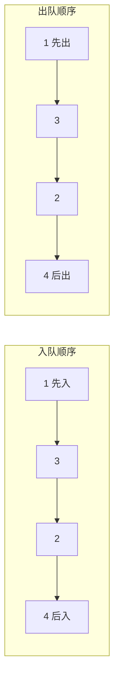

## 本节概述：STL 中的 queue

前两节课我们自己手写了队列——顺序表实现、链表实现都写过了。

实际开发中不用自己写，C++ STL 已经封装好了，直接用就行。它叫 **`std::queue`**。

> 学了原理再用库，你就知道底层发生了什么，用起来心里有底。

## 引入头文件

要用 queue，先包含头文件：

```cpp
#include <queue>
#include <iostream>
using namespace std;
```

## 定义一个队列

queue 是模板类，尖括号里填元素类型。

```cpp
queue<int> q;          // 存 int 的队列
queue<double> dq;      // 存 double 的队列
queue<string> sq;      // 存 string 的队列
```

想存什么类型就填什么类型，跟 stack、vector 一样。

## 四大核心接口

STL 的 queue 就四个常用操作，记住就行：

| 操作 | 函数 | 说明 |
|---|---|---|
| 入队 | `push(元素)` | 把元素加到队尾 |
| 出队 | `pop()` | 弹出队头元素（不返回值） |
| 看队头 | `front()` | 获取队头元素（不弹出） |
| 判空 | `empty()` | 队列为空返回 true |

> [!TIP]
> 还有两个常用的：
> - **`size()`** — 返回队列中元素个数
> - **`back()`** — 获取队尾元素（比较少用）
>
> 注意：STL 的 `pop()` **不返回值**，只是弹出。要拿值先用 `front()` 看，再 `pop()` 弹。跟 stack 的 pop 一样。

## 入队和遍历

依次入队 1、3、2、4，然后遍历打印。

队列跟栈一样，不能按下标遍历——要遍历只能**一个一个从队头弹出来**。

```cpp
#include <iostream>
#include <queue>
using namespace std;

int main() {
    queue<int> q;

    // 入队：1、3、2、4
    q.push(1);
    q.push(3);
    q.push(2);
    q.push(4);

    // 遍历打印（边出队边打）
    while (!q.empty()) {            // 队列非空就继续
        cout << q.front() << " ";   // 先看队头
        q.pop();                    // 再弹出
    }
    cout << endl;

    return 0;
}
```

运行结果：

```
1 3 2 4
```

> 入队顺序是 1、3、2、4，出来的顺序也是 1、3、2、4。
>
> 这就是**先进先出（FIFO）**——最先进去的 1 最先出来，最后进去的 4 最后出来。



## 完整示例：队列的常用操作

```cpp
#include <iostream>
#include <queue>
#include <string>
using namespace std;

int main() {
    queue<string> q;

    // 判空
    cout << "空队列？" << (q.empty() ? "是" : "否") << endl;  // 是

    // 入队
    q.push("张三");
    q.push("李四");
    q.push("王五");

    // 大小
    cout << "大小：" << q.size() << endl;     // 3

    // 看队头
    cout << "队头：" << q.front() << endl;    // 张三

    // 看队尾
    cout << "队尾：" << q.back() << endl;     // 王五

    // 出队一个
    q.pop();
    cout << "出队后队头：" << q.front() << endl;  // 李四

    // 全部出队
    while (!q.empty()) {
        cout << q.front() << " ";
        q.pop();
    }
    cout << endl;   // 李四 王五

    cout << "弹完大小：" << q.size() << endl;  // 0

    return 0;
}
```

运行结果：

```
空队列？是
大小：3
队头：张三
队尾：王五
出队后队头：李四
李四 王五
弹完大小：0
```

## 注意事项

> [!WARNING]
> 1. **空队列不能调用 front() 和 pop()** — 会直接崩溃！调用前一定要用 `empty()` 检查
> 2. **pop() 不返回值** — STL 的 pop 只弹不返回，要取值先 front() 再 pop()
> 3. **队列不能随机访问** — 没有 `[]` 运算符，不能直接拿第几个元素
> 4. **队列不能遍历** — 想遍历只能弹，弹完队列就空了（会破坏原队列）
> 5. **队列没有迭代器** — 跟 stack 一样，queue 不支持 begin()/end()
> 6. **front() 是队头，back() 是队尾** — 别搞混了

## 栈 vs 队列 STL 对比

| 对比项 | std::stack | std::queue |
|---|---|---|
| 头文件 | `<stack>` | `<queue>` |
| 原则 | 后进先出 LIFO | 先进先出 FIFO |
| 插入 | `push()` | `push()` |
| 删除 | `pop()` | `pop()` |
| 看顶/头 | `top()` | `front()` |
| 看尾 | 没有 | `back()` |
| 判空 | `empty()` | `empty()` |
| 大小 | `size()` | `size()` |

> 注意名字不一样：栈看顶叫 `top()`，队列看头叫 `front()`。别搞混了。

## 什么时候用队列

凡是"先来先服务"的场景，用 queue 就对了：

1. **广度优先搜索 BFS** — 一层一层遍历，队列存待访问节点
2. **任务调度** — 按先来后到的顺序处理任务
3. **消息队列** — 消息先到先发，保证顺序
4. **打印任务** — 先点打印的先打
5. **排队系统** — 银行叫号、食堂排队
6. **缓冲区** — 生产者消费者模型

## 本章小结

**STL 的 `std::queue`** — 开箱即用的队列，头文件 `<queue>`。

**四大接口**：
- **push** — 入队（加到队尾），O(1)
- **pop** — 出队（删除队头，不返回值），O(1)
- **front** — 看队头，O(1)
- **empty** — 判空，O(1)

**还有两个**：`size()` 大小、`back()` 看队尾。

**注意**：队列不能随机访问、不能遍历、没有迭代器——只能两头操作。空队列不能 front/pop，否则崩溃。

