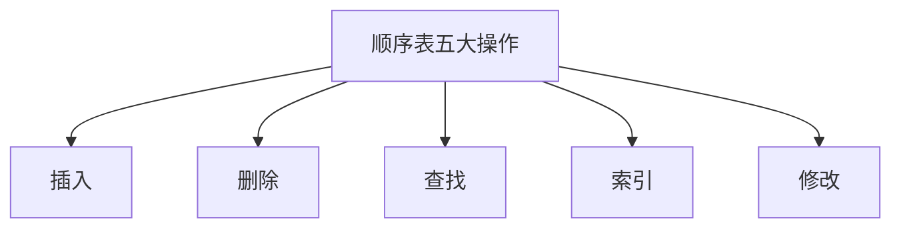
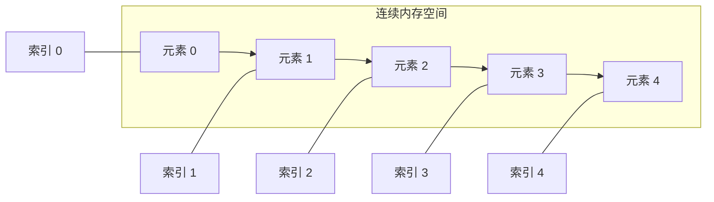
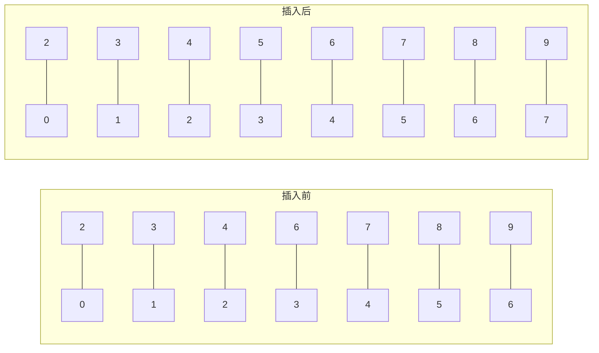
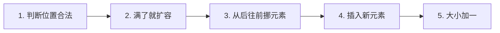
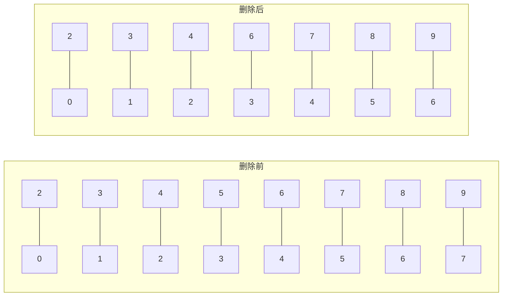
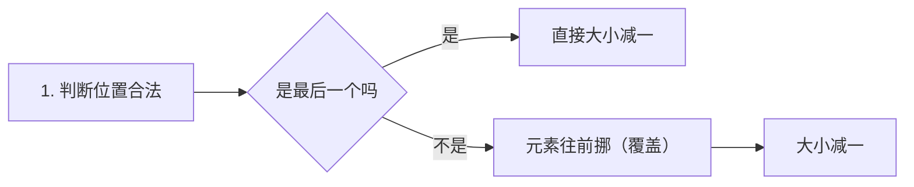
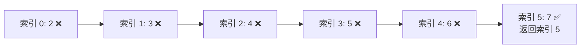
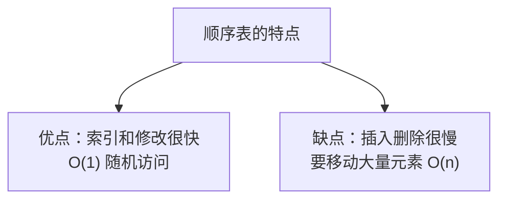

## 本节概述：顺序表是什么

顺序表是最基础的线性数据结构——数据按顺序依次存在**连续的内存空间**里。

说白了，顺序表就是我们平时说的**数组**的升级版——数组只能存固定大小的数据，顺序表可以动态扩容。

顺序表有五大核心操作：
- **插入** — 在指定位置加一个元素
- **删除** — 删掉指定位置的元素
- **查找** — 找某个元素在不在
- **索引** — 通过下标直接拿元素
- **修改** — 改指定位置的元素

这节课先讲概念，下节课写代码。

## 顺序表的结构

顺序表是一种**线性数据结构**——数据元素按顺序，依次存储在**连续的内存空间**中。

几个关键点：

1. **连续内存** — 所有元素挨在一起，地址是连续的
2. **索引（下标）** — 每个元素有唯一的编号，从 0 开始递增
3. **元素类型任意** — 可以是 int、float、结构体、对象……什么都行

> 索引从 0 开始，这个一定要记牢——几乎所有编程语言都是这样的。

## 操作一：元素插入

**插入**就是给定一个索引和一个元素，把元素插到那个位置上。

插入位置后面的所有元素，都要**往后挪一个位置**——给新元素腾地方。

举个例子：在索引 3 的位置插入元素 5。

原来索引 3 及以后的元素（6、7、8、9），全部往后挪了一位，新元素 5 占据了索引 3 的位置。

> 注意：移动元素要**从后往前挪**——不然会覆盖。

### 插入的五个步骤

1. **判断位置是否合法** — 不能插到 -1 或者超过长度的位置
2. **满了就扩容** — 顺序表满了的话，一般扩容成两倍大小
3. **元素后移** — 从后往前，把插入位置之后的元素都往后挪一位
4. **插入新元素** — 把新元素放到腾出来的位置上
5. **更新大小** — 元素个数加一

## 操作二：元素删除

**删除**就是给定一个索引，把那个位置的元素删掉。

删除位置后面的所有元素，都要**往前挪一个位置**——把空出来的位置填上。

删除可以理解成插入的逆操作。

举个例子：删除索引 3 的元素（值为 5）。

原来索引 3 后面的元素（6、7、8、9），全部往前挪了一位，5 就被覆盖掉了。

### 删除的四个步骤

1. **判断位置是否合法** — 不能删不存在的位置
2. **最后一个元素直接删** — 如果删的是最后一个，不用移动，直接大小减一
3. **元素前移** — 从前往后，把删除位置之后的元素都往前挪一位
4. **更新大小** — 元素个数减一

## 操作三：元素查找

**查找**就是在顺序表里找某个元素存不存在。

- 找到了 → 返回它的索引
- 没找到 → 返回 -1（因为索引从 0 开始，-1 代表"不存在"）

思路很简单：遍历整个顺序表，一个一个比，相等就返回。

举个例子：找值为 7 的元素。

因为要遍历一遍，所以**查找的时间复杂度是 O(n)**。

> 当然，如果顺序表是有序的，可以用二分查找，时间复杂度 O(log n)。但普通的顺序表查找就是 O(n)。

## 操作四：索引（下标访问）

**索引**就是给定一个下标，直接拿到那个位置的元素。

因为顺序表的内存是连续的，所以可以通过**地址计算**直接定位——不用遍历，一步到位。

比如 int 数组，每个元素占 4 字节，基地址是 100：
- 索引 0 的地址 = 100 + 0×4 = 100
- 索引 5 的地址 = 100 + 5×4 = 120

所以**索引访问的时间复杂度是 O(1)**——不管数组多大，都是一步搞定。

> 这就是顺序表最大的优势：**随机访问**，下标直接定位。

## 操作五：元素修改

**修改**就是把指定位置的元素改成新的值。

思路很简单：先通过索引找到元素（O(1)），然后赋值就行。

所以**修改的时间复杂度也是 O(1)**。

## 时间复杂度总结

| 操作 | 时间复杂度 | 说明 |
|---|---|---|
| 插入 | O(n) | 要移动后面的元素 |
| 删除 | O(n) | 要移动后面的元素 |
| 查找 | O(n) | 要遍历比较 |
| 索引 | O(1) | 下标直接定位 |
| 修改 | O(1) | 下标定位后直接改 |

## 本章小结

**顺序表**是线性数据结构，数据存在连续的内存空间中，用索引（下标）访问。

**五大操作**：
1. **插入** — 从后往前挪元素，腾出位置再插入，O(n)
2. **删除** — 从前往后挪元素，覆盖掉要删的，O(n)
3. **查找** — 遍历比较，找到返回索引，找不到返回 -1，O(n)
4. **索引** — 下标直接定位，O(1)
5. **修改** — 下标定位后赋值，O(1)

**核心特点**：随机访问快（O(1)），插入删除慢（O(n)）。

