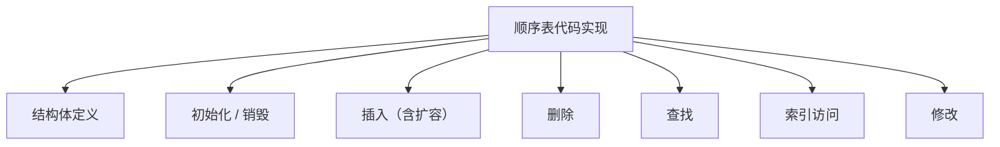
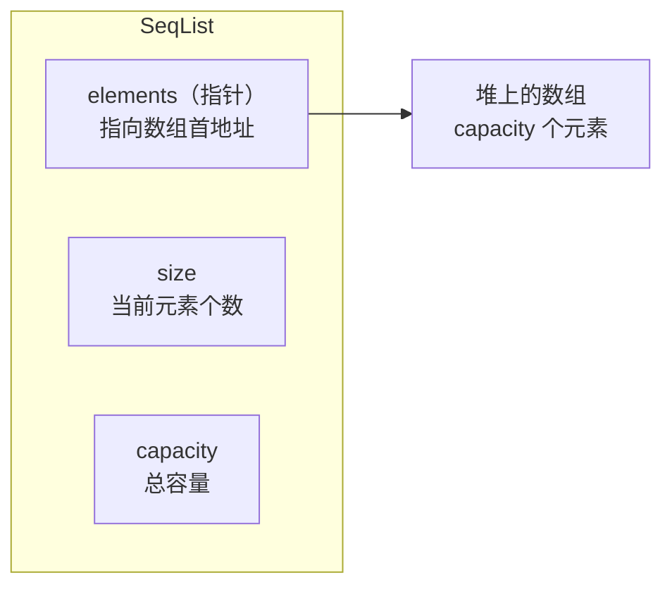
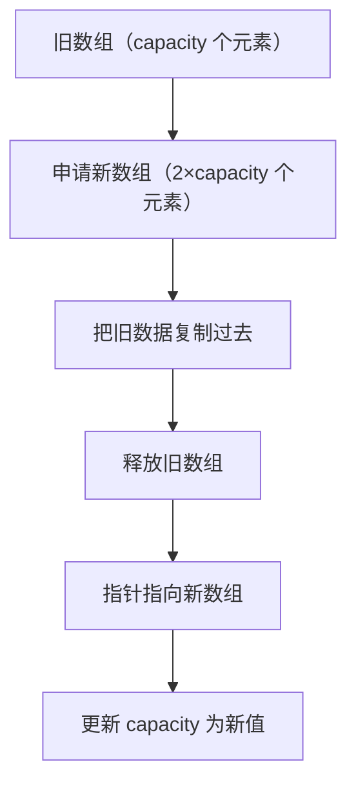
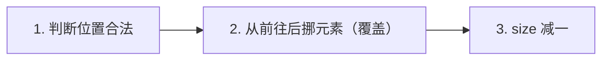

## 本节概述：手写一个顺序表

上节课讲了顺序表的概念，这节课我们用 C++ 把它真正写出来。

手写顺序表是数据结构的入门必写——写完你才能真正理解「插入时元素后移」「扩容」这些操作到底是怎么回事。



## 第一步：定义结构体

顺序表需要三个东西：
- **元素数组** — 存数据的地方（用指针，因为要动态扩容）
- **size** — 当前有多少个元素
- **capacity** — 总共能装多少个元素（容量）



size 和 capacity 的关系：**size ≤ capacity**。size 是实际用了多少，capacity 是最多能装多少。

先写头文件和类型定义：

```cpp
#include <iostream>
#include <stdexcept>  // 抛异常要用
using namespace std;

typedef int ElemType;  // 元素类型，想改类型只改这里就行
```

> 用 `typedef` 定义元素类型是个好习惯——以后想装 double、float、结构体，只改这一行就行。

然后定义顺序表结构体：

```cpp
struct SeqList
{
    ElemType* elements;  // 元素数组指针（堆上申请）
    int size;            // 当前元素个数
    int capacity;        // 总容量
};
```

## 第二步：初始化和销毁

### 初始化 initList

初始化要做三件事：
1. 申请 capacity 大小的数组空间
2. size 设为 0（一开始是空的）
3. capacity 记录下来

```cpp
void initList(SeqList* list, int capacity)
{
    list->elements = new ElemType[capacity];  // 申请堆内存
    list->size = 0;                            // 初始元素个数为 0
    list->capacity = capacity;                 // 记录总容量
}
```

> 注意传的是指针——如果传对象进来，改的是拷贝，没用。

### 销毁 destroy

销毁就一件事：把数组的内存释放掉。

```cpp
void destroy(SeqList* list)
{
    delete[] list->elements;  // 释放数组内存
}
```

> 用 `new[]` 申请的，要用 `delete[]` 释放，别漏了方括号。

## 第三步：两个简单接口

### 获取大小 getSize

```cpp
int getSize(SeqList* list)
{
    return list->size;
}
```

### 判断是否为空 isEmpty

```cpp
bool isEmpty(SeqList* list)
{
    return list->size == 0;  // size 为 0 就是空的
}
```

这两个接口很简单，快速过一下。

## 第四步：插入操作（重点）

插入是顺序表里最复杂的操作——要做的事情最多。

回忆一下插入的步骤：


### 函数签名

```cpp
void insertElement(SeqList* list, int index, ElemType element)
```

三个参数：顺序表指针、插入位置、要插入的元素。

### 第一步：判断位置是否合法

```cpp
if (index < 0 || index > list->size)
{
    throw invalid_argument("index 非法");
}
```

> 注意：插入时 `index == list->size` 是合法的——表示插到最后面。这和删除不一样，删除时 index 不能等于 size。

### 第二步：满了就扩容

如果 size 已经等于 capacity 了，说明数组装不下了，需要扩容。

扩容的套路：**翻倍**。



代码实现：

```cpp
if (list->size == list->capacity)
{
    int newCapacity = list->capacity * 2;          // 新容量 = 旧容量 × 2
    ElemType* newElements = new ElemType[newCapacity]; // 申请新数组

    for (int i = 0; i < list->size; i++)           // 复制数据
    {
        newElements[i] = list->elements[i];
    }

    delete[] list->elements;                       // 释放旧数组
    list->elements = newElements;                  // 指向新数组
    list->capacity = newCapacity;                  // 更新容量
}
```

> 为什么翻倍？因为均摊下来每次插入的时间复杂度还是 O(1)。如果每次只加 1，那每次插入都要扩容，就变成 O(n) 了。

### 第三步：从后往前挪元素

```cpp
for (int i = list->size; i > index; i--)
{
    list->elements[i] = list->elements[i - 1];  // 前一个赋值给后一个
}
```

从最后一个元素开始，一个一个往后挪，直到腾出 index 这个位置。

> 一定要**从后往前挪**——如果从前往后挪，会把后面还没挪的数据覆盖掉。

### 第四步：插入新元素

```cpp
list->elements[index] = element;
```

腾出来的位置，把新元素放进去。

### 第五步：size 加一

```cpp
list->size++;
```

多了一个元素，计数器加一。

---

把它们拼起来，完整的插入函数：

```cpp
void insertElement(SeqList* list, int index, ElemType element)
{
    // 1. 判断位置是否合法
    if (index < 0 || index > list->size)
    {
        throw invalid_argument("index 非法");
    }

    // 2. 满了就扩容（翻倍）
    if (list->size == list->capacity)
    {
        int newCapacity = list->capacity * 2;
        ElemType* newElements = new ElemType[newCapacity];

        for (int i = 0; i < list->size; i++)
        {
            newElements[i] = list->elements[i];
        }

        delete[] list->elements;
        list->elements = newElements;
        list->capacity = newCapacity;
    }

    // 3. 从后往前挪元素
    for (int i = list->size; i > index; i--)
    {
        list->elements[i] = list->elements[i - 1];
    }

    // 4. 插入新元素
    list->elements[index] = element;

    // 5. size 加一
    list->size++;
}
```

## 第五步：删除操作

删除比插入简单——不用考虑扩容。



### 第一步：判断位置是否合法

```cpp
if (index < 0 || index >= list->size)
{
    throw invalid_argument("index 非法");
}
```

> 注意：删除时 `index == list->size` 是非法的——因为下标是 0 到 size-1，size 那个位置没有元素。这和插入不一样哦！

### 第二步：从前往后挪元素

```cpp
for (int i = index; i < list->size - 1; i++)
{
    list->elements[i] = list->elements[i + 1];  // 后一个赋值给前一个
}
```

从 index 开始，把后面的元素一个一个往前挪——index 位置的元素就被覆盖掉了。

> 删除是插入的逆操作：插入从后往前挪，删除从前往后挪。

### 第三步：size 减一

```cpp
list->size--;
```

少了一个元素，计数器减一。

---

完整的删除函数：

```cpp
void deleteElement(SeqList* list, int index)
{
    // 1. 判断位置是否合法
    if (index < 0 || index >= list->size)
    {
        throw invalid_argument("index 非法");
    }

    // 2. 从前往后挪元素（覆盖掉要删的）
    for (int i = index; i < list->size - 1; i++)
    {
        list->elements[i] = list->elements[i + 1];
    }

    // 3. size 减一
    list->size--;
}
```

> [!TIP]
> 要不要缩容？
>
> 可以做也可以不做。删除很多元素后，如果 size 只有 capacity 的 1/4，可以缩容一半。但新手阶段先不用考虑这么多，不缩容也不影响功能，只是多占点内存而已。

## 第六步：查找操作

找某个元素在不在，在的话返回下标，不在返回 -1。

```cpp
int findElement(SeqList* list, ElemType element)
{
    for (int i = 0; i < list->size; i++)
    {
        if (list->elements[i] == element)
        {
            return i;  // 找到了，返回下标
        }
    }
    return -1;  // 遍历完没找到，返回 -1
}
```

遍历一遍，一个一个比——**时间复杂度 O(n)**。

## 第七步：索引访问（获取元素）

通过下标拿元素，一步到位。

```cpp
ElemType getElement(SeqList* list, int index)
{
    if (index < 0 || index >= list->size)
    {
        throw invalid_argument("index 非法");
    }
    return list->elements[index];
}
```

先判断下标合不合法，合法就直接返回——**时间复杂度 O(1)**。

## 第八步：修改元素

通过下标找到元素，然后改成新值。

```cpp
void updateElement(SeqList* list, int index, ElemType value)
{
    if (index < 0 || index >= list->size)
    {
        throw invalid_argument("index 非法");
    }
    list->elements[index] = value;
}
```

先索引再赋值——**时间复杂度 O(1)**。

## 完整代码汇总

把上面所有内容拼起来，就是一个完整的顺序表了：

```cpp
#include <iostream>
#include <stdexcept>
using namespace std;

typedef int ElemType;

struct SeqList
{
    ElemType* elements;
    int size;
    int capacity;
};

// 初始化
void initList(SeqList* list, int capacity)
{
    list->elements = new ElemType[capacity];
    list->size = 0;
    list->capacity = capacity;
}

// 销毁
void destroy(SeqList* list)
{
    delete[] list->elements;
}

// 获取大小
int getSize(SeqList* list)
{
    return list->size;
}

// 是否为空
bool isEmpty(SeqList* list)
{
    return list->size == 0;
}

// 插入
void insertElement(SeqList* list, int index, ElemType element)
{
    if (index < 0 || index > list->size)
        throw invalid_argument("index 非法");

    if (list->size == list->capacity)  // 满了就扩容
    {
        int newCapacity = list->capacity * 2;
        ElemType* newElements = new ElemType[newCapacity];
        for (int i = 0; i < list->size; i++)
            newElements[i] = list->elements[i];
        delete[] list->elements;
        list->elements = newElements;
        list->capacity = newCapacity;
    }

    for (int i = list->size; i > index; i--)  // 从后往前挪
        list->elements[i] = list->elements[i - 1];

    list->elements[index] = element;
    list->size++;
}

// 删除
void deleteElement(SeqList* list, int index)
{
    if (index < 0 || index >= list->size)
        throw invalid_argument("index 非法");

    for (int i = index; i < list->size - 1; i++)  // 从前往后挪
        list->elements[i] = list->elements[i + 1];

    list->size--;
}

// 查找
int findElement(SeqList* list, ElemType element)
{
    for (int i = 0; i < list->size; i++)
        if (list->elements[i] == element)
            return i;
    return -1;
}

// 索引访问
ElemType getElement(SeqList* list, int index)
{
    if (index < 0 || index >= list->size)
        throw invalid_argument("index 非法");
    return list->elements[index];
}

// 修改
void updateElement(SeqList* list, int index, ElemType value)
{
    if (index < 0 || index >= list->size)
        throw invalid_argument("index 非法");
    list->elements[index] = value;
}
```

## 测试一下

写个 main 函数验证一下所有功能对不对：

```cpp
int main()
{
    SeqList myList;
    initList(&myList, 10);  // 初始容量 10

    // 插入 10 个元素：0, 10, 20, 30, ..., 90
    for (int i = 0; i < 10; i++)
    {
        insertElement(&myList, i, i * 10);
    }

    cout << "大小：" << getSize(&myList) << endl;     // 输出：10
    cout << "是否为空：" << isEmpty(&myList) << endl;  // 输出：0（非空）

    // 遍历打印
    for (int i = 0; i < getSize(&myList); i++)
    {
        cout << getElement(&myList, i) << " ";
    }
    cout << endl;
    // 输出：0 10 20 30 40 50 60 70 80 90

    // 删除索引 5 的元素（值为 50）
    deleteElement(&myList, 5);

    // 把索引 1 的元素改成 1314
    updateElement(&myList, 1, 1314);

    // 再次打印
    for (int i = 0; i < getSize(&myList); i++)
    {
        cout << getElement(&myList, i) << " ";
    }
    cout << endl;
    // 输出：0 1314 20 30 40 60 70 80 90

    // 查找值为 20 的元素
    int idx = findElement(&myList, 20);
    if (idx != -1)
    {
        updateElement(&myList, idx, 520);  // 找到就改成 520
    }

    // 最后再打印
    for (int i = 0; i < getSize(&myList); i++)
    {
        cout << getElement(&myList, i) << " ";
    }
    cout << endl;
    // 输出：0 1314 520 30 40 60 70 80 90

    destroy(&myList);  // 用完销毁

    return 0;
}
```

> 建议大家别照着抄，理解了之后自己默写出来——这样才能真正掌握。

## 本章小结

**顺序表的核心操作**：

| 操作 | 时间复杂度 | 关键要点 |
|---|---|---|
| 插入 | O(n) | 从后往前挪、满了翻倍扩容 |
| 删除 | O(n) | 从前往后挪（覆盖） |
| 查找 | O(n) | 遍历比较，找不到返回 -1 |
| 索引 | O(1) | 下标直接定位 |
| 修改 | O(1) | 下标定位后赋值 |

**三个易错点**：
1. **插入和删除的 index 合法性判断不一样** — 插入可以等于 size（插最后），删除不能等于 size
2. **插入从后往前挪，删除从前往后挪** — 搞反了会覆盖数据
3. **扩容要申请新数组、复制数据、释放旧数组、更新指针** — 四步一个不能少

