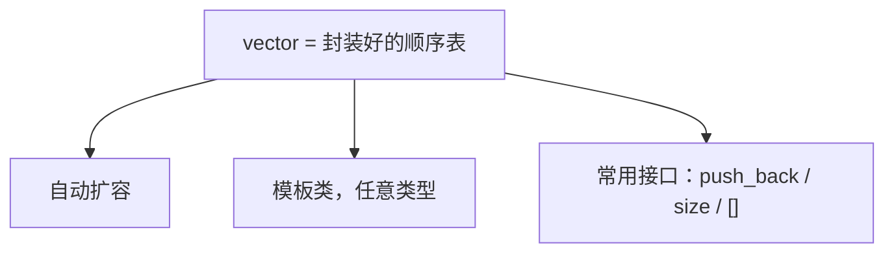
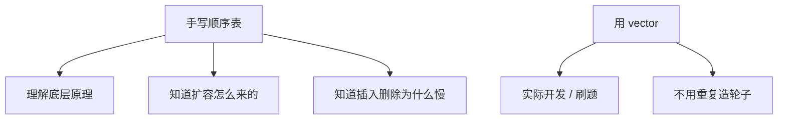

## 本节概述：C++ 自带的顺序表 vector

前两节课我们手写了一个顺序表——目的是理解原理。

实际开发中不用自己写，C++ 标准库已经给我们准备好了，叫做 **vector**（向量）。它就是 STL 里的一个模板类，内部封装好了顺序表的所有操作。



## 引入头文件

要用 vector，先包含头文件：

```cpp
#include <vector>   // vector 的头文件
using namespace std;
```

vector 中文叫"向量"，不用纠结名字，知道它就是顺序表就行。

## 什么是模板类

vector 是个**模板类**——意思是它里面的元素可以是任意类型。

```cpp
vector<int>     vec1;   // 存 int 的顺序表
vector<double>  vec2;   // 存 double 的顺序表
vector<string>  vec3;   // 存 string 的顺序表
```

你想要什么类型，就把类型写到尖括号 `< >` 里。

> 这比我们手写的 typedef 方便多了——typedef 只能定一种类型，模板类想用啥用啥。

定义出来的空 vector，就是一个空的顺序表，大小为 0。

## 基本操作

### 获取大小：size()

```cpp
vector<int> vec;
cout << vec.size() << endl;  // 输出：0（空的）
```

### 尾部插入：push_back()

往顺序表末尾加一个元素，不用自己处理扩容——vector 自动帮你搞定。

```cpp
vec.push_back(1024);         // 尾部插入 1024
cout << vec.size() << endl;  // 输出：1
```

### 下标访问：[ ]

跟数组一样，用方括号通过下标直接访问元素。

```cpp
cout << vec[0] << endl;      // 输出：1024
```

下标访问也是 O(1) 的——底层就是数组。

> push_back 就是插到最后面，所以也叫"尾插"。这是 vector 最常用的插入方式，因为不需要移动元素，均摊 O(1)。

## 初始化多个元素

想一开始就有 1,2,3,4,5 五个元素？直接用花括号初始化：

```cpp
vector<int> vec = {1, 2, 3, 4, 5};
```

### 遍历打印

用 for 循环，配合 size() 和 []：

```cpp
for (int i = 0; i < vec.size(); i++)
{
    cout << vec[i] << " ";
}
cout << endl;
// 输出：1 2 3 4 5
```

### 继续尾插

有了初始元素，还能继续往后加：

```cpp
vec.push_back(1024);  // 尾部再加一个 1024

for (int i = 0; i < vec.size(); i++)
{
    cout << vec[i] << " ";
}
cout << endl;
// 输出：1 2 3 4 5 1024
```

自动扩容的事 vector 全帮你做了，不用管。

## vector 常用接口速查表

| 操作 | 写法 | 时间复杂度 | 说明 |
|---|---|---|---|
| 尾插 | `vec.push_back(x)` | 均摊 O(1) | 加到末尾 |
| 获取大小 | `vec.size()` | O(1) | 元素个数 |
| 下标访问 | `vec[i]` | O(1) | 随机访问 |
| 修改 | `vec[i] = val` | O(1) | 直接赋值 |
| 是否为空 | `vec.empty()` | O(1) | 空返回 true |
| 尾删 | `vec.pop_back()` | O(1) | 删掉最后一个 |
| 清空 | `vec.clear()` | O(n) | 清空所有元素 |

> 算法里一般不用 vector 做中间插入删除——因为时间复杂度高（O(n)）。如果需要频繁插入删除，用链表更合适。vector 最适合的场景是：**尾插 + 随机访问**。

## 为什么手写了还要学 vector

有人可能会问：既然有 vector 了，为什么还要手写顺序表？



答案很简单：
- **手写是为了理解原理** — 知道它底层怎么回事，遇到问题才能定位
- **用 vector 是为了效率** — 实际写代码不用重复造轮子

就像学开车——你得知道发动机大概怎么工作，但平时开车不用自己造发动机。

> 以后刷题、做项目，直接用 vector 就行。但心里要清楚它底层就是我们手写的那个顺序表。

## 本章小结

**vector** 是 C++ STL 里的顺序表模板类，底层就是我们手写的那套东西。

**常用操作**：
- `push_back(x)` — 尾部插入，均摊 O(1)
- `size()` — 获取元素个数，O(1)
- `vec[i]` — 下标访问，O(1)
- `vec[i] = val` — 修改元素，O(1)
- `empty()` — 判断是否为空
- `pop_back()` — 尾部删除
- `clear()` — 清空所有元素

**一句话**：**vector 就是封装好的顺序表，尾插和下标访问飞快，中间插入删除慢，刷题开发直接用就行。**

---

**顺序表 3.2 全部 3 篇完成：**
- [3.2.1 概念篇](docs/C++/英雄编程/第三章/顺序表/3.2.1概念篇)
- [3.2.2 代码篇](docs/C++/英雄编程/第三章/顺序表/3.2.2代码篇)
- 3.2.3 vector 篇（本节）

下一章我们学**链表**——顺序表插入删除慢的问题，链表来解决。
