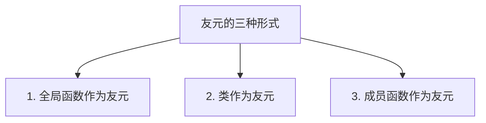
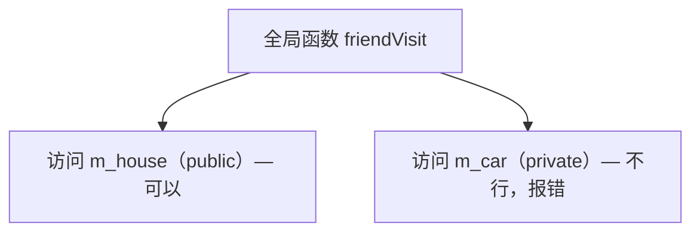
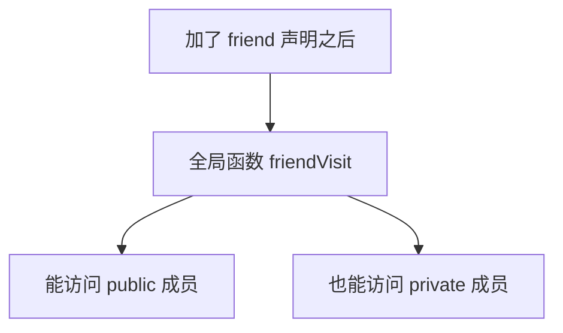
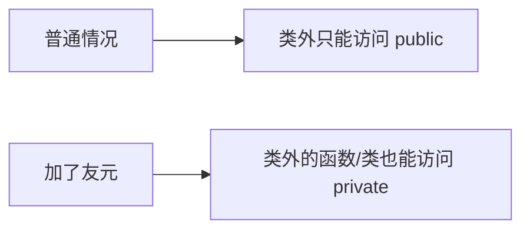

## 本节概述：给好朋友开的"后门"

前面我们学了访问权限——private 的成员，类外面是访问不到的。

但是！凡事总有例外。比如你有一辆跑车（private），一般人不让碰，但你的好朋友来了，你愿意让他开开。

在 C++ 里也一样——有些特殊的函数或类，我们希望它们能访问类的私有成员，但又不想把所有东西都设成 public。怎么办？

用 **友元（friend）**。


友元的关键字是 `friend`，就是"朋友"的意思——是朋友，才能进你的家门看你的私藏。

友元一共有三种：



这一节我们先学第一种：**全局函数作为友元**。

## 先看问题：全局函数访问不了私有成员

我们用一个生活化的例子来演示。

假设有一个"人"类，这个人有两样东西：
- **房子** — 公开的，谁都能来看（public）
- **跑车** — 私有的，一般人碰不到（private）

```cpp
#include <iostream>
#include <string>
using namespace std;

class People
{
public:
    string m_house;  // 房子：公开的

private:
    string m_car;    // 跑车：私有的
};
```

现在有一个全局函数 `friendVisit`——"好朋友来拜访"，好朋友想看看你的房子，也想看看你的跑车：

```cpp
// 全局函数：好朋友来拜访
void friendVisit(People *p)
{
    cout << "好朋友来访问你的：" << p->m_house << endl;  // ✅ 房子是 public，可以访问
    cout << "好朋友来访问你的：" << p->m_car << endl;    // ❌ 跑车是 private，访问不到，报错！
}

int main()
{
    People p;
    p.m_house = "别墅";
    // p.m_car = "跑车";  // 类外也访问不到 private

    friendVisit(&p);

    return 0;
}
```

编译器直接报错——`m_car` 是私有成员，全局函数访问不到。



这很正常——私有成员就是给类外面准备的"防火墙"。

## 解决方案：声明为友元

那我就是想让好朋友看看跑车怎么办？很简单——在类里面把这个函数声明为**友元**。

```cpp
class People
{
    // 声明 friendVisit 是我的好朋友（友元）
    friend void friendVisit(People *p);

public:
    string m_house;

private:
    string m_car;
};
```

就加一行——在函数声明前面加个 `friend` 关键字，放在类里面（public、private 区域都行，不影响）。

加上之后，刚才的报错立马消失了。我们把代码补完整：

```cpp
#include <iostream>
#include <string>
using namespace std;

class People
{
    // 声明全局函数 friendVisit 是 People 类的友元
    friend void friendVisit(People *p);

public:
    People()
    {
        m_house = "别墅";
        m_car = "跑车";
    }

    string m_house;  // 房子：公开的

private:
    string m_car;    // 跑车：私有的
};

// 全局函数：好朋友来拜访
void friendVisit(People *p)
{
    cout << "好朋友来访问你的：" << p->m_house << endl;  // ✅ 房子没问题
    cout << "好朋友来访问你的：" << p->m_car << endl;    // ✅ 加了 friend 之后，跑车也能访问了
}

int main()
{
    People p;
    friendVisit(&p);

    return 0;
}
```

运行结果：
```
好朋友来访问你的：别墅
好朋友来访问你的：跑车
```

完美！加上 `friend` 声明之后，全局函数就能访问私有成员了。



## 友元声明的格式

全局函数作为友元的声明格式很简单：

```
friend 返回类型 函数名(参数列表);
```

就比普通的函数声明多了一个 `friend` 关键字。

几点注意：

1. **写在类里面** — 友元声明必须写在类的内部
2. **放在哪都行** — public、private、protected 区域都可以，不影响效果
3. **只是声明** — 友元声明只是告诉编译器"这个函数是我的朋友"，函数本身的定义还是在类外面
4. **不是成员函数** — 友元函数只是个全局函数，不是类的成员，所以没有 `this` 指针

> [!TIP]
> **怎么记？**
>
> 你就想：我在我家（类）里面贴了一张名单——"这些人是我的好朋友，可以进我房间看私人物品"。
>
> 名单写在我家里（类里面），前面加个 `friend` 标记。名单上的人（函数）就能访问我的私藏（private 成员）了。

## 友元的目的

最后再强调一下友元的核心目的：

**让一个函数或者类，能够访问另一个类的私有成员。**



友元本质上是对封装的一种"放松"——大多数时候我们用 private 保护数据，但某些特殊情况下，我们允许特定的函数或类来访问私有成员。

> [!WARNING]
> **友元要慎用**
>
> 友元打破了封装性，用多了会让代码变得混乱——谁都能访问私有成员，那封装还有什么意义？
>
> 原则：**能不用就不用**。只有当你确定某个函数确实需要频繁访问私有成员、而且用 public 接口又太麻烦的时候，才考虑用友元。

## 本章小结

**友元（friend）**的作用是：让一个函数或类能够访问另一个类的私有成员。

**关键字**：`friend`（朋友的意思，是朋友才能看私藏）

**三种形式**：
1. 全局函数作为友元
2. 类作为友元
3. 成员函数作为友元

**全局函数作为友元的写法**：在类里面写 `friend 返回类型 函数名(参数);`

**几个要点**：
- 友元声明写在类内部，public/private 区域都行
- 友元函数不是成员函数，没有 this 指针
- 友元只是声明，函数定义还是在类外面
- 友元要慎用，用多了会破坏封装性

