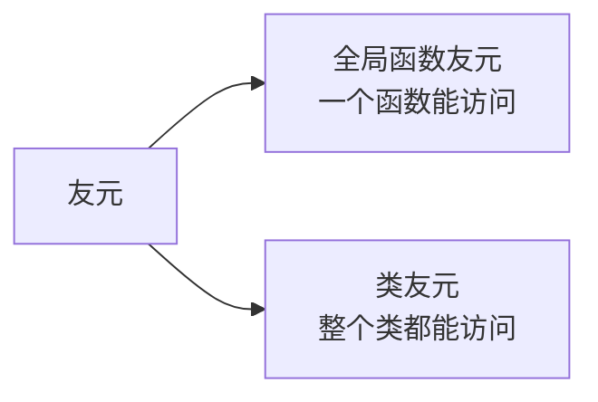
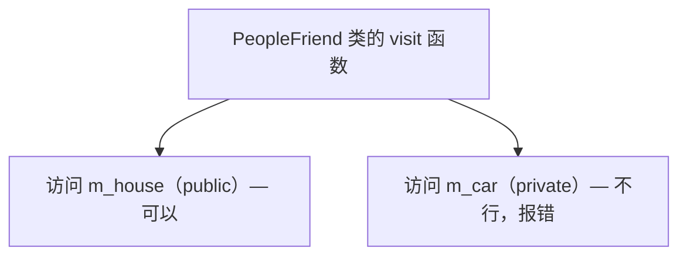
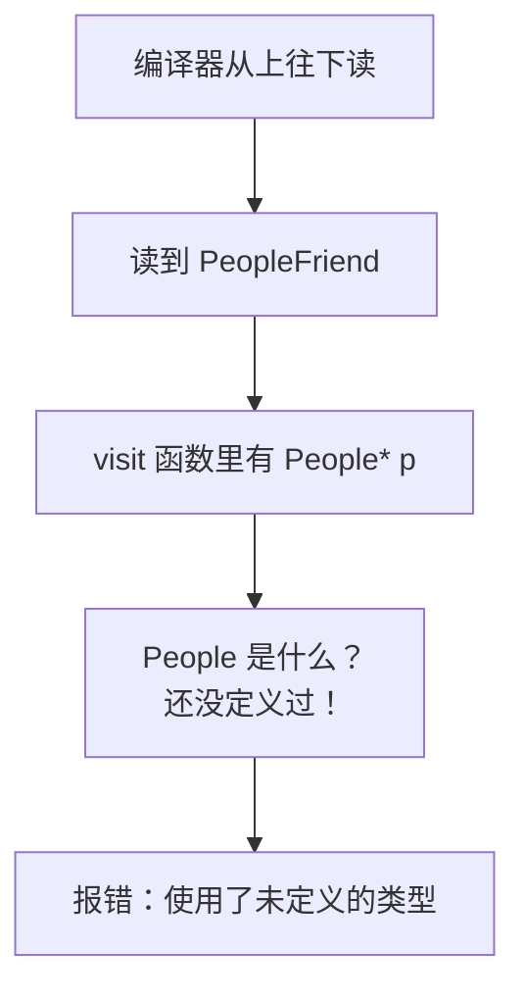
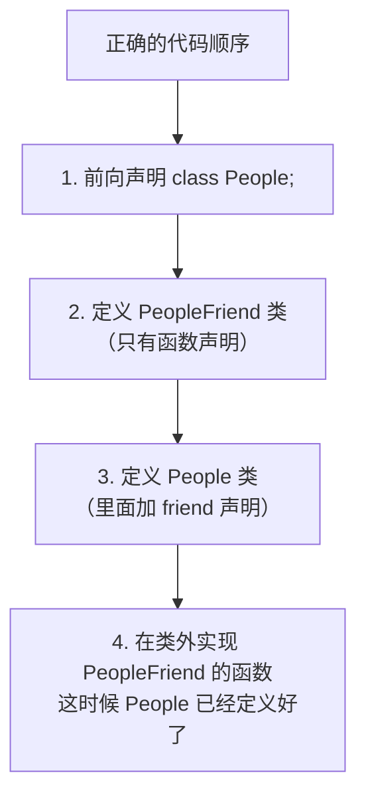
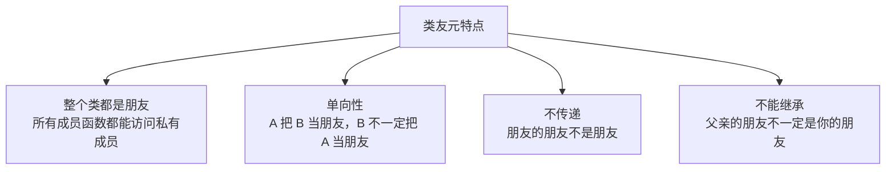

## 本节概述：让一个类成为另一个类的朋友

上一节我们学了全局函数作为友元——让一个全局函数能访问类的私有成员。

这一节我们升级一下：让**整个类**成为另一个类的朋友。也就是说，这个类里的所有成员函数，都能访问另一个类的私有成员。



还是用我们熟悉的例子：人有房子（public）和跑车（private）。现在不是一个函数来访问了，而是一个"朋友类"来访问。

## 先看问题：另一个类访问不了私有成员

我们先写两个类：

- **People** —— 人类，有房子（公开）和跑车（私有）
- **PeopleFriend** —— 朋友类，有一个 visit 函数来拜访

```cpp
#include <iostream>
#include <string>
using namespace std;

class People
{
public:
    People()
    {
        m_house = "别墅";
        m_car = "跑车";
    }

    string m_house;  // 房子：公开的

private:
    string m_car;    // 跑车：私有的
};
```

朋友类长这样：

```cpp
class PeopleFriend
{
public:
    PeopleFriend() {}

    // 拜访函数：来看看你家有啥
    void visit(People *p)
    {
        cout << "好朋友来访问你的：" << p->m_house << endl;  // ✅ 房子没问题
        cout << "好朋友来访问你的：" << p->m_car << endl;    // ❌ 跑车是 private，访问不到！
    }
};
```

`visit` 函数里访问 `m_car` 的时候直接报错——因为跑车是私有成员，朋友类也访问不到。



## 解决方案：声明类为友元

跟全局函数友元类似，我们在 People 类里面把 PeopleFriend 声明为朋友——加一行 `friend class PeopleFriend;`。

```cpp
class People
{
    // 声明 PeopleFriend 是我的好朋友（类友元）
    friend class PeopleFriend;

public:
    People()
    {
        m_house = "别墅";
        m_car = "跑车";
    }

    string m_house;

private:
    string m_car;
};
```

格式记一下：

```
friend class 类名;
```

比全局函数友元多了个 `class` 关键字。

## 一个容易踩的坑：类的声明顺序

你以为加上 friend 就完事了？没那么简单——这里有个经典的坑。

### 坑在哪里

如果我们的代码顺序是这样的：

```cpp
// 1. 先写朋友类
class PeopleFriend
{
public:
    void visit(People *p)  // ❌ People 是什么？编译器还没见过！
    {
        cout << p->m_house << endl;
    }
};

// 2. 再写人类
class People
{
    friend class PeopleFriend;
    // ...
};
```

编译器从上往下读，读到 `People *p` 的时候，它还没见过 `People` 这个类呢——直接报错：**使用了未定义的类型**。



### 怎么解决

解决方法分两步：

**第一步：提前声明 People 类**

在最前面加一行 `class People;`——告诉编译器"有这么个类，后面会定义的"。这叫**类的前向声明**。

```cpp
class People;  // 前向声明：告诉编译器 People 是个类
```

但光有前向声明还不够——前向声明只告诉编译器"有这个类"，但没告诉编译器这个类里面有什么成员。所以函数体里写 `p->m_house` 还是会报错，因为编译器不知道 People 有 `m_house` 这个成员。

**第二步：把函数实现移到类定义的后面**

函数声明可以留在类里面，但函数的具体实现要挪到 People 类定义完之后再写。



这样编译器读到函数实现的时候，People 类已经完整定义了，里面有什么成员编译器都知道了。

## 完整代码示例

把上面说的都整合起来，完整代码长这样：

```cpp
#include <iostream>
#include <string>
using namespace std;

// 第一步：前向声明，告诉编译器 People 是个类
class People;

// 第二步：定义朋友类（函数只写声明，不写实现）
class PeopleFriend
{
public:
    PeopleFriend();

    void visit(People *p);  // 函数声明
};

// 第三步：定义人类（里面声明友元）
class People
{
    // 声明 PeopleFriend 是我的好朋友
    friend class PeopleFriend;

public:
    People()
    {
        m_house = "别墅";
        m_car = "跑车";
    }

    string m_house;

private:
    string m_car;
};

// 第四步：在类外实现朋友类的成员函数
PeopleFriend::PeopleFriend() {}

void PeopleFriend::visit(People *p)
{
    cout << "好朋友来访问你的：" << p->m_house << endl;  // ✅ 房子没问题
    cout << "好朋友来访问你的：" << p->m_car << endl;    // ✅ 加了友元，跑车也能访问了
}

int main()
{
    People p;
    PeopleFriend pf;
    pf.visit(&p);

    return 0;
}
```

运行结果：
```
好朋友来访问你的：别墅
好朋友来访问你的：跑车
```

完美！加上类友元之后，PeopleFriend 类里的所有成员函数都能访问 People 的私有成员了。

> [!TIP]
> **为什么要这么折腾顺序？**
>
> 因为 C++ 编译器是**从上往下逐行读**的——读到一个名字的时候，它必须已经见过这个名字的声明才行。
>
> 前向声明解决了"知道有这个类"的问题，但函数实现需要知道类里面有什么成员，所以必须放在类定义的后面。
>
> 这个顺序问题刚开始学容易懵，写多了就习惯了。

## 类友元的特点

总结一下类作为友元的几个要点：



1. **整个类都是朋友** — 声明了类友元之后，这个类的所有成员函数都能访问另一个类的私有成员
2. **友元是单向的** — People 把 PeopleFriend 当朋友，不代表 PeopleFriend 也把 People 当朋友。People 的 private 对 PeopleFriend 开放，但 PeopleFriend 的 private 对 People 还是关闭的
3. **友元不传递** — A 是 B 的朋友，B 是 C 的朋友，不代表 A 是 C 的朋友
4. **友元不能继承** — 父亲的朋友，不一定是儿子的朋友（继承的时候会讲到）

## 本章小结

**类作为友元**就是让一个类的所有成员函数，都能访问另一个类的私有成员。

**语法**：在类里面写 `friend class 类名;`

**两个类协作的正确代码顺序**：
1. 前向声明被访问的类：`class People;`
2. 定义朋友类（函数只写声明）
3. 定义被访问的类（里面加 friend 声明）
4. 在类外实现朋友类的成员函数

**类友元的特点**：
- 整个类都是朋友，所有成员函数都能访问私有成员
- 友元是单向的（我把你当朋友 ≠ 你把我当朋友）
- 友元不传递（朋友的朋友不是朋友）
- 友元不能继承

