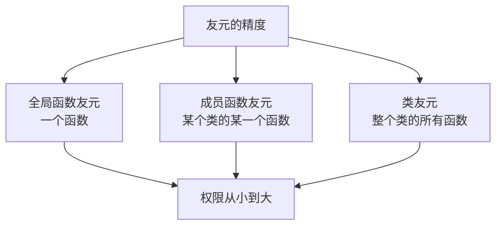
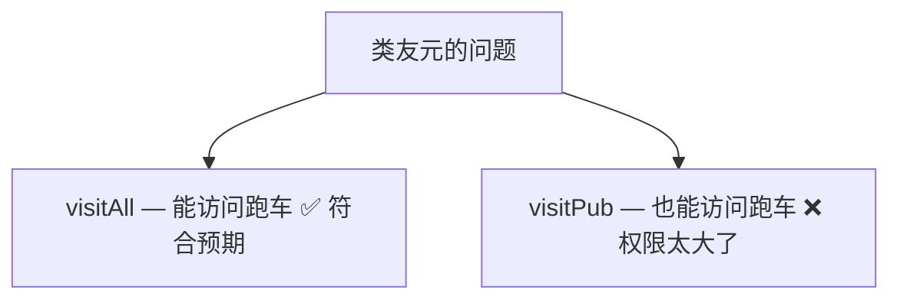
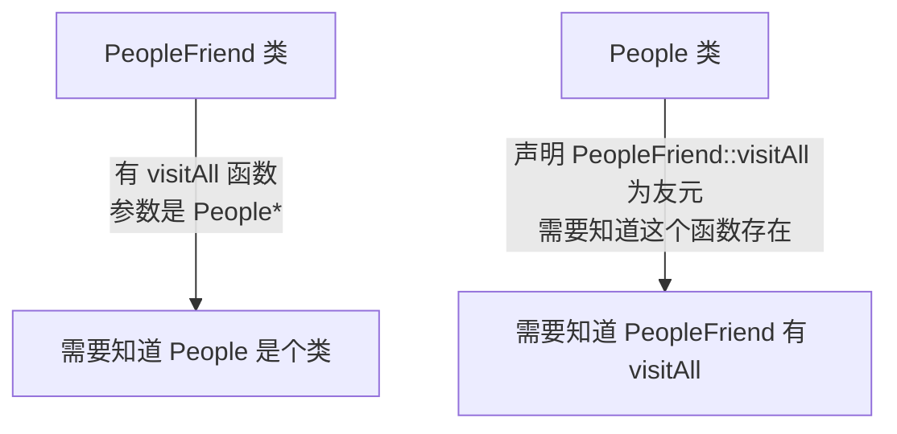
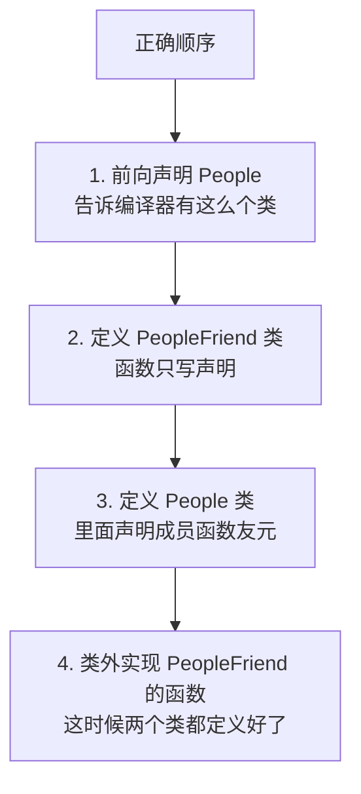
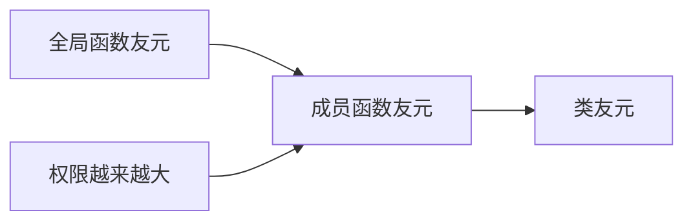

## 本节概述：精准授权，只给某个函数开后门

前面我们学了两种友元：
- **全局函数友元** — 让一个全局函数能访问私有成员
- **类友元** — 让整个类的所有函数都能访问私有成员

但有时候我们想要更精准的控制——**不是整个类都能访问，只让类里的某一个函数能访问**。

比如朋友类里有两个函数：
- `visitAll()` — 全部都看（别墅 + 跑车），需要访问私有成员
- `visitPub()` — 只看公开的（别墅），不需要访问私有成员

如果用类友元，两个函数都能访问跑车了——权限给大了。我们想要的是：只有 `visitAll()` 能看跑车，`visitPub()` 看不了。

这就需要用到：**成员函数作为友元**。



## 先看问题：类友元权限太大了

我们还是用房子和跑车的例子。朋友类里有两个函数：

```cpp
class PeopleFriend
{
public:
    void visitPub(People *p);   // 只看公开的（别墅）
    void visitAll(People *p);   // 全部都看（别墅 + 跑车）
};
```

如果我们用类友元：

```cpp
class People
{
    friend class PeopleFriend;  // 整个类都是朋友
    // ...
};
```

那 `visitPub()` 和 `visitAll()` 都能访问私有成员了——但我们只想让 `visitAll()` 能访问，`visitPub()` 不应该能看到跑车。



权限给得太宽了，不够精准。

## 解决方案：成员函数作为友元

C++ 允许我们更精准地控制——**只把类里的某一个函数声明为友元**。

语法格式：

```
friend 返回类型 类名::函数名(参数列表);
```

跟全局函数友元很像，只是函数名前面多了个 `类名::`，表示"这个函数是属于哪个类的"。

在 People 类里这样写：

```cpp
class People
{
    // 只把 PeopleFriend 的 visitAll 声明为友元
    friend void PeopleFriend::visitAll(People *p);

public:
    // ...

private:
    string m_car;
};
```

这样一来，只有 `visitAll()` 能访问 People 的私有成员，`visitPub()` 还是访问不到——权限精准了。

## 一个大坑：声明顺序

成员函数友元涉及到两个类互相引用，声明顺序非常容易出问题。这是本节最容易踩的坑。

### 坑在哪里

我们来梳理一下互相依赖的关系：



- PeopleFriend 里用到了 People* → 需要先知道 People 是个类
- People 里声明友元用到了 PeopleFriend::visitAll → 需要先知道 PeopleFriend 有这个函数

两边互相需要，怎么办？

### 正确的声明顺序

答案是：**用前向声明 + 函数实现后置**，分四步走：



**为什么这样安排？**

1. 先声明 People — 这样 PeopleFriend 里写 `People*` 参数时，编译器知道 People 是个类
2. 再定义 PeopleFriend（只有函数声明）— 这样 People 里写 `friend void PeopleFriend::visitAll(...)` 时，编译器知道有这个函数
3. 再定义 People（加友元声明）— 这时候 PeopleFriend 已经定义好了，友元声明能找到函数
4. 最后在类外实现函数 — 这时候两个类都完整定义了，函数体里访问成员没问题

### 如果顺序错了会怎样

如果你把 PeopleFriend 的定义放在 People 的后面：

```cpp
// 错误顺序：先定义 People，再定义 PeopleFriend
class People
{
    friend void PeopleFriend::visitAll(People *p);  // ❌ PeopleFriend 是什么？还没定义！
    // ...
};

class PeopleFriend  // PeopleFriend 定义在后面
{
    // ...
};
```

编译器读到 `friend void PeopleFriend::visitAll(...)` 的时候，PeopleFriend 还没定义——它根本不知道 PeopleFriend 里面有个叫 `visitAll` 的函数，直接报错。

> 这就是成员函数友元和类友元最大的区别：
> - 类友元只需要知道"有这么个类"就行（前向声明就够了）
> - 成员函数友元需要知道"这个类里面有这么个函数"（必须看到完整的类定义）

## 完整代码示例

把上面说的正确顺序落实到代码里：

```cpp
#include <iostream>
#include <string>
using namespace std;

// 第一步：前向声明 People
class People;

// 第二步：定义 PeopleFriend 类（函数只写声明）
class PeopleFriend
{
public:
    void visitPub(People *p);  // 只看公开的
    void visitAll(People *p);  // 全部都看
};

// 第三步：定义 People 类（声明成员函数友元）
class People
{
    // 只把 visitAll 声明为友元，visitPub 不是
    friend void PeopleFriend::visitAll(People *p);

public:
    People()
    {
        m_house = "别墅";
        m_car = "跑车";
    }

    string m_house;  // 房子：公开的

private:
    string m_car;    // 跑车：私有的
};

// 第四步：在类外实现 PeopleFriend 的成员函数

void PeopleFriend::visitPub(People *p)
{
    cout << "好朋友来访问你的：" << p->m_house << endl;  // ✅ 房子没问题
    // cout << p->m_car << endl;  // ❌ 报错！visitPub 不是友元，访问不了跑车
}

void PeopleFriend::visitAll(People *p)
{
    cout << "好朋友来访问你的：" << p->m_house << endl;  // ✅ 房子没问题
    cout << "好朋友来访问你的：" << p->m_car << endl;    // ✅ visitAll 是友元，跑车也能访问
}

int main()
{
    People p;
    PeopleFriend pf;

    cout << "=== 调用 visitPub ===" << endl;
    pf.visitPub(&p);

    cout << "=== 调用 visitAll ===" << endl;
    pf.visitAll(&p);

    return 0;
}
```

运行结果：
```
=== 调用 visitPub ===
好朋友来访问你的：别墅
=== 调用 visitAll ===
好朋友来访问你的：别墅
好朋友来访问你的：跑车
```

完美！`visitAll()` 既能看别墅又能看跑车（因为是友元），`visitPub()` 只能看别墅（因为不是友元，访问不了私有成员）——精准控制，恰到好处。

## 三种友元对比

最后用一张表把三种友元串起来：

| 友元形式 | 语法 | 权限范围 | 适用场景 |
|---|---|---|---|
| 全局函数友元 | `friend void func();` | 一个全局函数 | 某个工具函数需要访问 |
| 成员函数友元 | `friend void 类名::func();` | 另一个类的某一个函数 | 精准控制到某个函数 |
| 类友元 | `friend class 类名;` | 另一个类的所有函数 | 整个类都需要频繁访问 |



权限从小到大：全局函数友元 < 成员函数友元 < 类友元。用的时候按需选择——能用小权限的就不用大权限的。

## 本章小结

**成员函数作为友元**就是让另一个类的某一个成员函数，能访问当前类的私有成员。

**语法**：`friend 返回类型 类名::函数名(参数列表);`

**核心优势**：比类友元更精准——只给需要的函数开后门，不用把整个类都变成朋友。

**声明顺序（最容易踩坑）**：
1. 前向声明被访问的类（People）
2. 定义朋友类（PeopleFriend），函数只写声明
3. 定义被访问的类（People），里面声明成员函数友元
4. 在类外实现朋友类的函数

**为什么顺序这么严格**：因为成员函数友元需要编译器看到完整的类定义（知道里面有这个函数），而类友元只需要前向声明就行。

