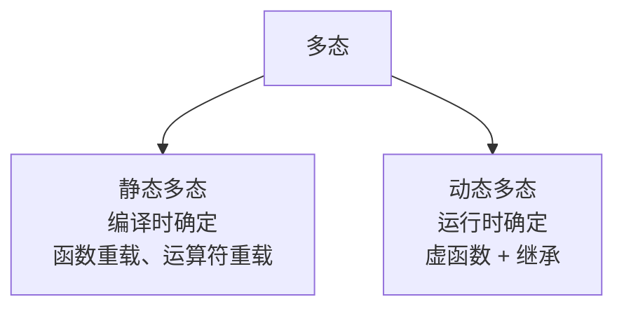
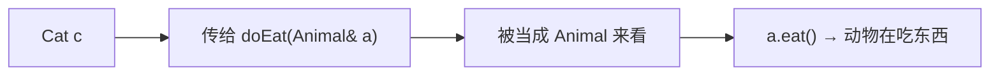
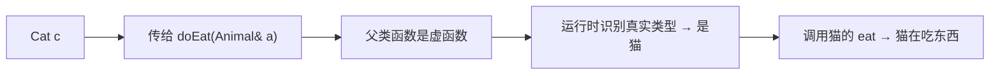
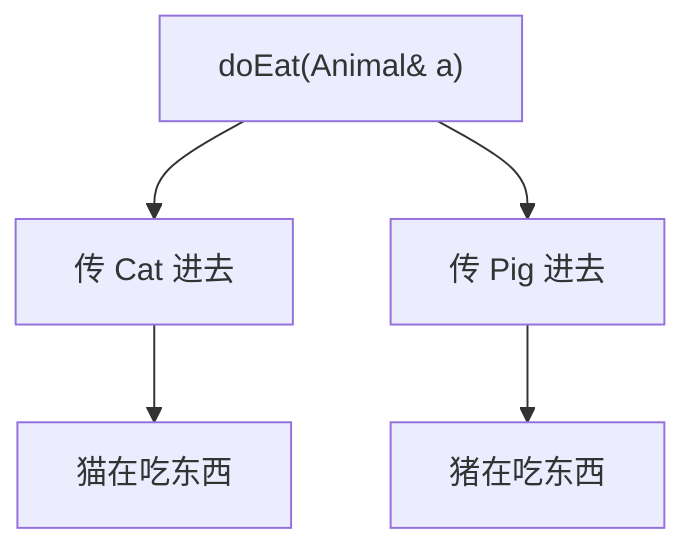
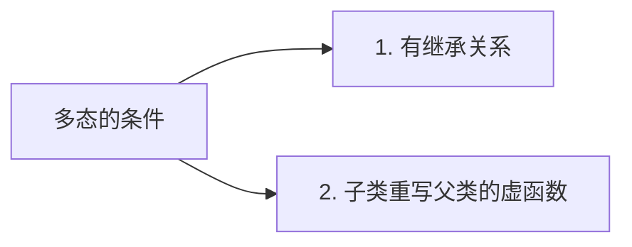

## 本节概述：同一个函数调用，不同的行为

面向对象有三大特性：封装、继承、多态。

前两个我们已经学完了，这一节开始学习第三个——**多态**。

多态分两种：
- **静态多态** — 函数重载、运算符重载（编译时就确定调用哪个）
- **动态多态** — 用虚函数实现（运行时才确定调用哪个）

我们这一节学的就是动态多态。



> 概念听不懂没关系，我们用代码说话——看完代码你就懂了。

## 先看问题：没有多态的时候

父类 Animal 有个 `eat` 函数，子类 Cat 也有个 `eat` 函数。

```cpp
#include <iostream>
using namespace std;

// 父类
class Animal
{
public:
    void eat()
    {
        cout << "动物在吃东西" << endl;
    }
};

// 子类
class Cat : public Animal
{
public:
    void eat()
    {
        cout << "猫在吃东西" << endl;
    }
};
```

现在写一个函数，参数是 `Animal&`（动物的引用），里面调用 `eat`：

```cpp
// 统一喂食函数
void doEat(Animal& a)
{
    a.eat();
}
```

我们传一个猫的对象进去：

```cpp
void test()
{
    Cat c;
    doEat(c);  // 传猫进去，调用的是谁的 eat？
}
```

运行结果：
```
动物在吃东西
```

调用的是父类的 `eat`。

为什么？因为传参的时候，子类对象被隐式转换成了父类引用——既然变成了"动物"，那调用的当然就是动物的 `eat` 了。



但这不是我们想要的——明明传的是猫，凭啥按动物来吃？

**我们想要的效果：传进去的是猫，就调用猫的 eat；传进去的是猪，就调用猪的 eat。**

同一个函数调用，根据传入的对象不同，产生不同的行为——这就是多态。

## 解决方案：虚函数

怎么实现？很简单——**在父类的函数前面加个 `virtual` 关键字**。

```cpp
class Animal
{
public:
    virtual void eat()   // 加个 virtual，变成虚函数
    {
        cout << "动物在吃东西" << endl;
    }
};
```

就改这一处，子类不用改。再运行一下：

```cpp
void test()
{
    Cat c;
    doEat(c);
}
```

运行结果：
```
猫在吃东西
```

变了！现在调用的是子类的 `eat` 了。



就加了一个 `virtual`，效果完全不一样——这就是虚函数的魔力。

## 再加一个子类试试

举一反三——再写一个 Pig 类：

```cpp
class Pig : public Animal
{
public:
    void eat()
    {
        cout << "猪在吃东西" << endl;
    }
};
```

同样的 `doEat` 函数，传猪进去：

```cpp
void test()
{
    Cat c;
    Pig p;

    doEat(c);  // 传猫
    doEat(p);  // 传猪
}
```

运行结果：
```
猫在吃东西
猪在吃东西
```

完美！同一个 `doEat` 函数，传不同的动物进去，产生不同的行为——这就是多态。



## 多态的一句话总结

老师的原话，记下来：

> **函数传参是个动物，但是传入不同的动物会产生不同的行为——这个就叫多态。**

说人话就是：**同一个接口，不同的实现。**

你不用管传进来的具体是什么动物，你只知道它是动物，它会吃东西——至于具体怎么吃，它自己决定。

## 多态的两个必要条件

实现多态需要满足两个条件：



1. **有继承关系** — 子类继承父类
2. **子类重写父类的虚函数** — 父类函数加 `virtual`，子类写一个同名同参的函数

> [!NOTE]
> **关于"重写"**
>
> 重写（override）和重载（overload）是两个概念：
> - **重载**：同一个作用域，函数名相同，参数不同
> - **重写**：父子类之间，函数名和参数都一样，父类是虚函数
>
> 重写就是子类把父类的虚函数"重新写一遍"，替换掉父类的实现。

## 怎么调用多态

满足条件之后，怎么触发多态？用**父类的指针或引用**指向子类对象。

```cpp
// 方式一：引用
void doEat(Animal& a)
{
    a.eat();  // 多态调用
}

// 方式二：指针
void doEat2(Animal* a)
{
    a->eat();  // 多态调用
}
```

核心就是：**父类的指针/引用，指向子类对象，调用虚函数。**

> 没有虚函数的时候，调用哪个看指针/引用的类型（父类就调父类的）
>
> 有了虚函数之后，调用哪个看指向的真实对象类型（是猫就调猫的）

## 本章小结

**多态**就是同一个函数调用，根据传入的对象不同，产生不同的行为。

**多态的两个必要条件**：
1. **有继承关系** — 子类继承父类
2. **子类重写父类的虚函数** — 父类加 `virtual`，子类写同名同参函数

**触发多态的方式**：
- 父类的**引用**指向子类对象
- 父类的**指针**指向子类对象

**一句话记忆**：函数传参是个动物，传入不同的动物产生不同的行为——这就是多态。

