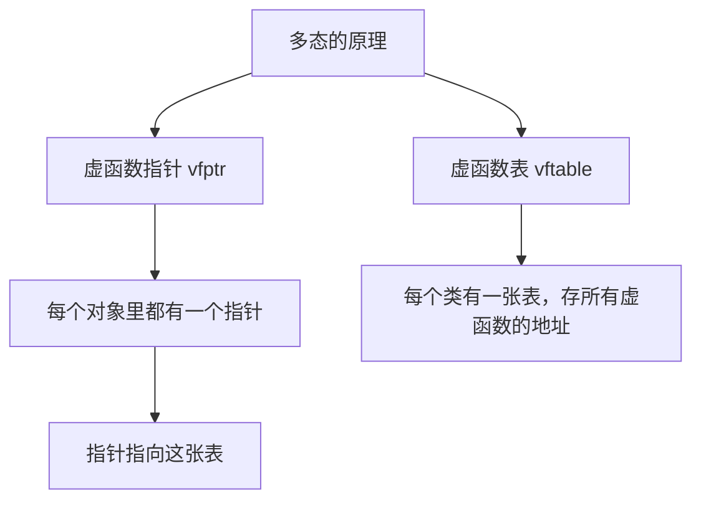
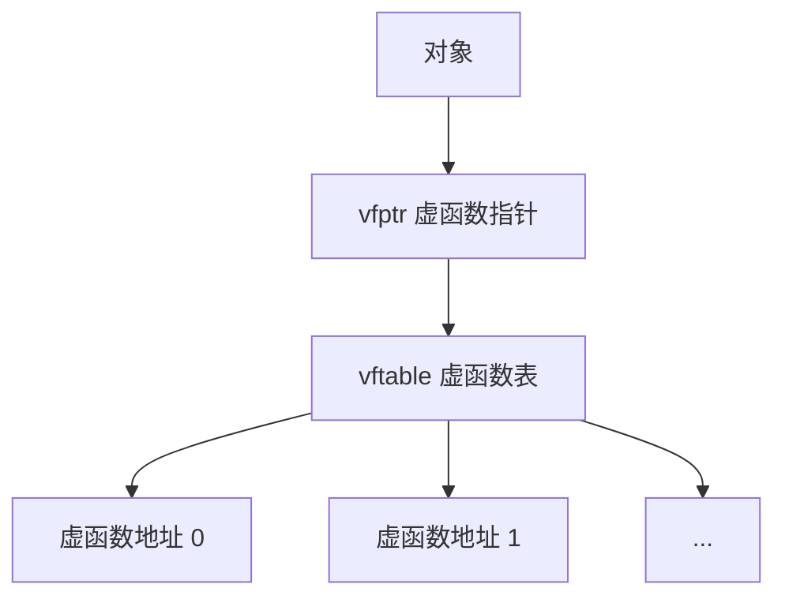
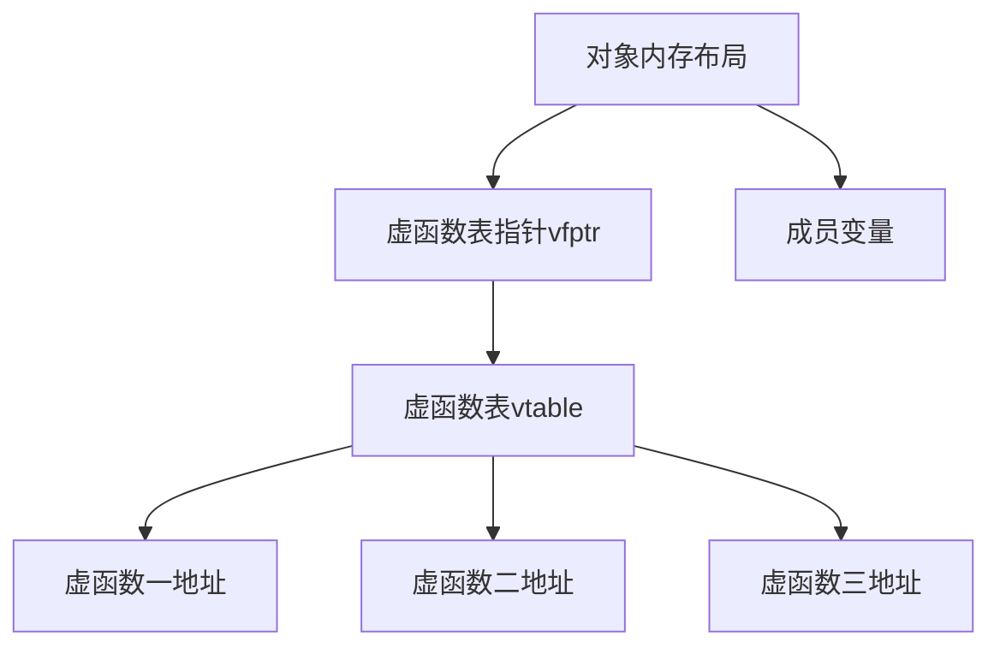
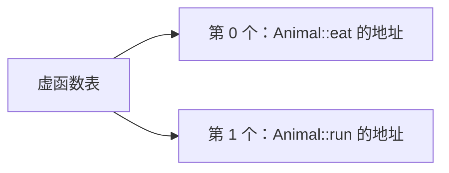
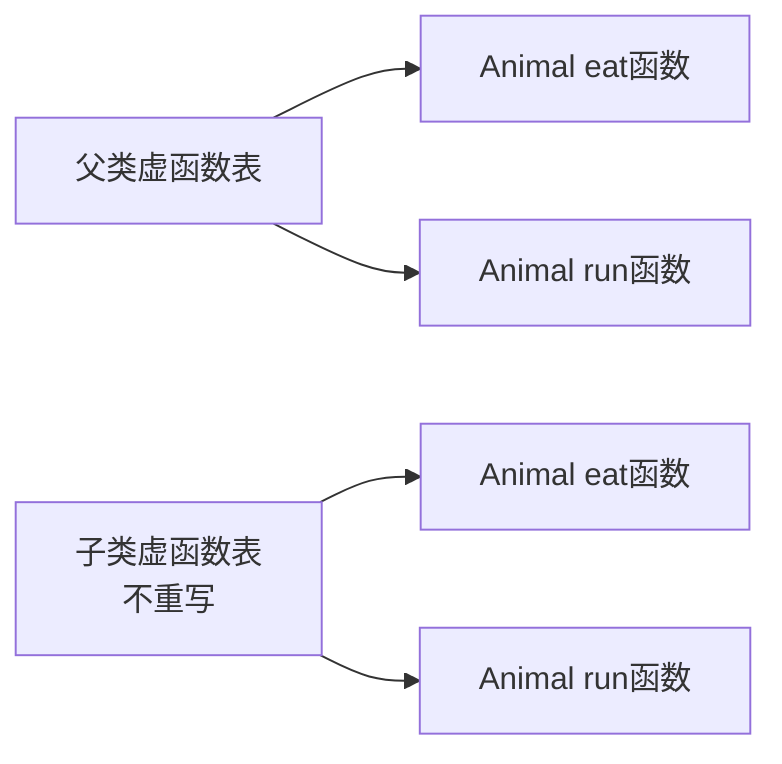
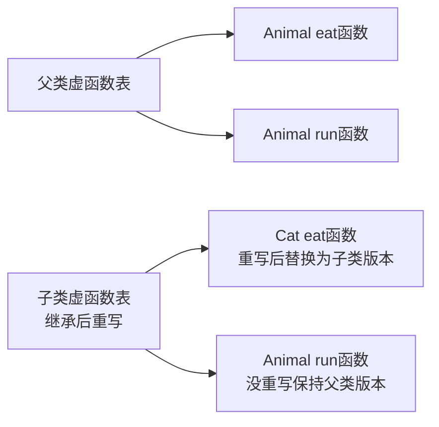
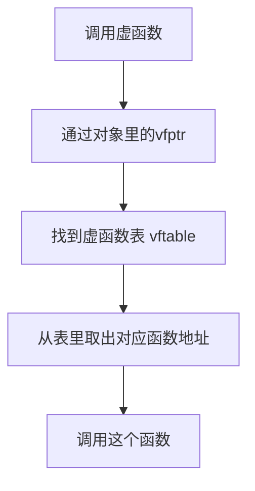
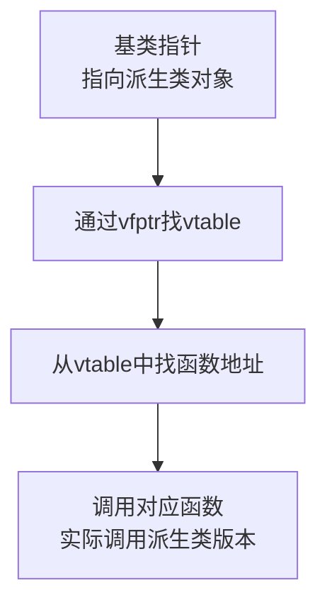
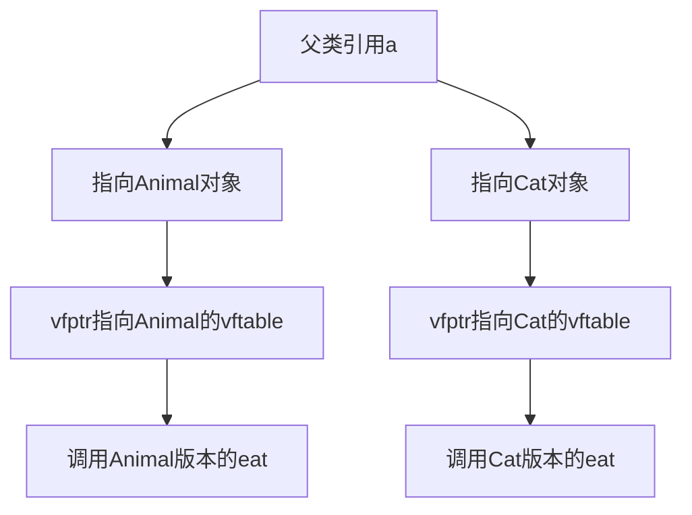

## 本节概述：虚函数到底是怎么实现多态的

上一节我们知道了——父类加个 `virtual`，子类重写一下，传父类引用指向子类对象，调用的就是子类的函数。

但为什么加了个 `virtual` 就这么神奇？它背后到底干了啥？

这一节我们来揭开谜底——**虚函数指针 + 虚函数表**。



## 先看没有虚函数的时候

先看一个空类（只有普通函数，没有成员变量）：

```cpp
class Animal
{
public:
    void eat()
    {
        cout << "动物在吃东西" << endl;
    }
};
```

猜一下 `sizeof(Animal)` 等于多少？

答案是 **1 个字节**。


为什么是 1 不是 0？因为如果类大小是 0，那创建 100 个对象它们的地址都一样，就没法区分了。所以编译器给了 1 个字节的占位——只是占个位置，没有实际意义。

> 成员函数不占对象空间，因为函数是存在代码区的，所有对象共用一份，不需要每个对象都存一份。

## 加了 virtual 之后，发生了什么

在 `eat` 前面加个 `virtual`：

```cpp
class Animal
{
public:
    virtual void eat()
    {
        cout << "动物在吃东西" << endl;
    }
};
```

再看 `sizeof(Animal)`——变成 **8 字节**了（64 位系统）。

1 个字节突然变成 8 字节——这 8 字节是什么？

64 位系统上什么东西是 8 字节？指针。

**加了虚函数之后，类里多了一个指针。**

## 虚函数指针 vfptr

这个指针有个名字，叫 **虚函数指针**（vfptr，virtual function pointer）。

调试的时候你能看到它，长这样：`__vfptr`（两个下划线开头）。


虚函数指针指向什么呢？指向一张表——**虚函数表**。

## 虚函数表 vftable

虚函数表（vftable，virtual function table），你可以把它理解成一个数组，里面存的是**所有虚函数的地址**。





类有几个虚函数，表里就有几个元素。比如只有一个 `eat` 虚函数，表里就一个元素。

再加一个虚函数 `run`：

```cpp
class Animal
{
public:
    virtual void eat() { ... }
    virtual void run() { ... }
};
```

虚函数表里就有两个元素：



> [!TIP]
> **注意区分**
>
> - **vfptr（虚函数指针）** — 存在**对象**里，每个对象都有一个，占 8 字节
> - **vftable（虚函数表）** — 存在**类**级别，同一个类的所有对象共用同一张表
>
> 就像每个人都有自己的身份证（vfptr），但身份证指向的户口本（vftable）是全家共用的。

## 子类继承后发生了什么

重点来了——子类继承父类后，虚函数表会发生什么？

我们先看 Cat 继承 Animal，但**不重写**虚函数的情况：

```cpp
class Cat : public Animal
{
    // 不重写 eat 和 run
};
```

这时候 Cat 的虚函数表跟 Animal 的一模一样——两个函数都是父类的版本。



## 子类重写虚函数后

如果 Cat **重写**了 `eat` 函数：

```cpp
class Cat : public Animal
{
public:
    void eat()  // 重写父类的虚函数
    {
        cout << "猫在吃东西" << endl;
    }
    // run 没有重写
};
```

这时候 Cat 的虚函数表变成什么样了？

**重写了的那个函数，地址被替换成子类的；没重写的，还是父类的。**



看出来了吗？就像填表——父类先填了一张表，子类继承的时候抄一份，然后把子类自己重写了的那一行覆盖掉，没重写的保持原样。

## 多态是怎么实现的

现在你应该能理解多态的原理了。

当你用父类引用指向子类对象，调用虚函数的时候：

```cpp
void doEat(Animal& a)
{
    a.eat();  // 多态调用
}
```

编译器干了什么？



1. 从对象里找到虚函数指针 vfptr
2. 通过 vfptr 找到虚函数表 vftable
3. 从虚函数表里找到对应函数的地址
4. 调用这个函数



**如果 a 指向的是 Animal 对象** → 虚函数表里是 `Animal::eat` → 调用动物的 eat
**如果 a 指向的是 Cat 对象** → 虚函数表里是 `Cat::eat` → 调用猫的 eat

这就是为什么——同一个函数调用，传入不同的对象，会产生不同的行为。

> 因为走的是同一张"查表"的流程，但表里填的内容不一样。



## 用一句话总结原理

> **子类重写父类虚函数时，会把自己虚函数表中对应的那条记录替换成自己的函数地址。调用时通过虚函数指针查表，找到的就是被替换后的函数——所以走子类的版本。**

## 本章小结

**虚函数实现多态的原理**：

1. **虚函数指针 vfptr** — 类有虚函数时，每个对象里多了一个指针（8字节）
2. **虚函数表 vftable** — 每个类有一张表，存所有虚函数的地址
3. **继承时** — 子类先复制父类的虚函数表
4. **重写时** — 子类把虚函数表中对应的那条记录替换成自己的
5. **调用时** — 通过对象的 vfptr 找到 vftable，从表里取函数地址调用

**结果**：父类指针/引用指向哪个子类对象，就用哪个子类的虚函数表，调用的就是哪个子类的函数——这就是多态。

