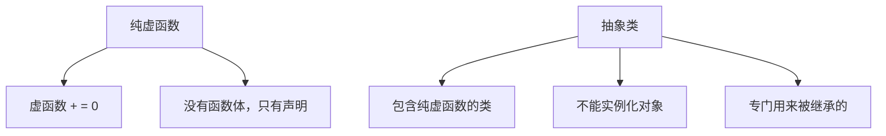
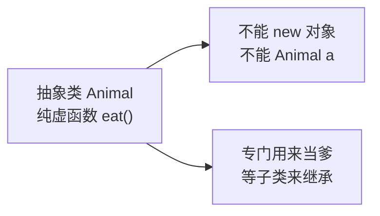
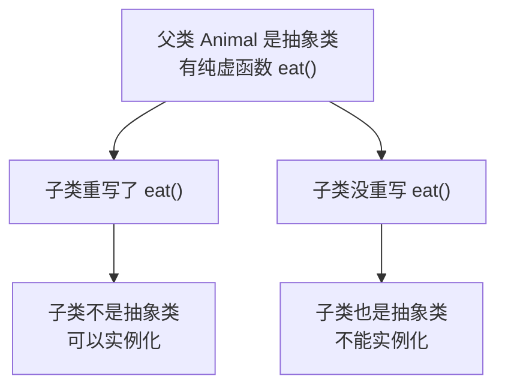
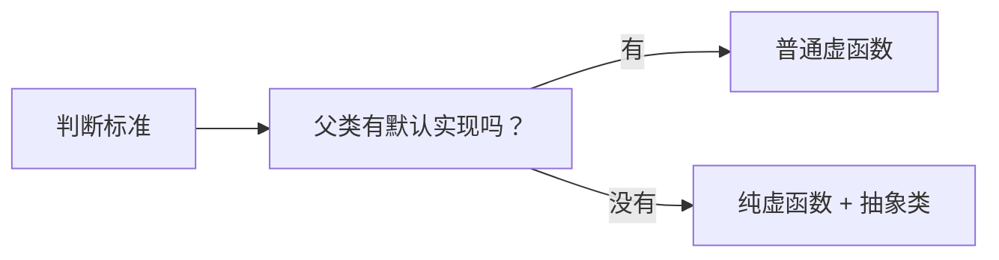

## 本节概述：只规定"要有"，不管"怎么实现"

有时候父类里的函数根本不需要实现——它就是个空架子，规定"你必须有这个功能"，但具体怎么干，全交给子类。

这种函数叫 **纯虚函数**，有纯虚函数的类叫 **抽象类**。



## 纯虚函数的语法

普通虚函数长这样：

```cpp
virtual void eat()
{
    cout << "动物在吃东西" << endl;
}
```

纯虚函数呢？把函数体去掉，后面加个 `= 0`：

```cpp
virtual void eat() = 0;   // 纯虚函数
```

就这么简单——`virtual` + 函数声明 + `= 0;`。

> 注意：`= 0` 不是赋值，也不是说函数等于 0，它只是一个语法标记——告诉编译器"这是纯虚函数"。

## 抽象类是什么

**只要类里有一个纯虚函数，这个类就是抽象类。**

抽象类有一个特点：**不能实例化对象**。

```cpp
class Animal
{
public:
    virtual void eat() = 0;  // 纯虚函数
};

void test()
{
    Animal a;  // ❌ 编译报错：不允许使用抽象类型的对象
}
```

为什么不让实例化？因为纯虚函数没有实现啊——你创建了对象，调用 `eat` 函数，它干啥去？啥也干不了。

所以抽象类的定位很明确——**它就是为了被继承而生的**。



> 你可以把抽象类理解成一张"设计图纸"——规定了必须有什么功能，但不负责实现。具体怎么实现，交给子类去干。

## 子类继承抽象类

子类继承了抽象类，有两种选择：

### 选择一：重写纯虚函数 → 正常类

子类把父类的纯虚函数重写了，那子类就不是抽象类了，可以正常实例化。

```cpp
class Cat : public Animal
{
public:
    void eat()  // 重写父类的纯虚函数
    {
        cout << "猫在吃东西" << endl;
    }
};

void test()
{
    Cat c;     // ✅ 没问题，Cat 不是抽象类
    c.eat();   // 输出：猫在吃东西
}
```

### 选择二：不重写 → 子类也是抽象类

如果子类不重写纯虚函数，那子类也继承了这个纯虚函数——所以子类也变成了抽象类，照样不能实例化。

```cpp
class Cat : public Animal
{
    // 没有重写 eat
};

void test()
{
    Cat c;  // ❌ 编译报错：Cat 也是抽象类，不能实例化
}
```



## 纯虚函数 vs 普通虚函数

| 类型 | 有函数体吗 | 父类能实例化吗 | 子类必须重写吗 |
|---|---|---|---|
| **普通虚函数** | ✅ 有 | ✅ 能 | ❌ 不强制，想重写就重写 |
| **纯虚函数** | ❌ 没有（=0） | ❌ 不能（抽象类） | ✅ 必须重写，否则子类也是抽象类 |

## 什么时候用纯虚函数

什么时候该用普通虚函数，什么时候该用纯虚函数？

很简单——

- **父类有默认实现，但子类可以改** → 用普通虚函数
- **父类根本没有默认实现，全靠子类自己写** → 用纯虚函数

比如"动物吃东西"——动物这个概念太宽泛了，根本不知道"动物吃东西"应该怎么实现，每种动物吃法都不一样。这种情况就适合用纯虚函数——规定"动物都要吃东西"，但具体怎么吃，你猫啊狗啊猪啊自己写去。



## 多态照样能用

纯虚函数本质上还是虚函数——所以多态该怎么用还怎么用。

```cpp
void doEat(Animal& a)  // 父类引用（抽象类也能当引用类型）
{
    a.eat();
}

void test()
{
    Cat c;
    Pig p;

    doEat(c);  // 猫在吃东西
    doEat(p);  // 猪在吃东西
}
```

跟之前的多态一模一样——传什么动物就调用什么动物的 eat。

> 注意：抽象类虽然不能实例化对象，但可以用它的指针或引用指向子类对象——这正是多态的用法。

## 本章小结

**纯虚函数**：虚函数后面加 `= 0`，没有函数体。

**抽象类**：包含纯虚函数的类，不能实例化对象，专门用来被继承。

**子类继承抽象类**：
- 重写了所有纯虚函数 → 子类是正常类，可以实例化
- 没重写（或没重写完） → 子类也是抽象类，不能实例化

**使用场景**：父类只规定"要有这个功能"，不提供默认实现，全靠子类自己写的时候用。

