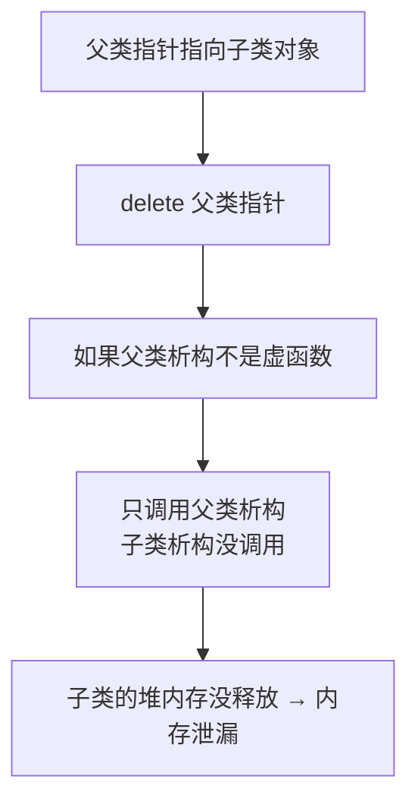
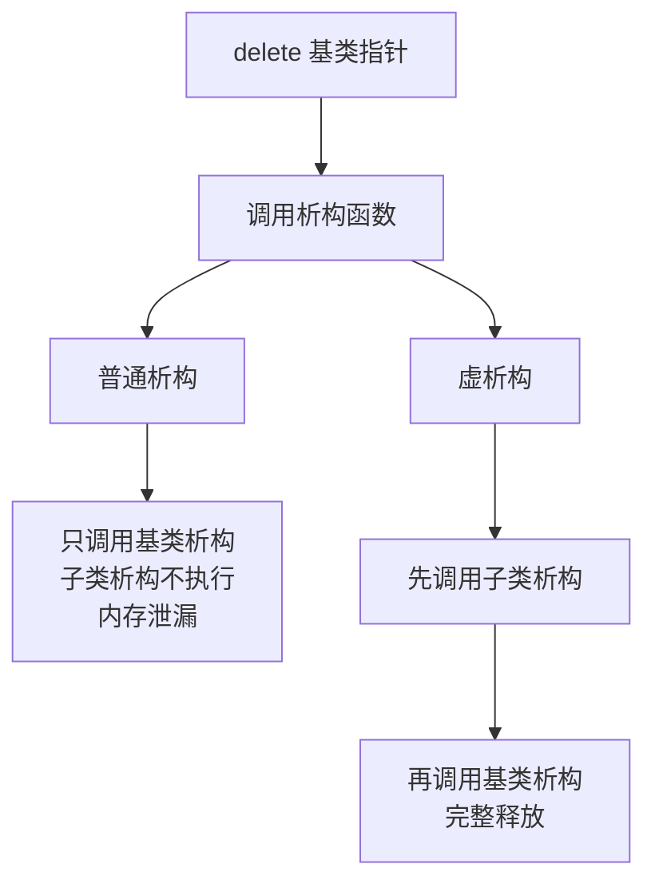
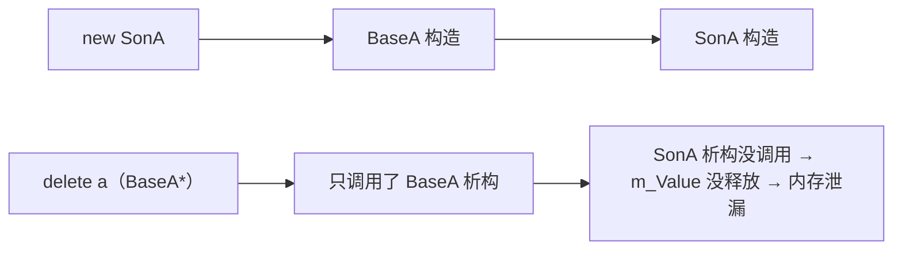
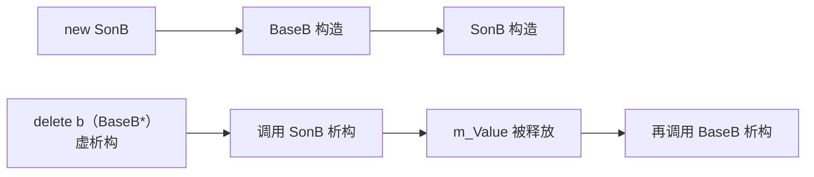
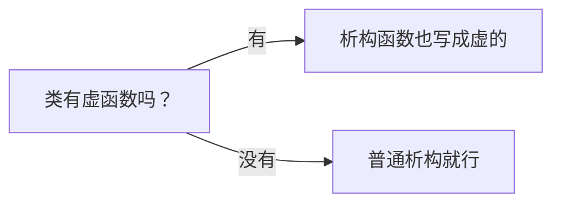

## 本节概述：解决 delete 父类指针时的内存泄漏

虚析构函数主要解决一个问题——**父类指针指向子类对象，delete 父类指针时，子类析构函数调用不到，导致内存泄漏**。





## 先看问题：内存泄漏

父类 BaseA，子类 SonA。子类里有个堆上的成员变量，需要在析构函数里释放。

```cpp
#include <iostream>
using namespace std;

// 父类
class BaseA
{
public:
    BaseA()
    {
        cout << "BaseA 构造函数" << endl;
    }

    ~BaseA()  // 普通析构函数，不是虚函数
    {
        cout << "BaseA 析构函数" << endl;
    }
};

// 子类
class SonA : public BaseA
{
public:
    SonA()
    {
        m_Value = new int(10);  // 在堆上申请内存
        cout << "SonA 构造函数" << endl;
    }

    ~SonA()
    {
        delete m_Value;  // 释放堆内存
        cout << "SonA 析构函数" << endl;
    }

    int* m_Value;
};
```

现在用父类指针指向子类对象，然后 delete：

```cpp
void test01()
{
    BaseA* a = new SonA;  // 父类指针，指向子类对象
    delete a;             // 释放
}
```

运行结果：
```
BaseA 构造函数
SonA 构造函数
BaseA 析构函数
```

看到了吗？**子类的析构函数没调用到！**



子类里 `new` 出来的 `m_Value`，因为析构函数没调用到，所以 `delete` 没执行——这块内存就泄漏了。

> 为什么只调用父类析构？因为父类析构不是虚函数，编译器按指针类型（BaseA*）来决定调用谁的——指针是 BaseA 的，那就调用 BaseA 的析构。

## 解决方案一：虚析构函数

很简单——**在父类析构函数前面加个 `virtual`**。

```cpp
class BaseB
{
public:
    BaseB()
    {
        cout << "BaseB 构造函数" << endl;
    }

    virtual ~BaseB()  // 加 virtual，变成虚析构函数
    {
        cout << "BaseB 析构函数" << endl;
    }
};

class SonB : public BaseB
{
public:
    SonB()
    {
        m_Value = new int(10);
        cout << "SonB 构造函数" << endl;
    }

    ~SonB()
    {
        delete m_Value;
        cout << "SonB 析构函数" << endl;
    }

    int* m_Value;
};
```

同样的操作：

```cpp
void test02()
{
    BaseB* b = new SonB;
    delete b;
}
```

运行结果：
```
BaseB 构造函数
SonB 构造函数
SonB 析构函数
BaseB 析构函数
```

完美！子类析构调用到了，父类析构也调用到了——内存正常释放，没有泄漏。

> 原理跟虚函数一样——析构函数是虚函数，delete 时通过虚函数表找，找到的是子类的析构，子类析构执行完再调用父类析构。



## 解决方案二：纯虚析构函数

跟纯虚函数类似，析构函数也可以写成纯虚的——后面加 `= 0`。

```cpp
class BaseC
{
public:
    virtual ~BaseC() = 0;  // 纯虚析构函数
};
```

但是！纯虚析构跟普通纯虚函数不一样——**纯虚析构必须有实现**。

> 为什么？因为子类析构的时候会调用父类析构，如果父类纯虚析构没实现，子类析构到调用父类那一步就找不到函数了——链接错误。

所以要在类外面补一个实现：

```cpp
BaseC::~BaseC()  // 类外实现纯虚析构
{
    cout << "BaseC 析构函数" << endl;
}
```

完整示例：

```cpp
class BaseC
{
public:
    BaseC()
    {
        cout << "BaseC 构造函数" << endl;
    }

    virtual ~BaseC() = 0;  // 纯虚析构
};

// 纯虚析构必须在类外有实现！
BaseC::~BaseC()
{
    cout << "BaseC 析构函数" << endl;
}

class SonC : public BaseC
{
public:
    SonC()
    {
        m_Value = new int(10);
        cout << "SonC 构造函数" << endl;
    }

    ~SonC()
    {
        delete m_Value;
        cout << "SonC 析构函数" << endl;
    }

    int* m_Value;
};
```

测试：

```cpp
void test03()
{
    BaseC* c = new SonC;
    delete c;
}
```

运行结果跟虚析构一模一样：
```
BaseC 构造函数
SonC 构造函数
SonC 析构函数
BaseC 析构函数
```

## 纯虚析构的作用

纯虚析构跟虚析构效果一样，那为什么还要有纯虚析构？

因为——**有纯虚函数的类是抽象类**。

如果你想让一个类变成抽象类（不能实例化），但又没有其他合适的纯虚函数，就可以把析构函数写成纯虚的——既实现了"抽象类"的目的，又不影响正常使用。

```cpp
BaseC c;  // ❌ 报错：不允许使用抽象类类型的对象
```

> 注意：`BaseC* c = new SonC;` 没问题——这是指针，不是实例化 BaseC 对象。抽象类不能实例化对象，但可以有指针或引用指向子类对象。

## 虚析构 vs 纯虚析构 对比

| 类型 | 有函数体吗 | 父类能实例化吗 | 效果 |
|---|---|---|---|
| **虚析构** | ✅ 类内有 | ✅ 能 | 子类析构能被正确调用 |
| **纯虚析构** | ✅ 类外必须实现 | ❌ 不能（抽象类） | 跟虚析构一样，额外让类变成抽象类 |

> [!WARNING]
> **纯虚析构的坑**
>
> 普通纯虚函数不需要实现（`= 0` 就完事了），但纯虚析构不一样——**必须在类外有实现**。
>
> 不写的话链接报错："无法解析的外部符号"。因为子类析构时会调用父类析构，找不到函数就崩了。

## 什么时候用虚析构

一条经验法则：

> **如果你的类有虚函数，析构函数就写成虚的。**

为什么？因为有虚函数说明这个类是用来被继承的，而且很可能会用父类指针指向子类对象——这种情况下 delete 父类指针就会有内存泄漏的风险，所以析构函数直接写成虚的，保险。



## 本章小结

**虚析构函数**解决父类指针指向子类对象时，delete 调用不到子类析构导致的内存泄漏问题。

1. **普通析构的问题** — delete 父类指针只调用父类析构，子类析构没调用 → 内存泄漏
2. **虚析构** — 父类析构加 `virtual`，delete 时走虚函数表 → 子类析构先调用，再调父类析构
3. **纯虚析构** — 父类析构加 `= 0`，效果跟虚析构一样，额外让类变成抽象类
4. **纯虚析构必须有实现** — 类外要写函数体，否则链接报错
5. **经验法则** — 有虚函数的类，析构函数就写成虚的

