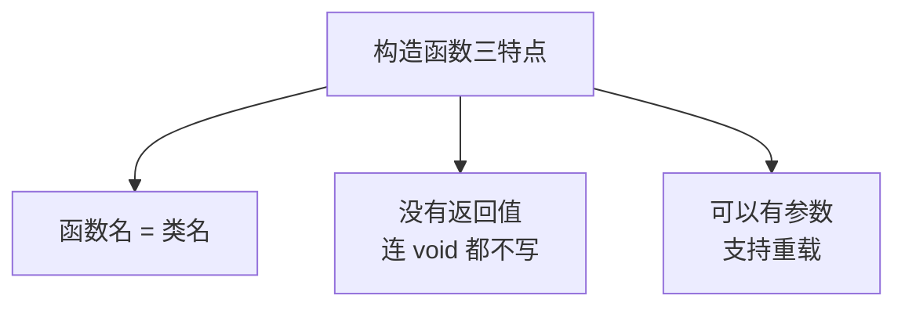
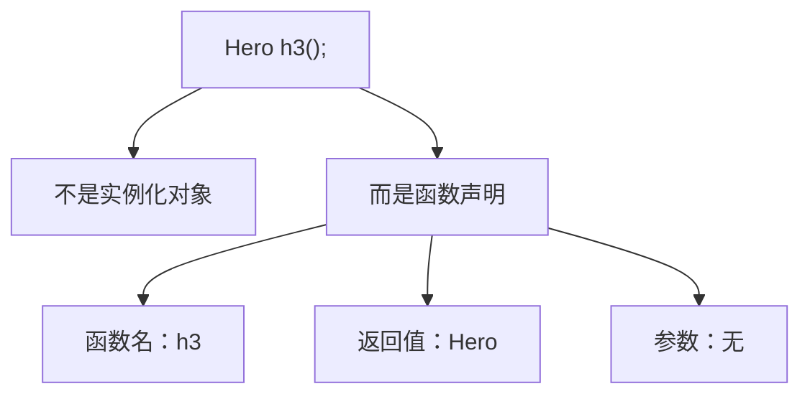

## 本节概述：对象出生时的初始化

你有没有想过一个问题：我们定义了一个类，然后创建一个对象，这个对象刚出生的时候，它的成员变量是什么值？

答案是：不确定的——可能是乱七八糟的随机值。

那怎么办？我们需要在对象创建的时候，自动给成员变量初始化。这件事，就是**构造函数**干的。


构造函数就是对象"出生"时自动调用的那个函数，专门负责初始化。

## 构造函数的三个特点

构造函数长得跟普通函数不太一样，记住三个特点：

| 特点 | 说明 |
|---|---|
| 函数名和类名相同 | 类叫 Hero，构造函数也叫 Hero |
| 没有返回值 | 连 void 都不用写 |
| 可以有参数 | 所以构造函数可以重载 |



## 默认构造函数（无参）

最简单的构造函数就是**无参构造函数**，也叫**默认构造函数**。

```cpp
#include <iostream>
#include <string>
using namespace std;

class Hero
{
public:
    // 默认构造函数（无参）
    Hero()
    {
        m_name = "";
        m_skillCount = 4;
        m_speed = 100;
        cout << "默认构造函数 — Hero 构造完毕" << endl;
    }

private:
    string m_name;
    int m_skillCount;
    int m_speed;
};

int main()
{
    Hero h;   // 创建对象，自动调用默认构造函数

    return 0;
}
```

运行结果：
```
默认构造函数 — Hero 构造完毕
```

看到了吗？我们没有手动调用 `Hero()`，但它自动执行了——**创建对象时，构造函数自动被调用**。

> [!NOTE]
> **不写构造函数会怎样？**
>
> 如果你一个构造函数都不写，编译器会自动给你提供一个默认构造函数。
>
> 但这个编译器提供的默认构造函数是空的——里面什么都不做，成员变量不会被初始化，值是随机的。
>
> 所以一般我们都会自己写构造函数，把成员变量初始化好。

## 有参构造函数

默认构造函数只能给所有对象同样的初始值。如果我想让每个英雄有不同的名字怎么办？

答案是：**有参构造函数**——通过参数把值传进来。

```cpp
class Hero
{
public:
    // 默认构造函数（无参）
    Hero()
    {
        m_name = "";
        m_skillCount = 4;
        m_speed = 100;
        cout << "默认构造函数 — Hero 构造完毕" << endl;
    }

    // 有参构造函数（传一个名字）
    Hero(string name)
    {
        m_name = name;
        m_skillCount = 4;
        m_speed = 100;
        cout << "有参构造函数 — " << name << " 构造完毕" << endl;
    }

private:
    string m_name;
    int m_skillCount;
    int m_speed;
};
```

创建对象的时候传参数，就会调用有参构造函数：

```cpp
int main()
{
    Hero h1;            // 不传参数 → 调用默认构造函数
    Hero h2("剑圣");    // 传一个 string → 调用有参构造函数

    return 0;
}
```

运行结果：
```
默认构造函数 — Hero 构造完毕
有参构造函数 — 剑圣 构造完毕
```

编译器会根据你传的参数数量和类型，自动匹配对应的构造函数——这就是**构造函数重载**。

## 构造函数可以有很多个

构造函数支持重载——你可以写好多个，参数不一样就行。

比如我们再写一个接收两个参数的：

```cpp
class Hero
{
public:
    // 默认构造
    Hero() { ... }

    // 有参构造 1 个参数：名字
    Hero(string name) { ... }

    // 有参构造 2 个参数：名字 + 技能数
    Hero(string name, int skillCount)
    {
        m_name = name;
        m_skillCount = skillCount;
        m_speed = 100;
        cout << "有参构造函数（两个参数）— " << name << endl;
    }

private:
    string m_name;
    int m_skillCount;
    int m_speed;
};
```

用的时候：

```cpp
Hero h3("猴子", 4);   // 传两个参数 → 调用两个参数的构造函数
```

想写几个写几个，只要参数列表不一样就行。


## 一个经典坑：Hero h() 不是实例化

这里有一个非常容易踩的坑，一定要注意：

```cpp
Hero h3();   // 这不是创建对象！
```

你可能以为这是在调用默认构造函数，但它不是。

这玩意儿其实是一个**函数声明**——声明了一个叫 `h3` 的函数，返回值是 `Hero` 类型，没有参数。



就跟 `int main()`、`void func()` 是一个路数，只是返回值从 `int` 变成了 `Hero` 而已。

**那无参构造到底怎么写？** 两种正确写法：

```cpp
Hero h1;        // 写法一：直接写，不加括号
Hero h2{};      // 写法二：用大括号（C++11 以后）
```

这两种都会调用默认构造函数。唯独加小括号 `Hero h3()` 不行——它是函数声明，不是创建对象。

> [!WARNING]
> **经典大坑：`Hero h3()` 不是创建对象！**
>
> 这是 C++ 里最经典的坑之一，无数人踩过。无参构造调用的时候不要加小括号，直接写 `Hero h;` 就好。

## 另一种写法：匿名对象赋值

再补充一种调用有参构造的写法：

```cpp
Hero h5 = Hero("剑圣");
```

这行代码干了什么？

1. 先创建一个**匿名对象**（没有名字的临时对象），调用有参构造函数
2. 然后把这个匿名对象赋值给 `h5`


效果跟 `Hero h5("剑圣");` 是一样的，只是写法不同。知道有这么个写法就行，平时用第一种就够了。

## 本章小结

**构造函数**是对象创建时自动调用的函数，专门用来初始化成员变量。

**三个核心特点**：
1. **函数名和类名相同** — 类叫 Hero，构造函数也叫 Hero
2. **没有返回值** — 连 void 都不用写
3. **可以有参数，支持重载** — 可以写多个构造函数，参数不同就行

**两种基本构造函数**：
- **默认构造函数（无参）** — 创建对象时不传参数就调用它
- **有参构造函数** — 传参数时调用，可以给每个对象不同的初始值

**一个经典大坑**：`Hero h3()` 不是创建对象，是函数声明！无参构造写 `Hero h;` 或 `Hero h{};`。

**编译器的默认构造**：如果你一个构造函数都不写，编译器会给你一个空的默认构造（什么都不做）。但只要你写了任意一个构造函数，编译器就不再提供默认的了。