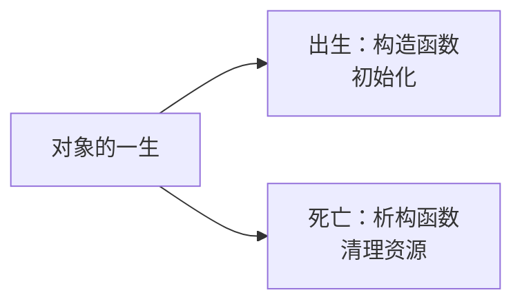
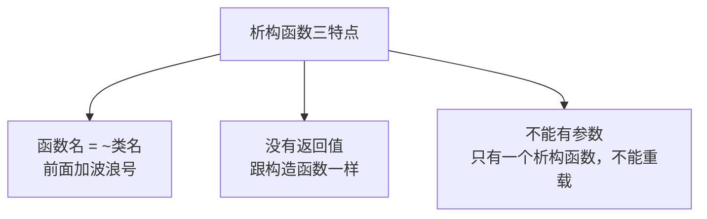
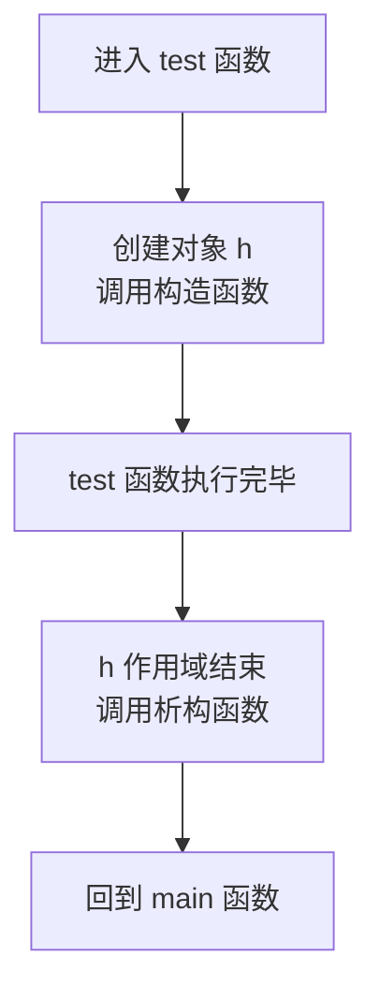
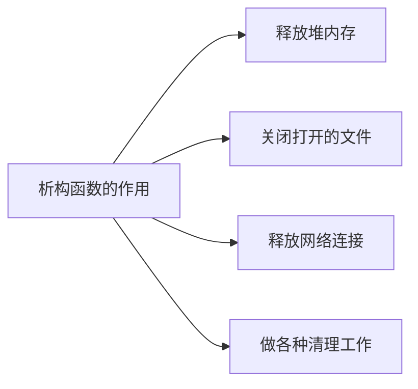

## 本节概述：对象销毁时的清理

上一节我们学了构造函数——对象创建时自动调用，负责初始化。

这一节学它的"好兄弟"：**析构函数**。

构造函数是对象"出生"时调用，析构函数就是对象"死亡"前调用——专门负责清理工作，比如释放堆内存、关闭文件等等。



## 析构函数的语法

析构函数长得跟构造函数很像，就是在前面多了一个**波浪号 `~`**。

```cpp
class Hero
{
public:
    // 构造函数
    Hero()
    {
        cout << "Hero 默认构造函数调用完毕" << endl;
    }

    // 析构函数
    ~Hero()
    {
        cout << "Hero 析构函数调用完毕" << endl;
    }
};
```

就这么简单——构造函数前面加个 `~`，就是析构函数了。

## 析构函数的三个特点

析构函数跟构造函数有相同点，也有不同点，记住三个特点：

| 特点 | 构造函数 | 析构函数 |
|---|---|---|
| 函数名 | 和类名相同 | 和类名相同，前面加 `~` |
| 返回值 | 没有 | 没有 |
| 参数 | 可以有，支持重载 | **不能有，不支持重载** |



前两点跟构造函数一样，第三点正好相反——构造函数可以有很多个（重载），但析构函数**只能有一个**，因为它不需要参数。

为什么不需要参数？也很好理解：构造的时候你可能需要传各种初始值，但销毁的时候直接销毁就行了，不需要传什么东西进去。

> [!NOTE]
> **不写析构函数会怎样？**
>
> 跟构造函数一样，如果你不写析构函数，编译器会自动给你提供一个空的析构函数——什么也不做。
>
> 当你的类里没有申请堆内存、打开文件之类需要手动释放的资源时，用默认的空析构就够了。但如果类里有堆内存，就必须自己写析构函数来释放（后面学深拷贝浅拷贝的时候会详细讲）。

## 析构函数什么时候调用

析构函数是在对象被销毁前自动调用的。那对象什么时候被销毁？

我们通过两个例子来看。

### 例子一：main 函数里的对象

```cpp
#include <iostream>
using namespace std;

class Hero
{
public:
    Hero()
    {
        cout << "Hero 默认构造函数调用完毕" << endl;
    }

    ~Hero()
    {
        cout << "Hero 析构函数调用完毕" << endl;
    }
};

int main()
{
    Hero h;   // 这里调用构造函数

    cout << "程序还在运行..." << endl;

    return 0; // main 结束前，h 被销毁，调用析构函数
}
```

运行结果：
```
Hero 默认构造函数调用完毕
程序还在运行...
Hero 析构函数调用完毕
```

可以看到：**对象在它的作用域结束时被销毁，销毁前自动调用析构函数**。

`h` 定义在 main 函数里，main 结束了它的作用域就结束了，所以析构函数在 `return 0` 之前被调用。

### 例子二：函数里的局部对象

再看一个更明显的例子——对象定义在某个函数里：

```cpp
void test()
{
    Hero h;   // 进入函数，创建对象 → 构造函数
}
// 函数结束，h 的作用域结束 → 析构函数

int main()
{
    cout << "调用 test 前" << endl;
    test();
    cout << "调用 test 后" << endl;

    return 0;
}
```

运行结果：
```
调用 test 前
Hero 默认构造函数调用完毕
Hero 析构函数调用完毕
调用 test 后
```



非常清晰：`h` 是 `test()` 函数里的局部变量，函数一结束，它的生命周期就到了，自动调用析构函数清理掉。

> 一句话总结：**对象在它的作用域结束时被销毁，销毁前自动调用析构函数。**

## 析构函数的作用

你可能会问：对象销毁了，内存不就自动回收了吗？那析构函数有啥用？

栈内存确实会自动回收，但如果你的对象在堆上申请了内存呢？

```cpp
class Hero
{
public:
    Hero()
    {
        m_name = new char[32];  // 在堆上申请了内存
    }

    ~Hero()
    {
        delete[] m_name;       // 析构函数里释放堆内存
    }

private:
    char *m_name;
};
```

如果没有析构函数释放 `m_name`，对象销毁了但堆内存还在——这就是**内存泄漏**。析构函数就是干这个的：对象死之前，把它占用的其他资源先释放干净。



现在我们还没学到堆内存的类内申请，所以暂时感觉不到析构函数的威力。等学到深拷贝和浅拷贝的时候，你就知道析构函数有多重要了。

## 本章小结

**析构函数**是对象销毁前自动调用的函数，负责清理工作，和构造函数是一对儿。

**三个核心特点**：
1. **函数名是 ~类名** — 在类名前面加波浪号 `~`
2. **没有返回值** — 跟构造函数一样
3. **不能有参数** — 所以析构函数只有一个，不能重载（这是和构造函数最大的区别）

**调用时机**：对象的作用域结束时，系统自动调用析构函数。函数里的对象，函数结束就析构；main 里的对象，main 结束才析构。

**作用**：释放堆内存、关闭文件、断开连接等清理工作。如果类里没有需要手动释放的资源，用编译器提供的空析构就行。
