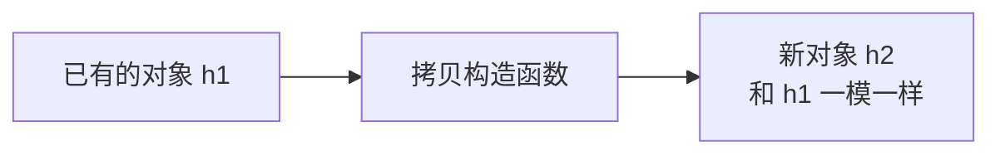
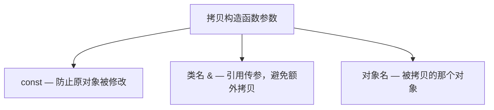
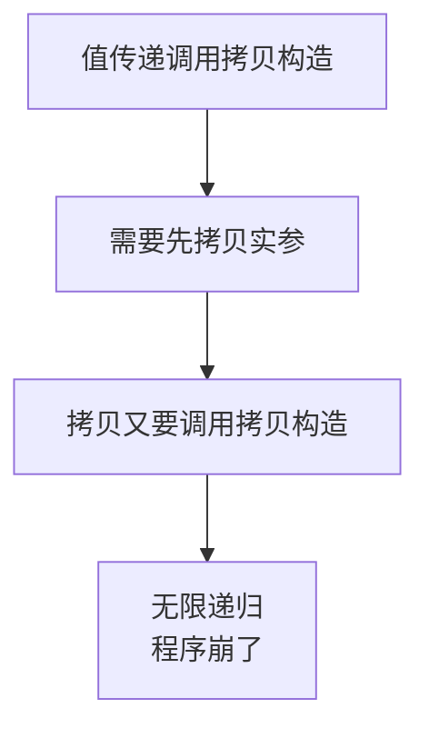
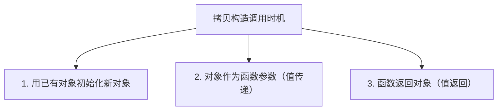
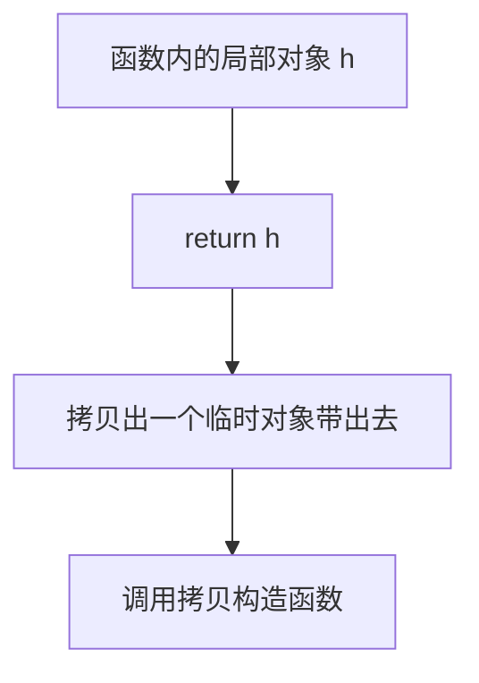

## 本节概述：用一个对象复制出另一个对象

前面我们学了默认构造函数和有参构造函数，这一节学一个特殊的构造函数——**拷贝构造函数**。

它特殊在哪呢？它的作用是：**用一个已经存在的对象，复制出一个新的对象**。



就像复印机一样——给它一张原稿，它印出一份一模一样的副本。

## 拷贝构造函数的语法

拷贝构造函数也是构造函数的一种，所以它也符合构造函数的特点：函数名和类名相同、没有返回值。

但它的参数比较特殊，固定长这样：

```cpp
Hero(const Hero &h)
{
    // 把 h 的成员一个个拷贝过来
    m_hp = h.m_hp;
}
```

**标准格式记一下**：

```
类名(const 类名 &对象名)
```



为什么参数一定是 `const + 引用`？我们一个一个说。

### 为什么要用引用

如果不用引用，直接传值会怎么样？

```cpp
Hero(Hero h)  // 错误！不能这么写
{
    m_hp = h.m_hp;
}
```

这样写会出问题——因为值传递需要把实参拷贝一份给形参，而"拷贝"这个动作本身又要调用拷贝构造函数……

结果就是：**拷贝构造函数调用拷贝构造函数，再调用拷贝构造函数……无限递归，直接栈溢出**。



所以必须用引用——引用是别名，不需要拷贝，也就不会递归了。

### 为什么要用 const

加 `const` 是为了**保护原对象不被修改**。

拷贝构造的本意是：我拿 a 对象来复制出一个 b 对象，a 应该原封不动才对。

如果不加 const，万一你在拷贝构造函数里手滑把原对象改了，外面的 a 就变了——这显然不合理。

加了 const 之后，编译器会帮你盯着：你要是敢改传进来的对象，直接给你报错。

```cpp
Hero(const Hero &h)
{
    // h.m_hp = 1000;  // 报错！const 对象不能修改
    m_hp = h.m_hp;      // 读是可以的
}
```

> 一句话：**引用避免无限递归，const 保护原对象不被修改。**

## 完整示例

我们写一个完整的 Hero 类，把三个构造函数都放进去：

```cpp
#include <iostream>
using namespace std;

class Hero
{
public:
    // 默认构造函数
    Hero()
    {
        m_hp = 100;
        cout << "默认构造函数调用完毕" << endl;
    }

    // 有参构造函数
    Hero(int hp)
    {
        m_hp = hp;
        cout << "有参构造函数调用完毕" << endl;
    }

    // 拷贝构造函数
    Hero(const Hero &h)
    {
        m_hp = h.m_hp;
        cout << "拷贝构造函数调用完毕" << endl;
    }

    // 析构函数
    ~Hero()
    {
        cout << "析构函数调用完毕" << endl;
    }

private:
    int m_hp;
};
```

有了这个类，我们下面来看看拷贝构造函数在哪些情况下会被调用。

## 拷贝构造函数的调用时机

拷贝构造函数有三种常见的调用场景：



### 时机一：用已有对象初始化新对象

这个最直观——我已经有一个对象了，想用它复制出一个新的。

```cpp
void func1()
{
    cout << "=== func1 ===" << endl;
    Hero h1(20);    // 有参构造
    Hero h2(h1);    // 用 h1 拷贝出 h2 → 调用拷贝构造函数
}
```

运行结果：
```
=== func1 ===
有参构造函数调用完毕
拷贝构造函数调用完毕
析构函数调用完毕
析构函数调用完毕
```

流程很清晰：
1. `h1` 出生 — 有参构造
2. `h2` 出生 — 拷贝构造（从 h1 复制）
3. 函数结束 — h2 和 h1 先后析构

### 时机二：对象作为函数参数（值传递）

当你把一个对象按值传递给函数的时候，也会调用拷贝构造函数——因为值传递要拷贝一份嘛。

```cpp
void test1(Hero h)
{
    // 形参 h 是实参的拷贝，调用了拷贝构造函数
}

void func2()
{
    cout << "=== func2 ===" << endl;
    Hero h1(20);    // 有参构造
    test1(h1);      // 值传递 → 调用拷贝构造函数
}
```

运行结果：
```
=== func2 ===
有参构造函数调用完毕
拷贝构造函数调用完毕
析构函数调用完毕
析构函数调用完毕
```


> 那如果传的是指针呢？比如 `void test2(Hero *h)`？
>
> 答案是：**不会调用拷贝构造函数**。因为指针传的是地址，没有生成新的对象，当然就不需要拷贝了。
>
> 拷贝构造的前提是——要有新对象诞生。

### 时机三：函数返回对象（值返回）

当函数的返回值是一个对象（值返回）的时候，也会调用拷贝构造函数——因为函数里的局部对象要被拷贝一份带出去。

```cpp
Hero test3()
{
    Hero h(40);
    return h;   // 返回局部对象 → 调用拷贝构造函数
}

void func3()
{
    cout << "=== func3 ===" << endl;
    Hero h = test3();
}
```



> [!NOTE]
> **关于 RVO 优化**
>
> 你实际运行上面的代码，可能会发现**没有调用拷贝构造函数**——这是因为编译器做了 **RVO 优化**（Return Value Optimization，返回值优化）。
>
> 编译器发现："我先在函数里造一个对象，再拷贝出去，多麻烦啊，我直接在外面造好不就行了？"于是它把多余的那次拷贝给省掉了，效率更高。
>
> RVO 是编译器的优化行为，不影响我们理解语法。你只要知道：**从语法上讲，函数值返回对象会调用拷贝构造函数**就行了。

## 本章小结

**拷贝构造函数**是一种特殊的构造函数，作用是用一个已有对象复制出一个新对象。

**语法格式**：`类名(const 类名 &对象名)` —— 记住这固定三件套：
- **const** — 保护原对象不被修改
- **引用 &** — 避免值传递导致的无限递归
- **参数是同类对象** — 被拷贝的那个对象

**为什么必须用引用**：如果用值传递，传参的时候要先拷贝，拷贝又要调用拷贝构造，就无限递归了。

**三种调用时机**：
1. **用已有对象初始化新对象** — `Hero h2(h1);`
2. **对象值传递给函数** — 形参是实参的拷贝
3. **函数值返回对象** — 返回值是局部对象的拷贝（编译器可能做 RVO 优化省掉）

**一个判断原则**：只要有新对象被复制出来，就会调用拷贝构造函数。如果只是传地址（指针、引用），没有新对象，就不会调用。
