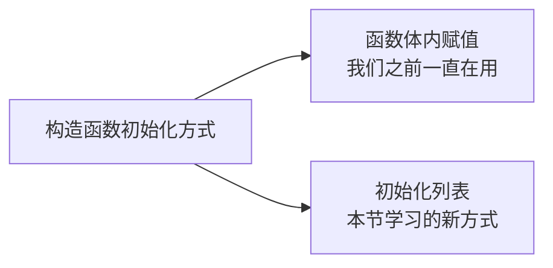
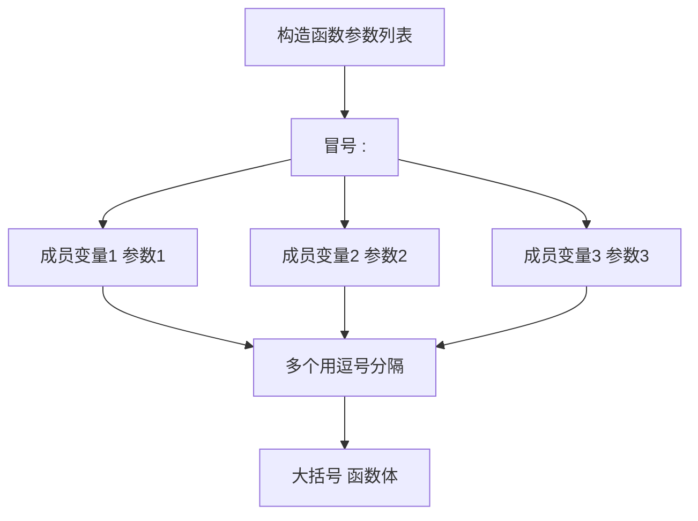
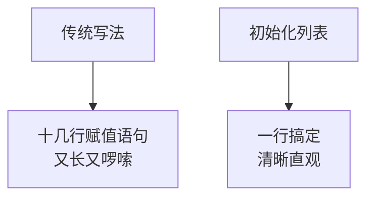

## 本节概述：更优雅的初始化方式

前面我们写构造函数的时候，都是在函数体里面给成员变量赋值：

```cpp
Hero(string name, int hp)
{
    m_name = name;
    m_hp = hp;
}
```

这种写法虽然没问题，但 C++ 还给我们提供了一种更优雅、更高效的初始化方式——**初始化列表**。



## 初始化列表的语法

初始化列表写在构造函数的参数列表后面，用一个冒号 `:` 开头，然后把每个成员变量和对应的参数用括号连起来。

**语法格式**：

```
构造函数(参数列表) : 成员变量1(参数1), 成员变量2(参数2), ...
{
    // 函数体（可以是空的）
}
```



看着有点绕，直接上代码就明白了。

## 代码示例

还是用我们熟悉的英雄类来演示。

### 传统写法 vs 初始化列表写法

```cpp
#include <iostream>
#include <string>
using namespace std;

class Hero
{
public:
    // 传统写法：函数体内赋值
    /*
    Hero(string name, int hp, int speed)
    {
        m_name = name;
        m_hp = hp;
        m_speed = speed;
    }
    */

    // 初始化列表写法
    Hero(string name, int hp, int speed)
        : m_name(name), m_hp(hp), m_speed(speed)
    {
        // 函数体可以是空的
        // 因为初始化工作已经在冒号后面完成了
    }

    void print()
    {
        cout << "英雄：" << m_name
             << " 的血量是" << m_hp
             << "，速度是" << m_speed << endl;
    }

private:
    string m_name;
    int m_hp;
    int m_speed;
};

int main()
{
    Hero h("剑圣", 100, 10);
    h.print();

    return 0;
}
```

运行结果：
```
英雄：剑圣 的血量是100，速度是10
```

效果跟传统写法完全一样，但写法更简洁——初始化工作直接在参数列表后面就搞定了。

> [!TIP]
> **怎么读这段代码？**
>
> `Hero(string name, int hp, int speed) : m_name(name), m_hp(hp), m_speed(speed)`
>
> 从左往右读：构造函数接收三个参数，然后用 name 初始化 m_name，用 hp 初始化 m_hp，用 speed 初始化 m_speed。
>
> 就像在说："把 name 给 m_name，把 hp 给 m_hp，把 speed 给 m_speed。"

## 初始化列表的好处

你可能会问：不就是换了种写法吗，有什么特别的？

好处主要有两个：

### 好处一：语法更简洁

成员越多，优势越明显。想象一下有十几个成员变量的类，传统写法要写十几行赋值语句，初始化列表一行就搞定了。



### 好处二：效率更高（针对类类型成员）

对于 `int`、`double` 这种基本类型，两种写法差别不大。

但如果成员是类类型（比如 `string`、另一个类的对象），区别就大了：
- **传统写法**：先默认构造成员，再赋值（两次操作）
- **初始化列表**：直接构造成员（一次操作）

简单说就是——初始化列表少了一步多余的默认构造，效率更高。

> 这个涉及到构造顺序的问题，等我们学了"对象成员"和"构造析构顺序"之后，你会理解得更深刻。现在先记住：初始化列表效率更高，是 C++ 的推荐写法。

## 注意事项

使用初始化列表有几个小细节需要注意：

1. **顺序不影响结果** — 初始化列表里成员的先后顺序不影响最终结果，每个成员都会被正确初始化。但有个冷知识：成员初始化的实际顺序是按照它们在类中声明的顺序来的，不是按初始化列表里的顺序。不过一般不用纠结这个，按声明顺序写就好。

2. **可以和函数体共存** — 初始化列表负责初始化成员，函数体里可以写其他逻辑（比如打印日志、做校验），两者不冲突。

3. **每个构造函数都可以有自己的初始化列表** — 默认构造、有参构造、拷贝构造，都可以用初始化列表。

## 本章小结

**初始化列表**是构造函数的另一种写法，用冒号 `:` 后面跟成员初始化列表，比在函数体内赋值更优雅、更高效。

**语法**：`构造函数(参数) : 成员1(参数1), 成员2(参数2), ... { }`

**两个好处**：
1. **写法简洁** — 一行搞定多个成员的初始化，代码清晰直观
2. **效率更高** — 对于类类型的成员，省去了默认构造再赋值的多余操作

**使用建议**：养成用初始化列表的习惯，这是 C++ 的推荐写法，也是企业开发中的通用风格。
