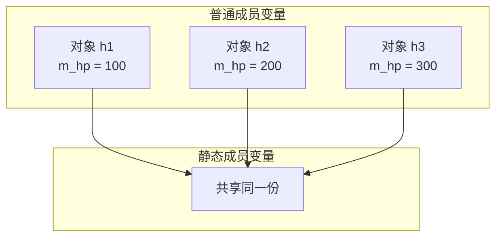
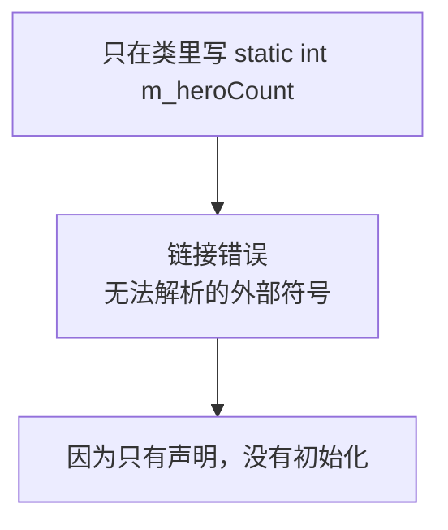
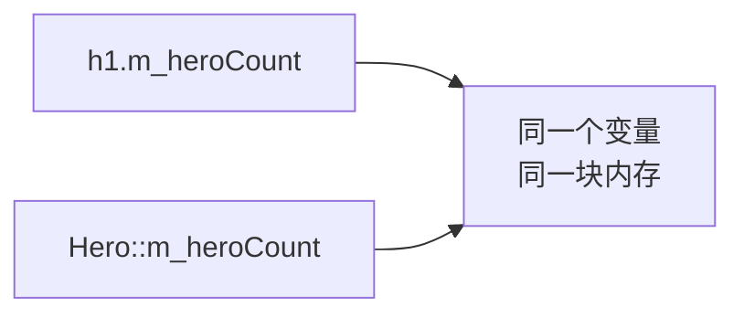
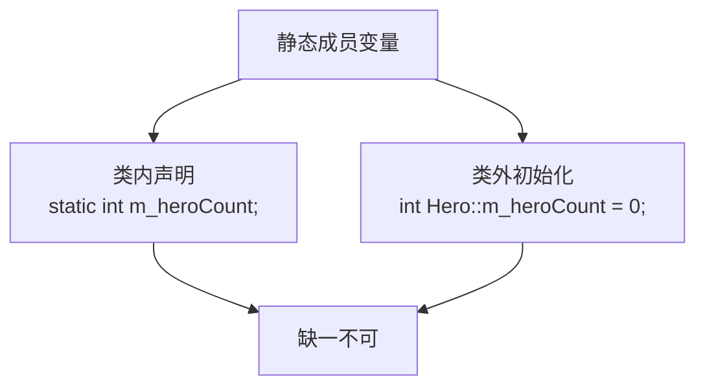
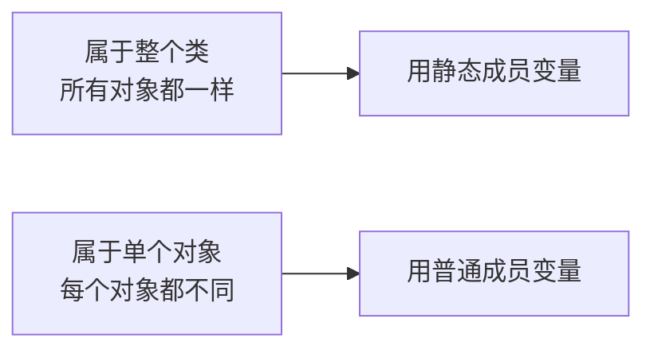

## 本节概述：所有对象共享的数据

前面我们学的成员变量，每个对象都有自己的一份——比如每个英雄都有自己的名字、自己的血量，互不干扰。

但有时候我们需要一种数据：**整个类只有一份，所有对象共享它**。

比如我想统计"当前一共有多少个英雄对象被创建了"——这个计数器不应该属于某一个英雄，而应该属于整个英雄类。

这就是我们这一节要学的：**静态成员变量**。



## 静态成员变量的语法

在成员变量前面加一个 **`static`** 关键字，它就变成静态成员变量了。

```cpp
class Hero
{
public:
    static int m_heroCount;  // 静态成员变量：统计英雄总数

private:
    string m_name;
    int m_hp;
};
```

但是！光这样写还不够——如果你直接用，编译器会报错：**无法解析的外部符号**（链接错误）。



### 为什么会报错

因为静态成员变量需要**两步**：类里声明 + 类外初始化。

| 步骤 | 位置 | 做什么 |
|---|---|---|
| 第一步 | 类的内部 | 声明静态成员变量（告诉编译器"有这么个东西"） |
| 第二步 | 类的外部 | 初始化静态成员变量（真正分配内存、赋初值） |

类里的 `static int m_heroCount;` 只是声明，还没有真正分配内存。必须在类外面再写一遍初始化才行。

### 正确写法：类内声明 + 类外初始化

```cpp
#include <iostream>
#include <string>
using namespace std;

class Hero
{
public:
    // 构造函数：每创建一个英雄，计数 +1
    Hero(string name, int hp)
    {
        m_name = name;
        m_hp = hp;
        m_heroCount++;   // 静态成员：每创建一个就 +1
    }

    static int m_heroCount;  // 第一步：类内声明

private:
    string m_name;
    int m_hp;
};

// 第二步：类外初始化（必须写！）
// 类名::变量名 = 初值
int Hero::m_heroCount = 0;
```

**注意格式**：`类型 类名::变量名 = 初值;`

- 要写在类的外面
- 用 `类名::` 来标明这是哪个类的静态成员
- 给它赋一个初始值

> 这个 `::` 叫**作用域解析符**，就是告诉编译器："这个 m_heroCount 是 Hero 类下面的，不是别的什么地方的。"

## 静态成员变量怎么访问

静态成员变量有两种访问方式：

### 方式一：通过对象访问

```cpp
Hero h1("剑圣", 100);
cout << h1.m_heroCount << endl;  // 通过对象访问
```

### 方式二：通过类名访问

```cpp
cout << Hero::m_heroCount << endl;  // 通过类名访问
```

两种方式都能拿到值。那它们拿到的是同一个东西吗？我们来验证一下：

```cpp
int main()
{
    Hero h1("剑圣", 100);

    // 两种方式访问
    cout << "通过对象：" << h1.m_heroCount << endl;
    cout << "通过类名：" << Hero::m_heroCount << endl;

    // 打印地址看看是不是同一个
    cout << "对象方式的地址：" << &h1.m_heroCount << endl;
    cout << "类名方式的地址：" << &Hero::m_heroCount << endl;

    return 0;
}
```

运行结果（地址值每次运行可能不同，但关键是两个地址一样）：
```
通过对象：1
通过类名：1
对象方式的地址：0x405000
类名方式的地址：0x405000
```

两个地址完全一样——说明它们就是**同一个变量**。



## 静态成员变量的特点

我们来总结一下静态成员变量的核心特点：

### 特点一：所有对象共享同一份

这是静态成员变量最重要的特点——不管你创建多少个对象，静态成员变量只有一份，大家共用。

```cpp
int main()
{
    cout << "初始计数：" << Hero::m_heroCount << endl;  // 0

    Hero h1("剑圣", 100);
    cout << "创建 h1 后：" << Hero::m_heroCount << endl;  // 1

    Hero h2("猴子", 80);
    cout << "创建 h2 后：" << Hero::m_heroCount << endl;  // 2

    Hero h3("赵云", 120);
    cout << "创建 h3 后：" << Hero::m_heroCount << endl;  // 3

    return 0;
}
```

运行结果：
```
初始计数：0
创建 h1 后：1
创建 h2 后：2
创建 h3 后：3
```

三个英雄，共用同一个计数器。每创建一个，计数就 +1，所有对象看到的都是同一个值。

### 特点二：编译阶段就分配内存

普通成员变量是在创建对象的时候才分配内存的（栈区或堆区），但静态成员变量不一样——它在**编译阶段**就已经分配好内存了，存在全局区。

这也是为什么它不需要等对象创建就已经存在——你甚至一个对象都没创建，也能通过 `类名::` 的方式访问它。

### 特点三：类内声明，类外初始化

这是我们前面踩过的坑——静态成员变量必须在类内声明、类外初始化，缺了类外那一步会报链接错误。



## 什么时候用静态成员变量

那什么时候该用静态成员变量呢？给你一个判断标准：

**如果这个属性属于整个类，而不是属于某个具体对象，那就应该用静态的。**

比如：
- 英雄的总数 — 属于整个英雄类，不是某个英雄的 → **静态**
- 英雄的名字 — 每个英雄都有自己的名字 → **普通**
- 英雄的血量 — 每个英雄血量不一样 → **普通**
- 英雄的最低血量上限 — 所有英雄都一样 → **静态**



## 本章小结

**静态成员变量**是被所有对象共享的成员变量，在前面加 `static` 关键字。

**三大特点**：
1. **所有对象共享同一份数据** — 一个对象改了，所有对象看到的都变了
2. **编译阶段分配内存** — 存在全局区，对象创建之前就已经存在
3. **类内声明，类外初始化** — 必须在类外面写 `类型 类名::变量名 = 初值;`，否则报链接错误

**两种访问方式**：
- 通过对象：`h.m_heroCount`
- 通过类名：`Hero::m_heroCount`（推荐，更能体现"属于类"的特性）

**使用场景**：当某个属性属于整个类、而不属于某个具体对象的时候，就用静态成员变量。
