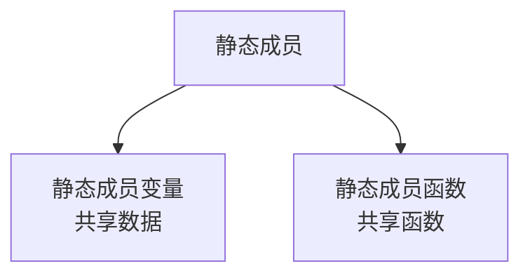
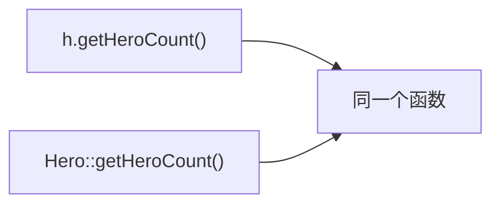
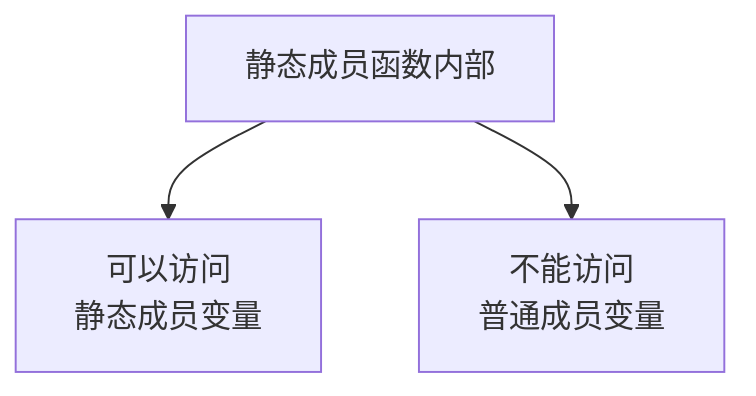
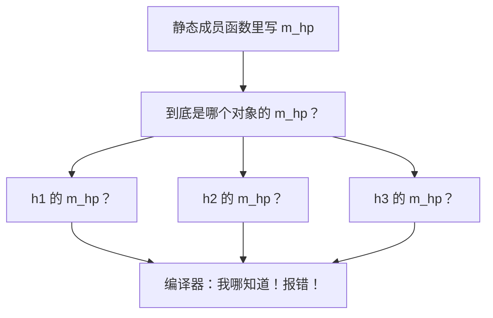

## 本节概述：所有对象共享的函数

上一节我们学了静态成员变量——所有对象共享同一份数据。

这一节学它的搭档：**静态成员函数**——所有对象共享同一个函数。



静态成员函数有两个核心特点：
1. **所有对象共享同一个函数**
2. **只能访问静态成员变量，不能访问普通成员变量**

## 静态成员函数的语法

在成员函数前面加一个 **`static`** 关键字，它就变成静态成员函数了。

```cpp
class Hero
{
public:
    // 静态成员函数：获取英雄总数
    static int getHeroCount()
    {
        return m_heroCount;
    }

    static int m_heroCount;  // 静态成员变量

private:
    string m_name;
    int m_hp;
};

// 静态成员变量类外初始化
int Hero::m_heroCount = 100;
```

跟普通成员函数比，区别就只是前面多了个 `static`。

> 注意：静态成员函数只能在声明的时候写 `static`，类外实现的时候**不用写** `static`，只需要 `类名::函数名` 就行。

## 两种调用方式

跟静态成员变量一样，静态成员函数也有两种调用方式：

### 方式一：通过对象调用

```cpp
Hero h;
cout << h.getHeroCount() << endl;  // 通过对象调用
```

### 方式二：通过类名调用

```cpp
cout << Hero::getHeroCount() << endl;  // 通过类名调用
```

两种方式调用的是**同一个函数**，效果完全一样。



完整代码跑一下：

```cpp
#include <iostream>
#include <string>
using namespace std;

class Hero
{
public:
    // 默认构造函数
    Hero()
    {
        m_hp = 100;
        m_name = "英雄";
    }

    ~Hero() {}

    // 静态成员函数：获取英雄总数
    static int getHeroCount()
    {
        return m_heroCount;
    }

    static int m_heroCount;  // 静态成员变量声明

private:
    string m_name;
    int m_hp;
};

// 静态成员变量类外初始化
int Hero::m_heroCount = 100;

int main()
{
    Hero h;

    // 方式一：通过对象调用
    cout << "通过对象调用：" << h.getHeroCount() << endl;

    // 方式二：通过类名调用
    cout << "通过类名调用：" << Hero::getHeroCount() << endl;

    return 0;
}
```

运行结果：
```
通过对象调用：100
通过类名调用：100
```

两种方式拿到的结果完全一样，因为调用的就是同一个函数。

## 核心特点：只能访问静态成员变量

这是静态成员函数最重要的一个特点——**它里面只能用静态成员变量，不能用普通成员变量**。



我们来试试——在静态成员函数里操作普通成员变量：

```cpp
static int getHeroCount()
{
    m_hp++;  // 试试操作普通成员变量
    return m_heroCount;
}
```

编译器直接报错：

```
非静态成员引用必须与特定对象相对
```

这报错说的有点绕，翻译成人话就是：**静态成员函数不属于任何一个对象，它不知道你要操作的是哪个对象的 m_hp。**

### 为什么会这样

我们来想一下：

- 普通成员变量 — 每个对象都有一份，`h1.m_hp` 和 `h2.m_hp` 是两个不同的东西
- 静态成员函数 — 所有对象共享同一个，不属于任何一个具体的对象

那问题来了：静态成员函数里如果写了 `m_hp`，它到底指的是 h1 的 m_hp？还是 h2 的？还是 h3 的？



答案是：编译器也不知道。所以它干脆不允许你这么写——静态成员函数里不能用普通成员变量。

而静态成员变量就不一样了——它只有一份，所有对象共享，所以不存在"到底是哪个的"这个问题。

> [!TIP]
> **一句话记住**：静态成员函数没有 `this` 指针，所以它找不到具体是哪个对象的普通成员。
>
> （`this` 指针我们后面会专门学，现在先记住这个结论就行。）

## 静态成员函数也有访问权限

跟成员变量一样，静态成员函数也受访问权限控制。

如果你把静态成员函数写在 `private` 下面，类外面就访问不到了：

```cpp
class Hero
{
public:
    static int m_heroCount;

private:
    // 私有静态成员函数
    static int getHeroCount2()
    {
        return m_heroCount;
    }
};

int main()
{
    Hero::getHeroCount2();  // 报错！类外访问不到 private 的函数
    return 0;
}
```

规则跟普通成员函数完全一样——public 类内能访问类外也能访问，private 只有类内能访问。

## 静态成员变量 vs 静态成员函数 对比

最后用一张表把静态成员的知识点串一下：

| | 静态成员变量 | 静态成员函数 |
|---|---|---|
| 共同点 | 所有对象共享同一份 | 所有对象共享同一个 |
| 关键字 | `static` | `static` |
| 调用方式 | 对象.变量 / 类名::变量 | 对象.函数() / 类名::函数() |
| 特殊点 | 类内声明，类外初始化 | 只能访问静态成员变量 |
| 访问权限 | 受 public/private 控制 | 受 public/private 控制 |

## 本章小结

**静态成员函数**是所有对象共享的成员函数，前面加 `static` 关键字。

**两大特点**：
1. **所有对象共享同一个函数** — 只有一份，不隶属于任何一个对象
2. **只能访问静态成员变量** — 不能访问普通成员变量，因为它不知道该操作哪个对象的

**两种调用方式**：
- 通过对象：`h.getHeroCount()`
- 通过类名：`Hero::getHeroCount()`（推荐）

**为什么只能访问静态成员变量**：因为静态成员函数不属于某个具体对象，普通成员变量每个对象都有一份，函数不知道该取哪个对象的。

**访问权限**：静态成员函数也受 public/private/protected 控制，规则跟普通成员函数一样。
