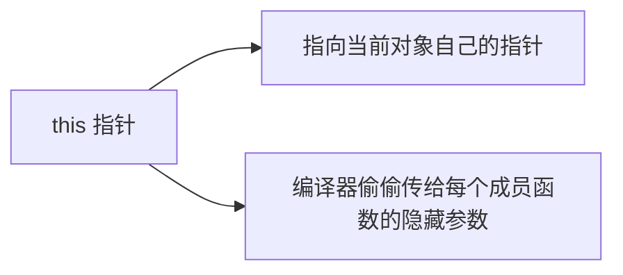
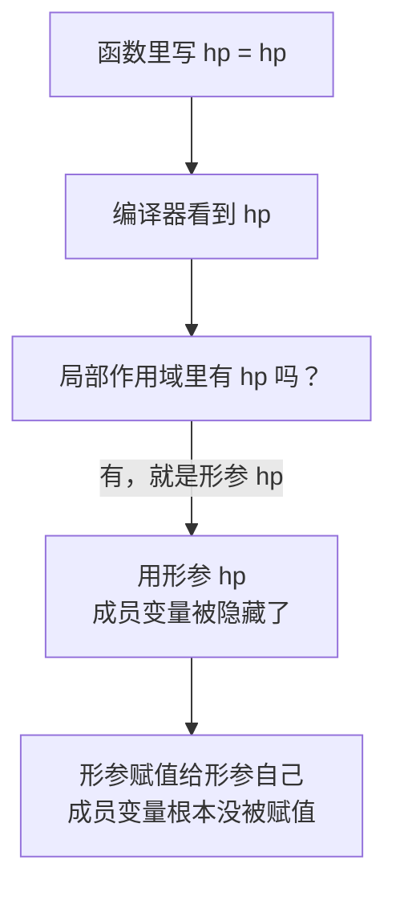
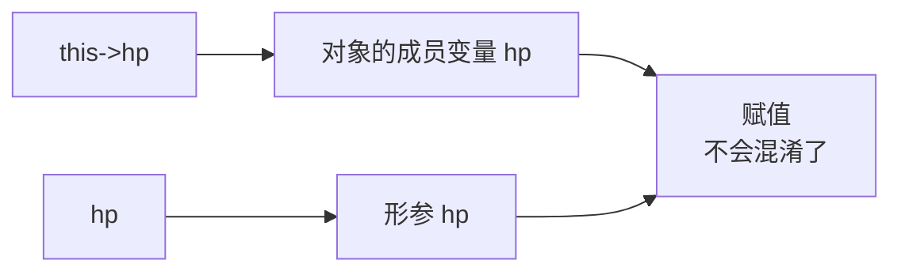
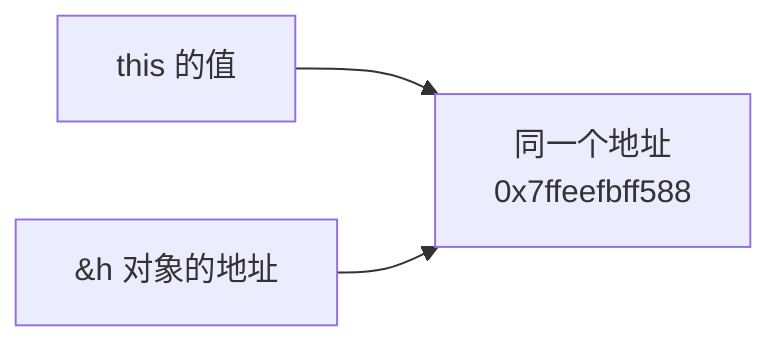
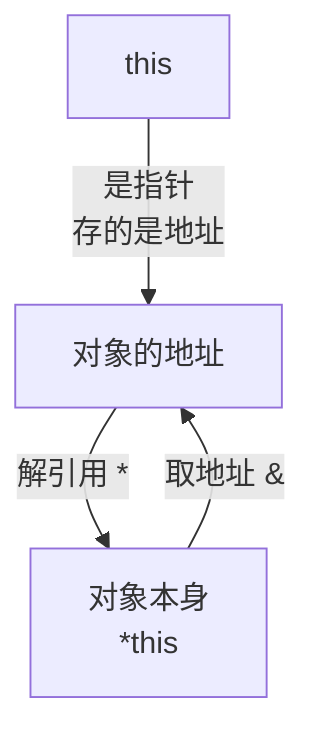
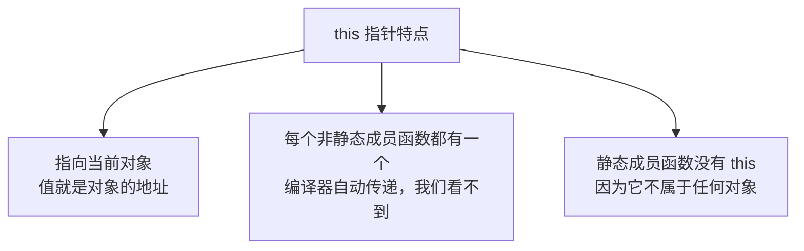

## 本节概述：指向对象自己的指针

前面我们写成员函数的时候，都是直接写成员变量名，比如 `m_hp = hp;`。

不知道你有没有好奇过——成员函数只有一份，那它怎么知道当前操作的是哪个对象的 `m_hp`？

答案就是：**`this` 指针**。



`this` 是 C++ 里的一个关键字，它的主要用途有两个：

1. **解决命名冲突** — 当形参名和成员变量名一样的时候
2. **获取对象本身** — `*this` 就表示当前对象

## 作用一：解决命名冲突

### 先看一个坑

我们写一个英雄类，构造函数的形参名就叫 `hp`，成员变量也叫 `hp`：

```cpp
#include <iostream>
using namespace std;

class Hero
{
public:
    Hero(int hp)
    {
        hp = hp;  // 形参赋值给形参？成员变量呢？
    }

    int hp;  // 成员变量也叫 hp
};

int main()
{
    Hero h(100);
    cout << h.hp << endl;  // 猜猜输出什么？

    return 0;
}
```

你觉得会输出 100 吗？

运行一下你会发现——输出的是一个乱七八糟的随机值！

### 为什么会这样

这就是**命名冲突**——当形参名和成员变量名相同的时候，形参会把成员变量"遮住"。



变量查找遵循"就近原则"——离得近的先找到，找到就不往外找了。所以函数里写的 `hp` 指的是形参，不是成员变量。结果就是形参赋值给形参自己，成员变量从头到尾没被碰过，所以输出随机值。

### 用 this 解决

怎么告诉编译器："我要的不是形参，是成员变量！"？

答案就是加 `this->`：

```cpp
Hero(int hp)
{
    this->hp = hp;  // this->hp 是成员变量，右边 hp 是形参
}
```

`this` 是指向当前对象的指针，`this->hp` 就是"当前对象的 hp 成员变量"。这样编译器就明白了——左边是成员变量，右边是形参，清清楚楚。



改完之后再运行，输出就是 100 了。

> [!TIP]
> **小技巧：怎么快速区分？**
>
> 在 IDE 里点一下变量名，如果三个 hp 都高亮了，说明编译器认为它们是同一个（就是形参把成员变量盖住了）。
>
> 加上 `this->` 之后，再点 `this->hp`，你会发现只有成员变量高亮了——编译器能准确识别。
>
> 这也是一个排查命名冲突的小技巧。

## this 到底是什么

光这么说你可能还没感觉，我们来直接打印看看。

### 打印 this 的值

```cpp
class Hero
{
public:
    Hero(int hp)
    {
        this->hp = hp;
        cout << "this 的值：" << this << endl;  // 打印 this 指针
    }

    int hp;
};

int main()
{
    Hero h(100);
    cout << "对象 h 的地址：" << &h << endl;  // 打印对象的地址

    return 0;
}
```

运行结果（地址值每次运行可能不同）：
```
this 的值：0x7ffeefbff588
对象 h 的地址：0x7ffeefbff588
```

两个地址**完全一样**！



所以结论很明确：**`this` 就是指向当前对象的指针，它的值就是对象的地址。**

你可以这么理解：每个成员函数在调用的时候，编译器会偷偷把对象的地址传进去，作为 `this` 参数。只是这个参数是隐藏的，我们看不到，但它确实存在。

## 作用二：`*this` 获取对象本身

`this` 是指针，那 `*this` 是什么？

指针解引用之后，拿到的就是指针指向的东西——**也就是对象本身**。



我们来验证一下：

```cpp
class Hero
{
public:
    Hero(int hp)
    {
        this->hp = hp;
    }

    void printHp()
    {
        // 三种方式都能拿到 hp，证明指向的是同一个对象
        cout << "直接写 hp：" << hp << endl;
        cout << "this->hp：" << this->hp << endl;
        cout << "(*this).hp：" << (*this).hp << endl;
    }

    int hp;
};
```

运行结果：
```
直接写 hp：100
this->hp：100
(*this).hp：100
```

三种写法拿到的都是同一个值——因为它们操作的就是同一个对象。

> [!NOTE]
> **为什么 `*this` 要加括号？**
>
> 因为 `.` 的优先级比 `*` 高。如果写成 `*this.hp`，编译器会先算 `this.hp`，但 `this` 是指针不能用 `.`，就报错了。
>
> 所以要加括号：`(*this).hp` —— 先解引用拿到对象，再用 `.` 访问成员。
>
> 当然，平时写代码直接用 `this->hp` 就好了，更简洁也更常用。

## this 指针的特点

总结一下 this 指针的几个重要特点：



1. **this 指向当前对象** — `this` 的值和 `&对象` 的值完全一样
2. **每个非静态成员函数都有 this** — 编译器偷偷传的隐藏参数，我们不用管
3. **静态成员函数没有 this** — 这也是为什么静态成员函数不能访问普通成员变量——它连 `this` 都没有，怎么找得到是哪个对象的成员？

## 本章小结

**this 指针**是指向当前对象的指针，是 C++ 的关键字，由编译器自动传递给每个非静态成员函数。

**两个主要作用**：
1. **解决命名冲突** — 当形参名和成员变量同名时，用 `this->成员名` 明确指定成员变量
2. **获取对象本身** — `*this` 就表示当前对象，可以用它来返回对象自身

**核心事实**：
- `this` 的值 = 对象的地址（可以打印验证）
- `this` 是指针，所以访问成员用 `->`
- `*this` 是对象本身，访问成员用 `.`（记得加括号）
- 静态成员函数没有 this 指针

