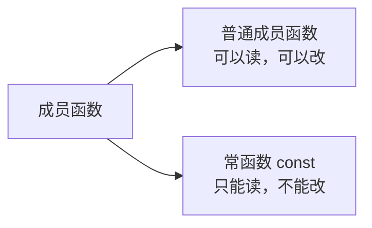
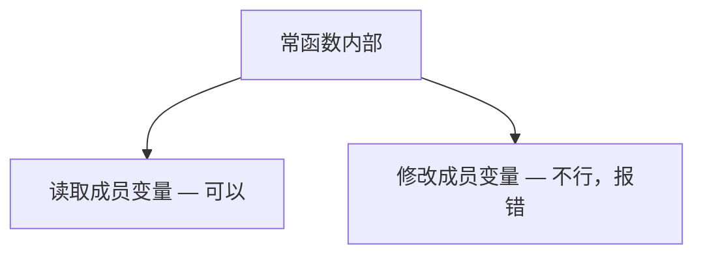
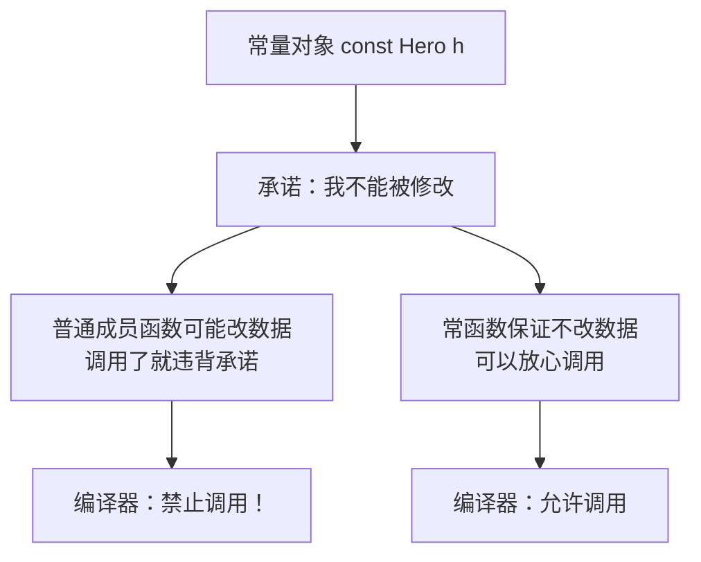
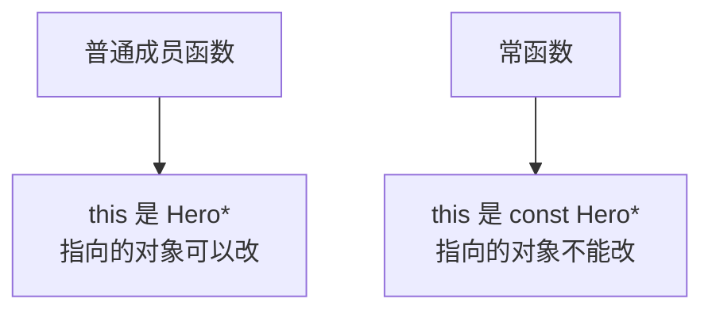

## 本节概述：只读的成员函数

前面我们学了普通成员函数——想读就读，想改就改。

但有时候我们写一个函数，它的目的只是"读取"数据，不应该修改任何成员变量。比如 `getHp()` 只是返回血量，不应该改血量。

问题来了：万一写代码的时候手滑，在 get 函数里不小心改了成员变量怎么办？

为了杜绝这种情况，C++ 提供了 **常函数**——在函数后面加 `const`，编译器就会帮你盯着：**这个函数里敢改成员变量，直接报错！**



## 常函数的语法

常函数的写法很特别——`const` 不是写在函数前面，而是写在**参数列表的后面**。

```cpp
class Hero
{
public:
    // 常函数：参数列表后面加 const
    int getHp() const
    {
        return m_hp;
    }

private:
    int m_hp;
};
```

**格式记一下**：

```
返回类型 函数名(参数列表) const
{
    // 函数体里不能修改成员变量
}
```

`const` 跟在参数列表屁股后面，这是常函数的标志性写法。

## 常函数的特点：不能修改成员变量

常函数最核心的特点就是：**函数体内不能修改成员变量的值**。

我们来做个实验——故意在常函数里改一下成员变量：

```cpp
#include <iostream>
using namespace std;

class Hero
{
public:
    Hero()
    {
        m_hp = 100;
    }

    // 常函数：获取血量
    int getHp() const
    {
        m_hp++;  // 试试在常函数里改成员变量
        return m_hp;
    }

private:
    int m_hp;
};

int main()
{
    Hero h;
    cout << h.getHp() << endl;
    return 0;
}
```

编译器直接报错：

```
表达式必须是可修改的左值
```

翻译成人话就是：**这是常函数，你不能改成员变量！**



### 为什么要这么设计

你可能会想：我自己小心点不就行了，至于让编译器管这么宽吗？

当函数逻辑简单的时候确实无所谓。但如果函数有几百行、上千行呢？你根本没法保证中间不会手滑改了某个成员变量。

加了 `const` 之后，编译器帮你做检查——**只要改了成员变量，编译就通不过**。这等于给函数上了一把"只读锁"，安全多了。

> [!NOTE]
> **STL 里到处都是常函数**
>
> 你去看 STL 的源码，比如 `vector` 的 `empty()` 函数，就是个常函数：
>
> ```cpp
> bool empty() const
> {
>     return _Mypair._Myval2._Mylast == _Mypair._Myval2._Myfirst;
> }
> ```
>
> "判空"这个操作只是读取数据，不需要修改任何东西，所以加上 const 让函数更安全。
>
> 后面我们学 STL 的时候，会看到大量的 const 成员函数——这是 C++ 的标准编程风格。

## 常对象只能调用常函数

常函数还有一个重要的配套规则：**常量对象只能调用常函数，不能调用普通成员函数。**

什么意思？我们来看：

```cpp
class Hero
{
public:
    Hero()
    {
        m_hp = 100;
    }

    // 常函数：读操作
    int getHp() const
    {
        return m_hp;
    }

    // 普通成员函数：写操作
    void setHp(int hp)
    {
        m_hp = hp;
    }

private:
    int m_hp;
};

int main()
{
    const Hero h;  // 常量对象：对象不能被修改

    h.getHp();   // ✅ 可以：调用常函数
    h.setHp(200); // ❌ 报错：不能调用普通成员函数

    return 0;
}
```

`setHp` 这一行编译器直接报错：

```
对象含有与成员函数 setHp 不兼容的类型限定符 const
```

### 为什么会这样

道理很简单：**常量对象的承诺是"我不能被修改"**。

如果允许常量对象调用普通成员函数，那普通成员函数万一在里面改了成员变量，常量对象的"不能修改"不就成空话了吗？



所以编译器制定了一条铁律：**常量对象只能调用常函数**。这样才能从语法上保证常量对象真的不会被修改。

> 反过来呢？普通对象能不能调用常函数？
>
> **可以的**。普通对象没有"不能修改"的限制，常函数只是不改数据而已，调用了完全没问题。
>
> 简单记：**严的可以兼容松的，松的不能兼容严的。**

## 常函数的本质

学了上一节的 this 指针之后，我们可以从底层来理解常函数。

常函数的 `const`，本质上是在修饰 `this` 指针——让 `this` 变成了**指向常量的指针**。



- 普通成员函数：`this` 的类型是 `Hero*` —— 通过 this 可以改对象的数据
- 常函数：`this` 的类型是 `const Hero*` —— 通过 this 不能改对象的数据

所以常函数里不能修改成员变量，本质上就是因为 `this` 被 const 修饰了，指向的对象是只读的。

## 什么时候该用常函数

给你一个判断标准：

**如果一个成员函数只是读取数据，不修改任何成员变量，那就应该加上 const，把它变成常函数。**

| 函数类型 | 该不该加 const | 例子 |
|---|---|---|
| 只读的 get 类函数 | 应该加 | `getHp()`、`getName()`、`isEmpty()` |
| 修改数据的 set 类函数 | 不能加 | `setHp()`、`setName()`、`addScore()` |

> 这是一个非常好的编程习惯——能加 const 的地方尽量加。好处是：
> 1. 编译器帮你检查，防止手滑改错数据
> 2. 代码意图更清晰——别人一看就知道这个函数不会改数据
> 3. 常量对象也能调用这个函数，适用范围更广

## 本章小结

**常函数**就是在成员函数的参数列表后面加 `const`，表示这个函数不会修改成员变量。

**语法**：`返回类型 函数名(参数) const { }`

**核心特点**：
1. **常函数内不能修改成员变量** — 编译器帮你做检查，改了直接报错
2. **常对象只能调用常函数** — 保证常量对象不会被修改，从语法层面保障安全

**本质**：常函数的 `this` 指针是 `const Hero*` 类型，指向的对象是只读的。

**使用建议**：只要是只读的函数（比如各种 get 函数），都应该加上 const，养成好习惯。这也是 STL 源码里的通用风格。
