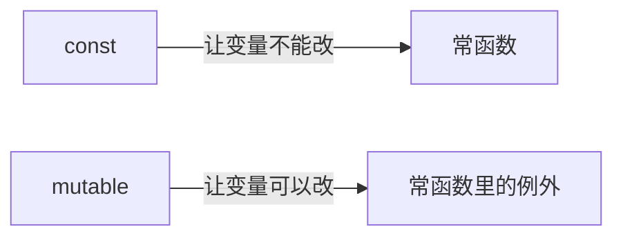
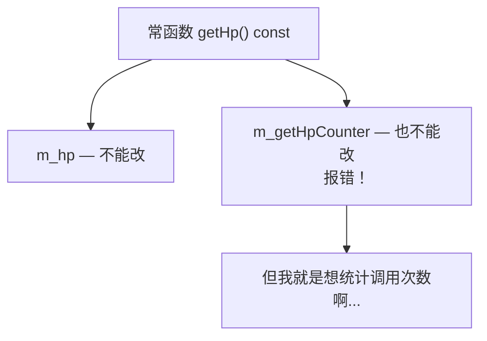
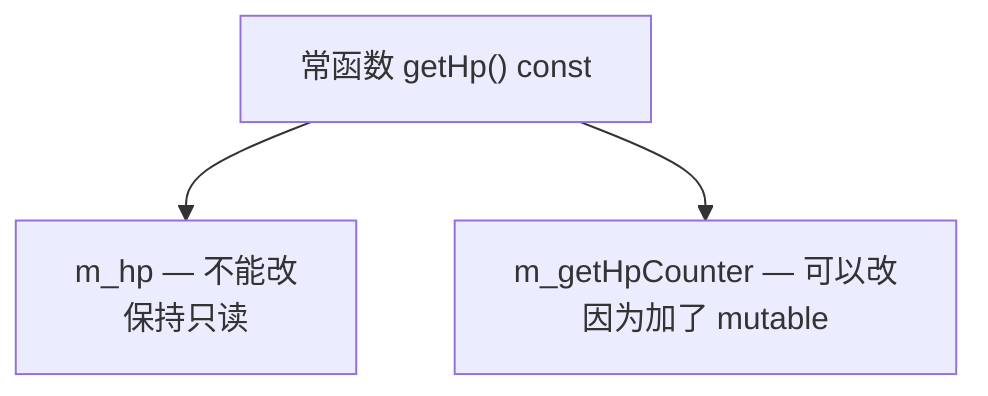

## 本节概述：const 的"例外"

上一节我们学了常函数——常函数里不能修改成员变量。

但是！凡事总有例外。有时候我们确实需要在常函数里修改某个变量——比如我想统计一下 `getHp()` 这个函数被调用了多少次。

函数是只读的，应该加 const 变成常函数。但计数器呢？计数器每次调用都要 +1，也就是要修改。这就矛盾了。

怎么办？用 **`mutable`** 关键字。



`mutable` 翻译过来是"可变的"，意思和 `const` 正好相反。它的作用就是：**让被它修饰的成员变量，在常函数里也能被修改。**

## mutable 的语法

用法很简单——在成员变量的类型前面加 `mutable` 就行。

```cpp
class Hero
{
public:
    // ...

private:
    int m_hp;                    // 普通成员变量：常函数里不能改
    mutable int m_getHpCounter;  // mutable 成员变量：常函数里也能改
};
```

就加一个关键字，别的都不用改。

## 完整示例：统计函数调用次数

我们来写一个完整的例子——用 mutable 实现"统计 getHp 被调用了多少次"。

### 第一步：先写好常函数

```cpp
#include <iostream>
using namespace std;

class Hero
{
public:
    Hero()
    {
        m_hp = 100;
        m_getHpCounter = 0;
    }

    // 常函数：获取血量
    int getHp() const
    {
        return m_hp;
    }

private:
    int m_hp;
    int m_getHpCounter;  // 计数器：统计 getHp 调用了多少次
};
```

### 第二步：尝试在常函数里改计数器

```cpp
int getHp() const
{
    m_getHpCounter++;  // 试试在常函数里改计数器
    return m_hp;
}
```

编译器直接报错——因为 `m_getHpCounter` 是普通成员变量，常函数里不能改。



### 第三步：加上 mutable

给 `m_getHpCounter` 加上 `mutable`：

```cpp
class Hero
{
public:
    Hero()
    {
        m_hp = 100;
        m_getHpCounter = 0;
    }

    int getHp() const
    {
        m_getHpCounter++;  // ✅ 现在可以改了！
        return m_hp;
    }

    // 常函数：打印调用次数
    void printCounter() const
    {
        cout << "getHp 被调用了 " << m_getHpCounter << " 次" << endl;
    }

private:
    int m_hp;
    mutable int m_getHpCounter;  // 加上 mutable
};
```

搞定！加上 `mutable` 之后，报错消失了——`m_getHpCounter` 在常函数里也能修改了。

### 第四步：测试一下

```cpp
int main()
{
    Hero h;

    // 调用 6 次 getHp
    h.getHp();
    h.getHp();
    h.getHp();
    h.getHp();
    h.getHp();
    h.getHp();

    // 看看计数器
    h.printCounter();

    return 0;
}
```

运行结果：
```
getHp 被调用了 6 次
```

完美！计数器正常工作了。



加了 mutable 之后，就相当于给这个成员变量开了个"后门"——别的成员变量在常函数里还是不能改，但它可以。

## mutable 的使用场景

mutable 用得不多，但在某些场景下非常好用。最常见的就是：

**需要在常函数里维护一些"辅助性"的状态。**

比如：
- 函数调用次数的计数器
- 缓存计算结果（第一次算了存起来，下次直接返回）
- 多线程里的互斥锁（加锁解锁要修改，但函数逻辑是只读的）

这些变量虽然会被修改，但它们不影响对象的"核心数据"——对象的本质状态没有变，只是一些辅助信息变了。这种情况下用 mutable 就很合适。

> [!WARNING]
> **不要滥用 mutable**
>
> mutable 是 const 的"后门"，用多了会破坏 const 的安全性。
>
> 原则：**能不用就不用**。只有当你确定这个变量是辅助性的、不影响对象核心状态的时候，才考虑用 mutable。
>
> 如果你发现好多成员变量都要加 mutable，那大概率是你的设计有问题——可能这个函数根本就不该是常函数。

## const vs mutable 对比

最后用一张表把这一对"冤家"总结一下：

| 关键字 | 作用 | 加在哪里 |
|---|---|---|
| `const` | 让东西不能改 | 函数后面（常函数）、变量前面（常量） |
| `mutable` | 让东西可以改 | 成员变量前面（常函数里也能改） |


const 把门关上了，mutable 又在墙上开了个小窗户。

## 本章小结

**mutable** 关键字的意思是"可变的"，和 const 正好相反。它用来修饰成员变量，表示**这个变量在常函数里也可以被修改**。

**语法**：`mutable 类型 变量名;`，写在成员变量声明的类型前面。

**核心作用**：解决"常函数里某个变量确实需要修改"的矛盾场景——比如计数器、缓存、锁等辅助性的状态。

**使用原则**：
- **能不用就不用** — mutable 是 const 的后门，用多了破坏安全性
- **只用于辅助变量** — 不影响对象核心状态的变量才考虑加 mutable
- **设计优先** — 如果很多变量都要 mutable，先想想是不是函数设计错了

