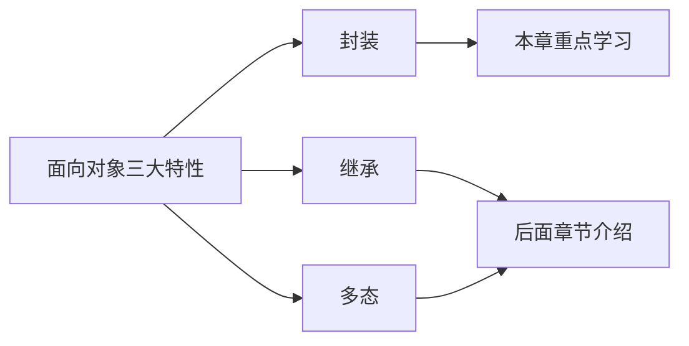
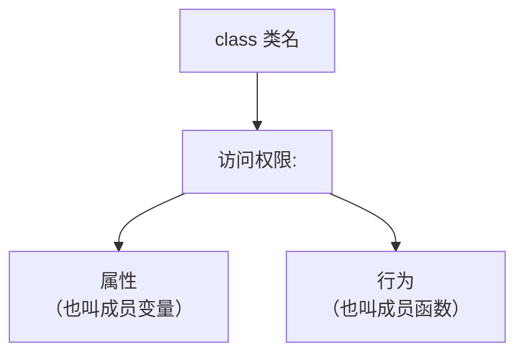
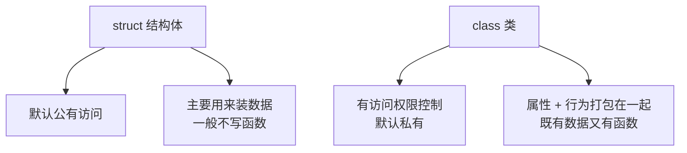
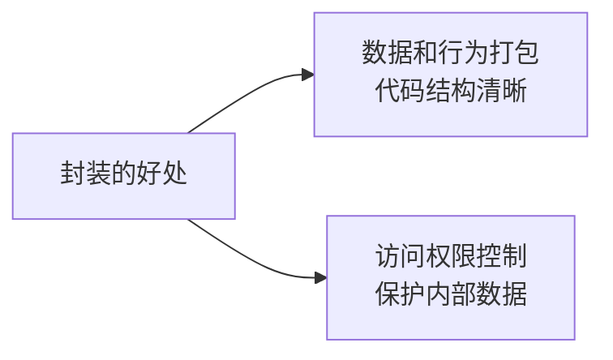

## 本节概述：封装是什么

从这一节开始，我们正式进入**面向对象编程**的世界。

面向对象有三大特性：**封装、继承、多态**。



封装是三大特性里的第一个，也是最基础的一个。这一节我们先搞懂：**类怎么写，属性和行为是什么关系**。

## 类的基本语法

封装，说白了就是把**属性**和**行为**打包到一个类里面。

写一个类的基本格式：

```cpp
class 类名
{
访问权限:
    属性（成员变量）

    行为（成员函数）
};
```



几个名词先对齐：
- **属性** = 成员变量 —— 类里面的变量
- **行为** = 成员函数 —— 类里面的函数

> 访问权限有三种：`public`、`private`、`protected`。这一节我们先用 `public`，下一节再详细讲它们的区别。

## 动手写一个英雄类

光说不练假把式。我们来写一个实际的例子——游戏里的英雄。

就拿王者荣耀来说，每个英雄都有 ID、血量，还能加血、减血。我们把这些东西封装成一个 `Hero` 类。

### 第一步：定义类

```cpp
#include <iostream>
using namespace std;

// 英雄类
class Hero
{
public:         // 访问权限：公有的（先直接用，下节细讲）

    // 属性（成员变量）
    int m_id;   // 英雄ID
    int m_hp;   // 英雄血量

    // 行为（成员函数）
    // 加血
    void addHp(int hp)
    {
        m_hp += hp;
    }

    // 减血
    void subHp(int hp)
    {
        m_hp -= hp;
    }
};
```

> [!NOTE]
> **关于 m_ 前缀的命名习惯**
>
> 你可能注意到了，属性名前面加了个 `m_`。这是一种常见的命名风格——`m` 是 member 的缩写，表示这是个**成员变量**。
>
> 好处是：在函数里一眼就能看出哪个是成员变量、哪个是普通变量，不容易搞混。当然这只是个习惯，不加也完全没问题。

### 第二步：实例化对象

类写好了，但它只是一张"图纸"。你得用这张图纸造出具体的英雄才行——这个过程叫**实例化**，造出来的东西叫**对象**。


实例化的语法跟结构体很像：

```cpp
int main()
{
    Hero h;     // 用 Hero 类创建一个对象 h

    // 给属性赋值
    h.m_id = 5;
    h.m_hp = 100;

    // 调用成员函数
    h.addHp(100);   // 加 100 血

    cout << "ID为" << h.m_id << "的英雄血量为" << h.m_hp << endl;

    h.subHp(100);   // 减 100 血

    cout << "ID为" << h.m_id << "的英雄血量为" << h.m_hp << endl;

    return 0;
}
```

运行结果：
```
ID为5的英雄血量为200
ID为5的英雄血量为100
```

完美符合预期——初始血量 100，加 100 变成 200，再减 100 又回到 100。

## 类 vs 结构体

你可能已经发现了——类跟结构体好像啊！确实很像，但有两个关键区别：



| 对比项 | struct 结构体 | class 类 |
|---|---|---|
| 访问权限 | 默认 public | 默认 private（后面讲） |
| 里面装什么 | 主要是数据变量 | 数据 + 函数都能装 |
| 用途 | 组织一组相关数据 | 封装完整的"事物" |

简单说：结构体是类的"低配版"，类是结构体的"升级版"——类不仅能装数据，还能装操作数据的函数。

## 封装的好处

为什么要把属性和行为封装到类里？好处有很多，先感受两点：

1. **代码更清晰** —— 英雄的数据（ID、血量）和英雄能做的事（加血、减血）放在一起，一看就知道这是"英雄"相关的东西
2. **操作更安全** —— 后面学了访问权限控制，你可以决定哪些东西能让外面改、哪些不能，把数据保护起来



后面几节我们会逐步感受到封装的强大之处。

## 本章小结

**封装**就是把属性和行为写到一个类里面，是面向对象三大特性之一。

**类的基本结构**：`class 类名 { 访问权限: 属性 行为 };`
- 属性 = 成员变量 —— 描述事物有什么
- 行为 = 成员函数 —— 描述事物能做什么

**实例化**：用类创建对象的过程。类是图纸，对象是用图纸造出来的具体东西。

**类 vs 结构体**：类是结构体的升级版，不仅能装数据，还能装操作数据的函数，并且有访问权限控制。

**命名小技巧**：成员变量前面加 `m_` 前缀（member 的缩写），一眼就能认出是成员变量。
