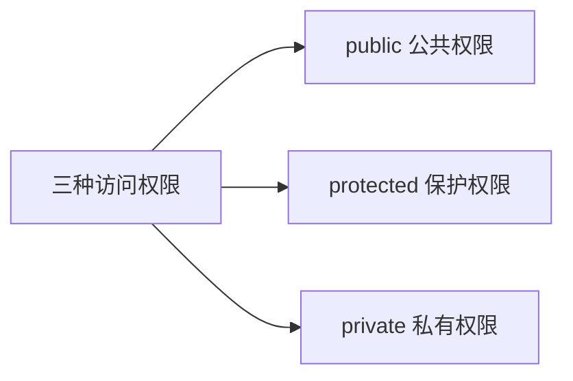
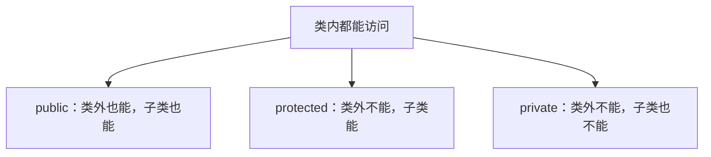
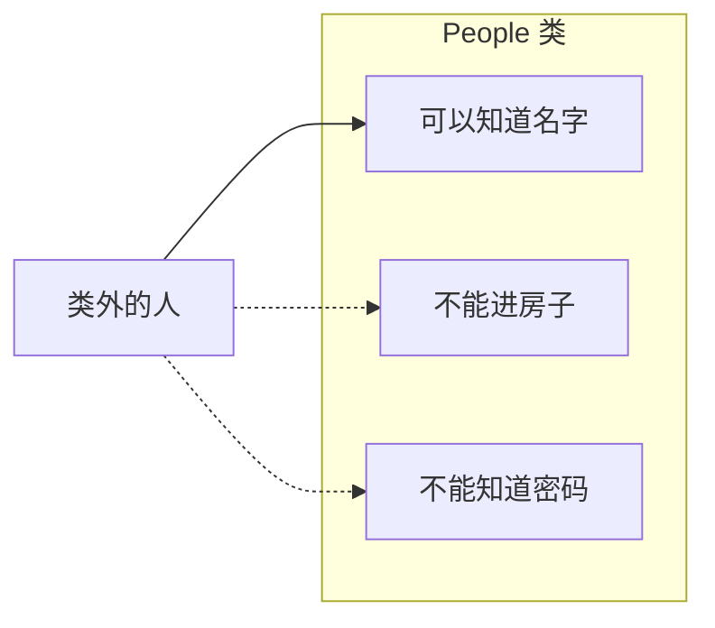
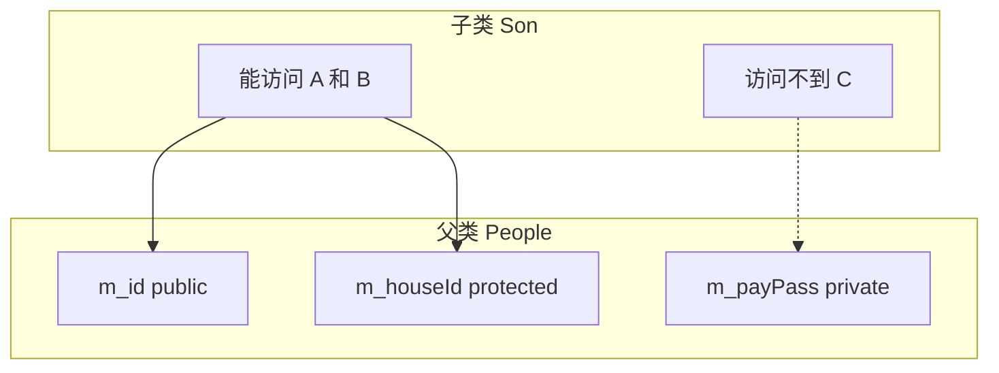

## 本节概述：三种访问权限

上一节我们写类的时候，用了一个 `public` 关键字，后面跟着一个冒号。这东西叫**访问权限**，是用来控制"谁能访问类里面的成员"的。

C++ 一共有三种访问权限：

- **public** —— 公共权限
- **protected** —— 保护权限
- **private** —— 私有权限



这一节我们就把这三种权限的区别搞清楚。

## 一句话概括

先记住一个总原则：**所有权限的成员，类的内部都能访问**。区别在于——类的外部和子类能不能访问。

| 访问权限 | 类内 | 类外 | 子类 |
|---|---|---|---|
| public 公共 | 可以 | 可以 | 可以 |
| protected 保护 | 可以 | 不可以 | 可以 |
| private 私有 | 可以 | 不可以 | 不可以 |



**子类**这个概念我们后面学继承才会详细讲，这里先简单理解：子类就是从一个类衍生出来的新类（比如"儿子"继承了"父亲"）。

## 生活化理解：名字、房子、支付密码

光看表格有点抽象，我们举个生活化的例子。

假设有一个 `People`（人类）类，里面有三个东西：

- **名字（ID）** —— 谁都能知道，公有的
- **房子** —— 自己能用，儿子也能住，但外人不能进，保护的
- **支付密码** —— 只有自己知道，连儿子都不能告诉，私有的



是不是一下子就好理解了？

- **public** — 对外公开的信息，谁都能看
- **protected** — 留给自家人的，外人不行，但儿子可以
- **private** — 只有自己知道，谁都不告诉

> 打赏女主播那个梗就不用我多说了吧？支付密码让儿子知道了，后果不堪设想。

## 动手验证：类外能不能访问

光说不练假把式，我们写一个 People 类来验证一下。

```cpp
#include <iostream>
using namespace std;

class People
{
public:             // 公共权限
    int m_id;       // 名字/ID —— 公有

protected:          // 保护权限
    int m_houseId;  // 房子 —— 保护

private:            // 私有权限
    int m_payPass;  // 支付密码 —— 私有
};

int main()
{
    People p;

    p.m_id = 1;     // 没问题！公有成员，类外可以访问

    // p.m_houseId = 5;  // 报错！保护成员，类外不可访问
    // p.m_payPass = 10; // 报错！私有成员，类外不可访问

    return 0;
}
```

你会发现：
- `p.m_id = 1` — 正常，编译器不报错
- `p.m_houseId = 5` — 编译报错，说不可访问
- `p.m_payPass = 10` — 同样报错，不可访问

**结论**：类外只能访问 public 的成员，protected 和 private 的都碰不到。

## 动手验证：类内能不能访问

那类的内部呢？我们在类里写一个成员函数，在里面访问所有成员试试：

```cpp
class People
{
public:
    int m_id;

    // 公有成员函数
    void work()
    {
        m_id = 1;        // 公有 —— 没问题
        m_houseId = 2;   // 保护 —— 没问题
        m_payPass = 314; // 私有 —— 也没问题！
    }

protected:
    int m_houseId;

private:
    int m_payPass;
};
```

你会发现 `work()` 函数里，三个属性都能访问，一个都不报错。


**结论**：类的内部（成员函数里），所有权限的成员都能访问，一视同仁。

> [!TIP]
> **成员函数也有权限**
>
> 不仅成员变量有权限，成员函数也有。如果你把一个成员函数放到 `private:` 下面，那类外就调用不了它了，只有类内的其他函数能调用它。
>
> 权限控制对变量和函数是一样的规则。

## protected 和 private 的区别：子类能不能访问

protected 和 private，类外都不能访问，那它们区别在哪？

答案是：**子类能不能访问**。

- **protected** — 子类可以访问
- **private** — 子类也访问不了

我们先简单感受一下（继承章节会详细讲）：

```cpp
// 父类
class People
{
public:
    int m_id;       // 公有，子类能访问
protected:
    int m_houseId;  // 保护，子类能访问
private:
    int m_payPass;  // 私有，子类访问不了
};

// 子类：Son 继承自 People
class Son : public People
{
public:
    void test()
    {
        m_id = 1;        // 没问题，公有
        m_houseId = 2;   // 没问题，保护的，子类能访问
        // m_payPass = 3; // 报错！私有的，子类也碰不到
    }
};
```



儿子能知道爸爸的名字、能住爸爸的房子，但爸爸的支付密码——儿子也别想知道。

> 继承的详细语法我们到 2.5 节再讲，这里你只要记住 protected 和 private 的核心区别就行。

## 本章小结

C++ 有三种访问权限，用来控制类成员的可见范围：

**public（公共权限）**：类内能访问，类外能访问，子类也能访问——完全公开。

**protected（保护权限）**：类内能访问，类外不能访问，但子类可以访问——留给自家人的。

**private（私有权限）**：类内能访问，类外不能访问，子类也不能访问——只有自己知道。

**一句话记忆**：
- 所有成员，类内都能用
- 类外只能碰 public
- 子类能碰 public + protected，碰不到 private

**成员函数也有权限控制**，规则跟成员变量完全一样。
