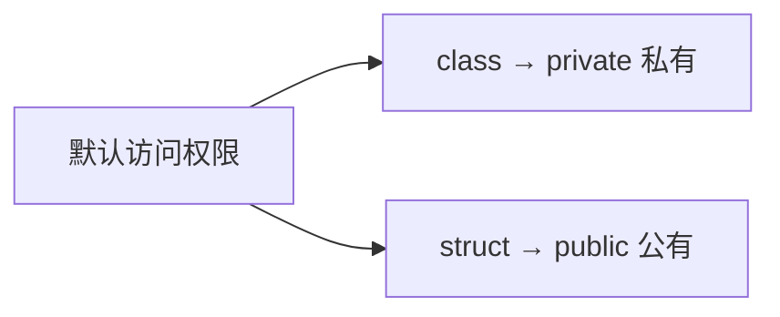
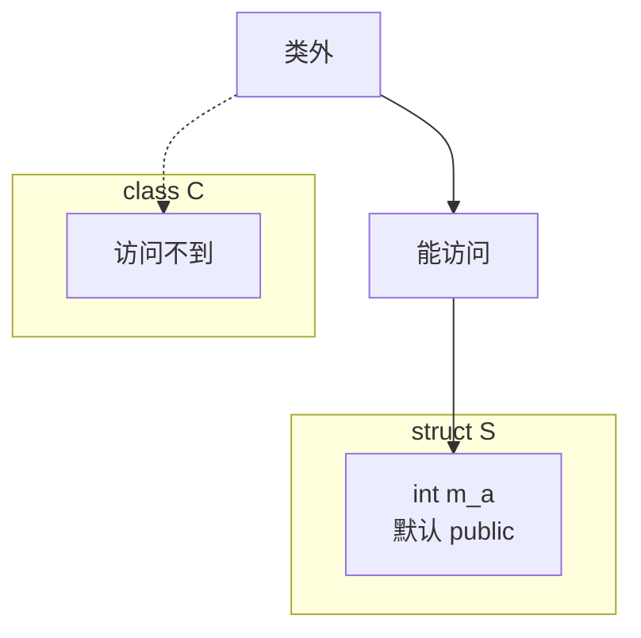
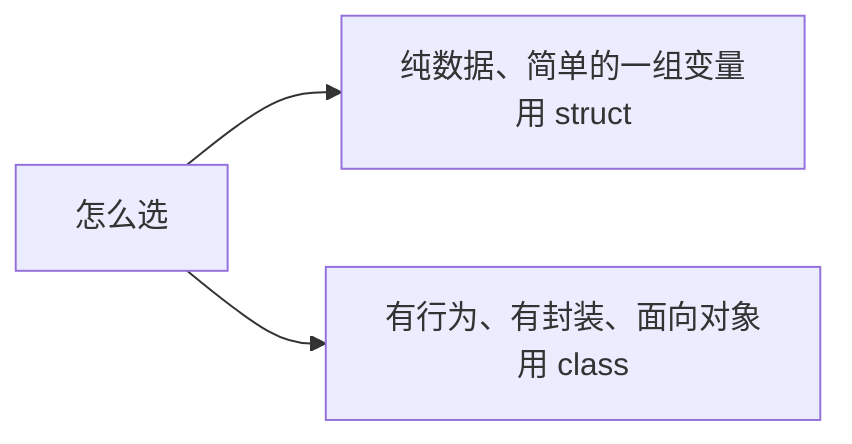

## 本节概述：class 和 struct 到底差在哪

学了类之后，很多人心里都会有个疑问：**class 和 struct 长得这么像，到底有什么区别？**

这一节我们就把这个问题说清楚。答案其实很简单——**只有默认访问权限不一样**。

## 核心区别：默认访问权限

`class` 和 `struct` 最主要、也是唯一的区别就是：

- **class 默认是 private（私有的）**
- **struct 默认是 public（公共的）**



啥意思呢？就是说如果你不写 `public:`、`private:` 这些访问权限标签，直接在大括号里写成员：
- class 里的成员默认是私有的，类外访问不到
- struct 里的成员默认是公有的，类外随便用

## 动手验证

我们来写代码验证一下。

### 不写访问权限，class 的情况

```cpp
class C
{
    int m_a;   // 没有写访问权限，默认是什么？
};

int main()
{
    C c;
    c.m_a = 10;  // 能访问吗？

    return 0;
}
```

答案是：**报错，访问不到**。

因为 class 的成员默认是 private 的，你没写 `public:`，那 `m_a` 就是私有的，类外碰不到。

### 不写访问权限，struct 的情况

```cpp
struct S
{
    int m_a;   // 没有写访问权限，默认是什么？
};

int main()
{
    S s;
    s.m_a = 10;  // 能访问吗？

    return 0;
}
```

答案是：**完全没问题**。

因为 struct 的成员默认是 public 的，你没写访问权限，它默认就是公有的，类外可以直接访问。



就这么简单——**一个默认私有，一个默认公有**，这就是 class 和 struct 最核心的区别。

## struct 里面也能写函数

可能有人会问：struct 里面是不是只能装变量，不能写函数？

还真不是。在 C++ 里，struct 里面也能定义成员函数，跟 class 一样一样的。

```cpp
struct S
{
    int m_a;

    // 结构体里也能写成员函数！
    void func()
    {
        m_a = 666;
    }
};

int main()
{
    S s;
    s.func();         // 调用成员函数，没问题
    cout << s.m_a << endl;  // 输出 666

    return 0;
}
```

运行一下，输出 `666`——完全正常。

> [!NOTE]
> **C 语言的 struct vs C++ 的 struct**
>
> 在 C 语言里，结构体确实只能装变量，不能写函数。
>
> 但在 C++ 里，struct 被大大增强了——它不仅能装函数，还能有继承、有多态，几乎跟 class 一模一样。
>
> 所以说：**在 C++ 中，class 和 struct 的区别只有默认访问权限这一个**。其他方面它们几乎是等价的。

## 什么时候用 class，什么时候用 struct

既然它们几乎一样，那平时写代码该怎么选？给你一个经验法则：



- **用 struct**：你只是想把几个相关的变量打包在一起，比如一个坐标点 `(x, y)`、一个学生信息（姓名、年龄、分数）——纯数据，没有什么复杂的操作，用 struct 简单直接
- **用 class**：你在做面向对象的设计，有封装、有访问权限控制、有成员函数——正经的类，用 class

当然这只是习惯，不是语法规定。你非要用 class 装纯数据、或者用 struct 写复杂的类，语法上也完全没问题，只是不符合大家的编码习惯而已。

## 本章小结

**class 和 struct 的核心区别只有一个：默认访问权限不同。**

- **class 默认 private** —— 不写访问权限的话，成员是私有的，类外访问不到
- **struct 默认 public** —— 不写访问权限的话，成员是公有的，类外随便用

**C++ 的 struct 不止能装变量** —— 它也能写成员函数、能继承、能多态，跟 class 几乎一样。这是 C++ 对 C 语言 struct 的增强。

**使用习惯**：纯数据用 struct，面向对象用 class。
