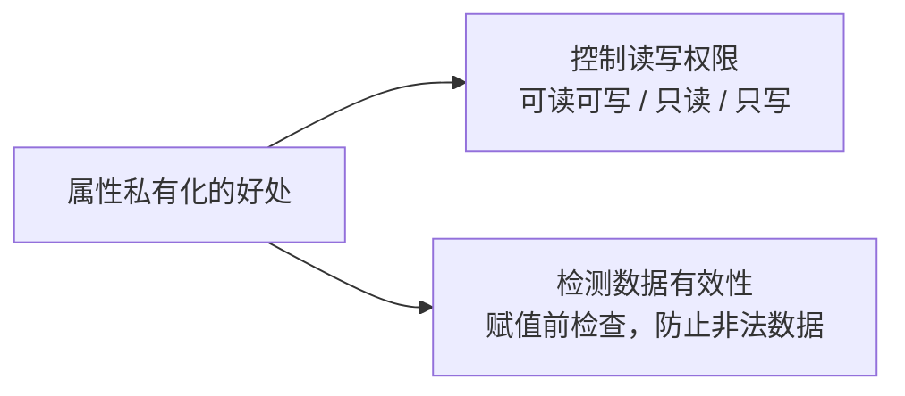
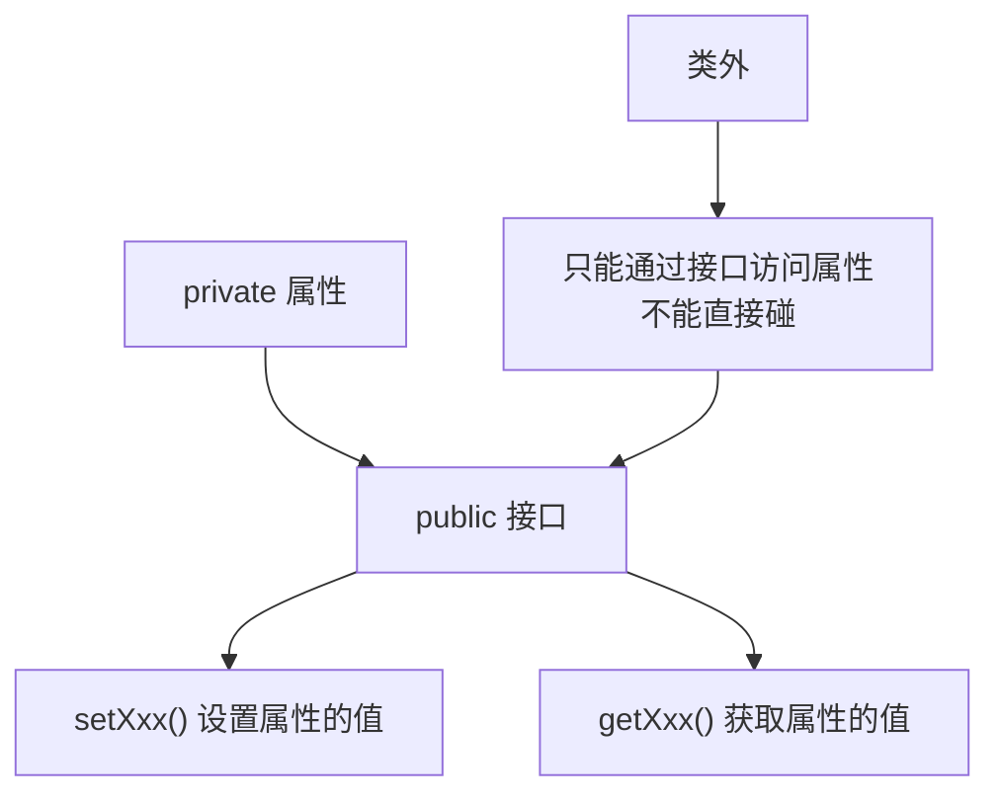
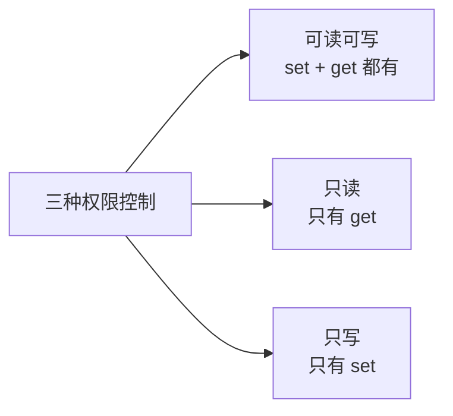
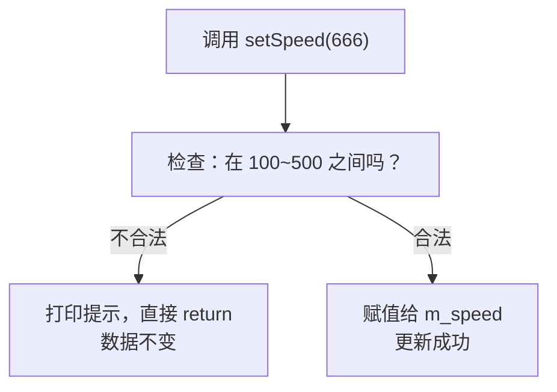

## 本节概述：为什么要把属性藏起来

前面两节我们学了访问权限，知道了 private 的成员类外碰不到。那你可能会问：**既然不让外面访问，我把属性设成 private 有啥用？**

这一节我们就来搞懂这个问题——**属性私有化**是企业级开发的标准做法，它有两大好处：

1. **精准控制读写权限** —— 想让你读才能读，想让你写才能写
2. **检测数据有效性** —— 赋值前先检查合不合理，防止乱填



我们还是用英雄类来举例，一步一步来看。

## 第一步：把属性都设成 private

先定义一个英雄类，把所有属性都藏到 private 下面：

```cpp
#include <iostream>
#include <string>
using namespace std;

class Hero
{
private:                    // 私有，类外访问不到
    string m_name;          // 英雄名字
    int m_skillCount;       // 技能数量
    int m_speed;            // 移动速度
};
```

这时候你在类外试一下：

```cpp
int main()
{
    Hero h;
    // h.m_name = "剑圣";    // 报错！private 成员，类外访问不到
    // h.m_skillCount = 4;   // 同样报错
    // h.m_speed = 300;      // 同样报错

    return 0;
}
```

全是红的，一个都访问不到。属性都藏起来了，外面想用怎么办？

## 第二步：提供 public 的接口

属性藏起来了，但不能不让外面用啊。我们可以提供一些 **public 的成员函数**（也叫**接口**），让外面通过这些函数来间接操作属性。

> [!NOTE]
> **接口、方法、成员函数 —— 都是一个意思**
>
> 你可能听过"接口"、"方法"、"成员函数"这几个词，它们说的其实是同一个东西——就是类里面那些 public 的函数，专门给外部调用的。

常见的接口有两种：
- **set 函数** —— 用来设置属性的值（写）
- **get 函数** —— 用来获取属性的值（读）



下面我们来给三个属性分别设计不同的权限。

## 案例一：名字 —— 可读可写

英雄的名字可以改、也可以查，所以是**可读可写**。那我们就同时提供 set 和 get 两个函数。

```cpp
class Hero
{
private:
    string m_name;

public:
    // 写：设置名字
    void setName(string name)
    {
        m_name = name;
    }

    // 读：获取名字
    string getName()
    {
        return m_name;
    }
};
```

用的时候通过函数来操作：

```cpp
int main()
{
    Hero h;
    h.setName("剑圣");          // 通过 set 函数设置名字
    cout << "英雄的名字：" << h.getName() << endl;  // 通过 get 函数获取名字

    return 0;
}
```

运行结果：
```
英雄的名字：剑圣
```

完美，跟直接访问效果一样，但现在是**通过函数间接访问**的。

## 案例二：技能数 —— 只读

一个英雄有几个技能？一般是固定的（比如 4 个主技能），不应该让外面随便改。那我们就设成**只读**——只提供 get 函数，不提供 set 函数。

```cpp
class Hero
{
private:
    int m_skillCount = 4;   // 直接初始化好，固定 4 个技能

public:
    // 只提供 get，不提供 set —— 只读
    int getSkillCount()
    {
        return m_skillCount;
    }
};
```

用的时候：

```cpp
cout << "英雄的技能数：" << h.getSkillCount() << endl;  // 输出 4
// h.setSkillCount(10);  // 根本没有这个函数，改不了！
```

想改？对不起，没有 set 函数，你改不了。这就是**只读**的效果。

## 案例三：速度 —— 只写

那能不能反过来——只让写、不让读？也可以。

比如速度这个属性，游戏里可能只需要设置，不需要外部读取（内部逻辑自己用）。那我们就只提供 set 函数，不提供 get 函数。

```cpp
class Hero
{
private:
    int m_speed;

public:
    // 只提供 set，不提供 get —— 只写
    void setSpeed(int speed)
    {
        m_speed = speed;
    }
};
```

用的时候：

```cpp
h.setSpeed(350);   // 可以设置速度
// h.getSpeed();   // 没有这个函数，读不出来
```

当然"只写"的场景比"只读"要少见一些，但语法上是支持的。



| 属性 | 权限 | set 函数 | get 函数 |
|---|---|---|---|
| 名字 m_name | 可读可写 | 有 | 有 |
| 技能数 m_skillCount | 只读 | 无 | 有 |
| 速度 m_speed | 只写 | 有 | 无 |

这就是属性私有化的第一个好处：**想给你什么权限就给你什么权限，尽在掌握**。

## 第三个好处：检测数据有效性

属性私有化还有一个更大的好处——**可以在 set 函数里检查数据合不合法**。

啥意思呢？比如英雄的移动速度，正常游戏里速度肯定有个范围，不能是负数，也不能快得离谱。如果属性是 public 的，外面随便填：

```cpp
h.m_speed = -100;   // 负数？倒着跑？
h.m_speed = 99999;  // 飞起来了？
```

没人拦得住，数据就乱了。

但如果属性是 private 的，速度只能通过 `setSpeed()` 来设置——那我们就在这个函数里加校验：

```cpp
void setSpeed(int speed)
{
    // 速度范围：100 ~ 500
    if (speed < 100 || speed > 500)
    {
        cout << "速度设置不合法！" << endl;
        return;   // 不合法就直接 return，不赋值
    }

    m_speed = speed;  // 合法才赋值
}
```

这时候你再乱填：

```cpp
h.setSpeed(666);   // 输出"速度设置不合法！"，m_speed 不会被改掉
h.setSpeed(300);   // 正常，赋值成功
```



**为什么这很重要？**

如果属性是 public 的，每个人用的时候都要自己判断合不合法——十个人用就写十次判断，还容易有人忘写。

但如果属性是 private 的，**判断逻辑只需要在 set 函数里写一次**，所有人通过 set 函数来赋值，自动就被校验了。从源头杜绝脏数据。

> 这才是封装真正的威力——把数据保护起来，只留受控的入口。

## 本章小结

**属性私有化**就是把成员变量设为 private，然后通过 public 的 set/get 函数来间接访问。

**两大好处：**

1. **控制读写权限** —— 通过是否提供 set/get 函数，可以精准控制每个属性是可读可写、只读、还是只写。不是什么都往外暴露，需要什么暴露什么。

2. **检测数据有效性** —— 在 set 函数里可以加校验逻辑，防止非法数据。而且校验只写一次，所有调用者都自动受益，从源头保证数据质量。

**接口 / 方法 / 成员函数** —— 这三个词说的是同一个东西，就是那些 public 的、给外部调用的函数。

**一个好习惯**：企业开发中，成员属性基本都会设为 private，然后提供对应的 set/get 接口。这是封装思想的重要体现。
