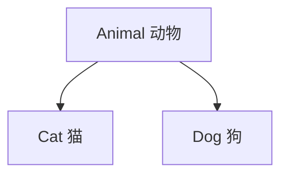
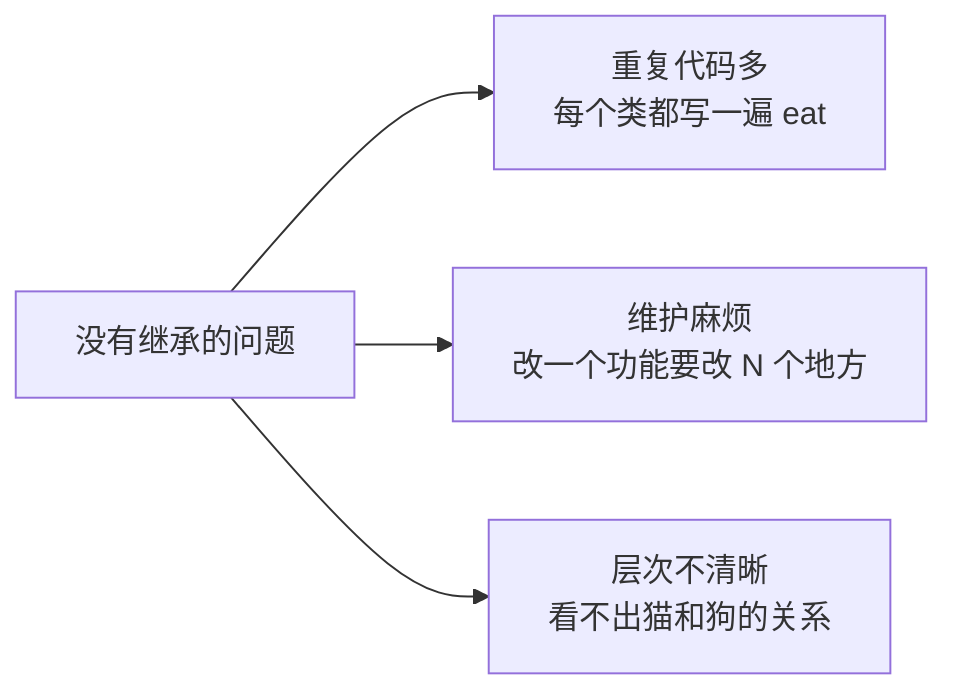
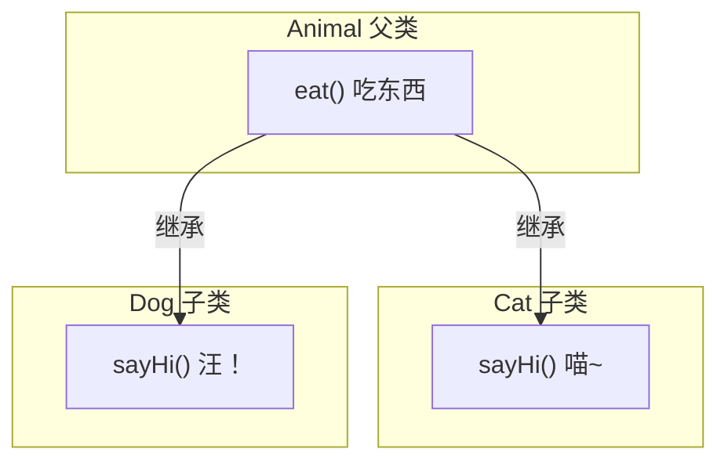
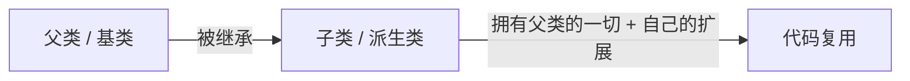
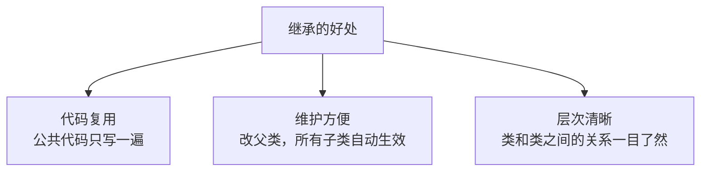

## 本节概述：减少重复代码的利器

继承是面向对象三大特性之一（封装、继承、多态），但理解起来并不难。

你可以把继承想象成一棵树——上层是更通用的"父类"，下层是更具体的"子类"。子类继承父类，就能直接拥有父类的所有属性和方法，不用再重复写一遍。



猫和狗都是动物——它们都会吃东西，但叫声不一样。我们把"吃东西"这个公共功能抽到 Animal 父类里，Cat 和 Dog 只要继承 Animal 就能直接用，不用再各写一遍了。

## 没有继承的时候

在讲继承之前，先看看没有继承的情况下，猫和狗两个类怎么写：

```cpp
#include <iostream>
using namespace std;

// 猫类
class Cat
{
public:
    void eat()
    {
        cout << "猫在吃" << endl;
    }

    void sayHi()
    {
        cout << "喵~" << endl;
    }
};

// 狗类
class Dog
{
public:
    void eat()
    {
        cout << "狗在吃" << endl;
    }

    void sayHi()
    {
        cout << "汪！" << endl;
    }
};

int main()
{
    Cat c;
    Dog d;

    c.eat();   // 猫在吃
    c.sayHi(); // 喵~

    d.eat();   // 狗在吃
    d.sayHi(); // 汪！

    return 0;
}
```

你发现了吗——`eat` 函数在两个类里几乎一模一样，只是输出的字稍微不同。这就是**代码冗余**。

如果以后再加个兔子、加个老虎，每个都要再写一遍 `eat`、再加别的公共函数……代码会越来越臃肿。



## 用继承来优化

继承的思路很简单：
1. 把公共的部分抽出来，做成一个**父类**（Animal）
2. 让 Cat 和 Dog **继承**这个父类
3. 父类里有的东西，子类自动拥有

### 父类 Animal

```cpp
// 父类：动物
class Animal
{
public:
    // 公共功能：吃东西
    void eat()
    {
        cout << "动物在吃" << endl;
    }
};
```

### 子类 Cat 和 Dog

继承的语法是：`class 子类 : 继承方式 父类`

```cpp
// 子类：猫，继承自 Animal
class Cat : public Animal
{
public:
    void sayHi()
    {
        cout << "喵~" << endl;
    }
};

// 子类：狗，继承自 Animal
class Dog : public Animal
{
public:
    void sayHi()
    {
        cout << "汪！" << endl;
    }
};
```

> 注意那个冒号 `:` 是英文冒号，别写成中文的了。

Cat 和 Dog 虽然没写 `eat` 函数，但因为继承了 Animal，所以自动拥有了 `eat` 的能力。

### 测试一下

```cpp
int main()
{
    Cat c;
    Dog d;

    c.eat();   // 动物在吃 —— 继承自父类
    c.sayHi(); // 喵~ —— 子类自己的

    d.eat();   // 动物在吃 —— 继承自父类
    d.sayHi(); // 汪！ —— 子类自己的

    return 0;
}
```

运行结果：
```
动物在吃
喵~
动物在吃
汪！
```

完美！Cat 和 Dog 不用写 `eat`，直接就能调用——这就是继承的力量。



## 基本概念

继承里有几个名词需要对齐一下：

| 名称 | 别名 | 意思 |
|---|---|---|
| 父类 | 基类 | 被继承的类，提供公共属性和方法 |
| 子类 | 派生类 | 继承父类的类，在父类基础上扩展 |



说人话就是：
- 你把公共的东西抽到上面——这是**父类**
- 下面的类继承它，自动拥有父类的东西，再加点自己的——这是**子类**
- 结果就是同样的代码只写一遍，大家都能用

## 继承方式

你可能注意到了，继承的时候写的是 `public Animal`——这个 `public` 就是**继承方式**。

继承方式有三种：
- **public** 公有继承
- **protected** 保护继承
- **private** 私有继承

不同的继承方式，会影响父类成员在子类里的访问权限。这个我们下一节详细讲，现在你先记住最常用的是 public 继承就行。

> [!NOTE]
> **class 默认的继承方式是 private**
>
> 如果你只写了冒号和父类名，没写继承方式：
> ```cpp
> class Cat : Animal  // 默认是 private 继承
> ```
> 对于 class 来说，默认的继承方式是 private。
>
> 这一点跟 struct 不一样——struct 默认是 public 继承。不过平时我们用 class 的话，建议显式写出来，别靠默认值。

## 继承的好处

最后总结一下继承到底解决了什么问题：



1. **代码复用** — 公共的属性和方法只在父类写一遍，所有子类都能用
2. **维护方便** — 要改公共功能，只改父类一处，所有子类自动跟着变
3. **层次清晰** — 类和类之间的父子关系一目了然，代码结构更清楚

## 本章小结

**继承**就是让子类拥有父类的属性和方法，减少重复代码。

**语法**：`class 子类名 : 继承方式 父类名`

**基本概念**：
- **父类（基类）** — 被继承的类，提供公共功能
- **子类（派生类）** — 继承父类的类，在父类基础上扩展

**三种继承方式**：public、protected、private（下节详细讲），最常用的是 public。

**核心好处**：代码复用、维护方便、层次清晰。

