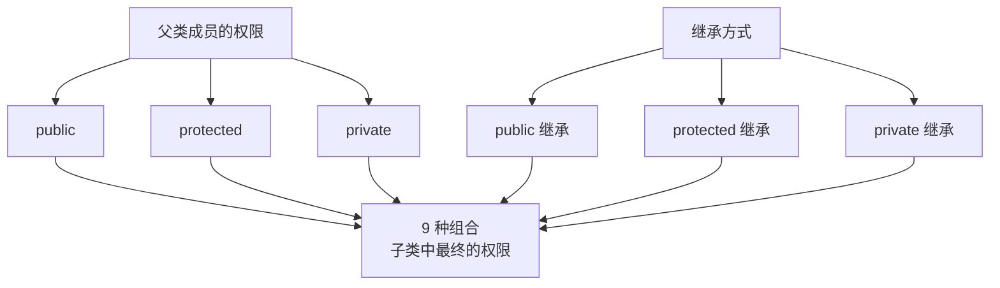
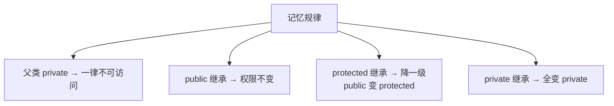
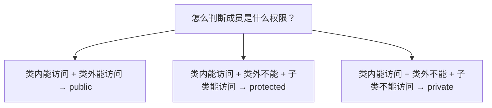
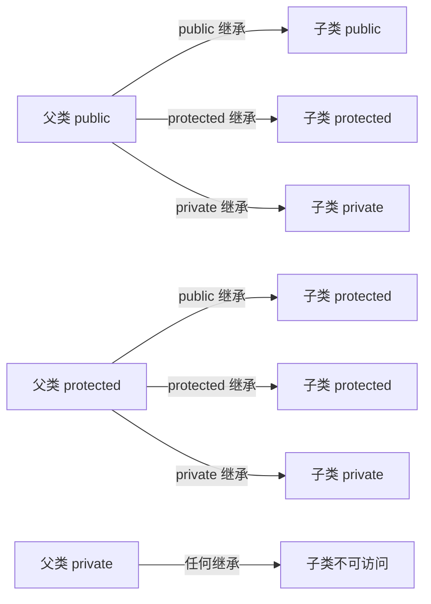

## 本节概述：继承方式决定了权限变化

上一节我们学了继承的基本语法，知道继承方式有三种：`public`、`protected`、`private`。

那这三种继承方式有什么区别呢？

简单说——**继承方式会改变父类成员在子类中的访问权限**。

父类的成员本来有三种权限（public、protected、private），经过三种继承方式的作用，到了子类里权限会发生变化——3×3 = 9 种情况。



## 结论先抛出来

先给结论，后验证。这张 3×3 的表你先记住：

| 父类成员权限 \ 继承方式 | public 继承 | protected 继承 | private 继承 |
|---|---|---|---|
| **public** | public | protected | private |
| **protected** | protected | protected | private |
| **private** | 不可访问 | 不可访问 | 不可访问 |



四条规律帮你记住：
1. **父类的 private 成员** — 无论怎么继承，子类都**不可访问**
2. **public 继承** — 原封不动，public 还是 public，protected 还是 protected
3. **protected 继承** — 降一级，public 变成 protected，protected 还是 protected
4. **private 继承** — 全部变成 private

> 你可以这么理解：继承方式像一个"过滤器"——public 最宽松原样过，protected 会把 public 压成 protected，private 最狠，全压成 private。

## 验证思路

光记结论不够，我们用代码来验证。思路是这样的：



验证方法三步走：
1. **类内能访问吗？** — 在子类构造函数里直接赋值，能编译过说明类内能访问
2. **类外能访问吗？** — 用对象 `.` 出来，能访问说明是 public
3. **孙子类能访问吗？** — 再写个孙子类继承子类，能访问说明是 protected，不能就是 private

我们用一个 Animal 父类（三个权限的成员变量各一个），然后用三种不同的继承方式来验证。

## 父类 Animal

先搭一个父类，里面放三个不同权限的成员变量：

```cpp
class Animal
{
public:
    int m_Pub;       // 公有权限

protected:
    int m_Pro;       // 保护权限

private:
    int m_Pri;       // 私有权限
};
```

下面我们分别用 public、protected、private 三种方式继承它，看看每个变量在子类里最终是什么权限。

## 一、public 公有继承

```cpp
class Cat : public Animal
{
public:
    Cat()
    {
        m_Pub = 1;  // ✅ 能访问
        m_Pro = 2;  // ✅ 能访问
        // m_Pri = 3;  // ❌ 不能访问（父类私有）
    }
};
```

类内能访问 `m_Pub` 和 `m_Pro`，`m_Pri` 访问不到——这证明了父类的私有成员子类是碰不到的。

### 验证 m_Pub 是 public 还是 protected

类外试试：

```cpp
int main()
{
    Cat c;
    c.m_Pub = 10;  // ✅ 类外能访问 → 说明是 public
    // c.m_Pro = 20;  // ❌ 类外不能访问 → 说明不是 public
}
```

`m_Pub` 类外能访问 → 一定是 **public**。

### 验证 m_Pro 是 protected 还是 private

类外不能访问，那它是 protected 还是 private？

再写个孙子类试试：

```cpp
class BossCat : public Cat  // 波斯猫，继承 Cat
{
public:
    BossCat()
    {
        m_Pro = 20;  // ✅ 孙子类也能访问 → 说明是 protected
    }
};
```

孙子类还能访问 `m_Pro` → 说明它在 Cat 里是 **protected**（如果是 private，孙子类就访问不到了）。

### public 继承结论

| 父类成员 | 子类中的权限 | 验证依据 |
|---|---|---|
| m_Pub（public） | **public** | 类内类外都能访问 |
| m_Pro（protected） | **protected** | 类内能访问，类外不能，但孙子类能 |
| m_Pri（private） | **不可访问** | 类内都访问不到 |

跟我们的结论表完全对上。

## 二、protected 保护继承

```cpp
class Dog : protected Animal
{
public:
    Dog()
    {
        m_Pub = 1;  // ✅ 能访问
        m_Pro = 2;  // ✅ 能访问
        // m_Pri = 3;  // ❌ 不能访问
    }
};
```

类内两个都能访问，私有成员还是碰不到。

### 类外验证

```cpp
int main()
{
    Dog d;
    // d.m_Pub = 10;  // ❌ 类外不能访问
    // d.m_Pro = 20;  // ❌ 类外不能访问
}
```

类外都访问不到——说明 `m_Pub` 已经不是 public 了。

### 孙子类验证

```cpp
class PoliceDog : public Dog  // 警犬，继承 Dog
{
public:
    PoliceDog()
    {
        m_Pub = 10;  // ✅ 孙子类能访问 → 不是 private，那就是 protected
        m_Pro = 20;  // ✅ 孙子类能访问 → 是 protected
    }
};
```

孙子类还能访问这两个变量 → 说明它们在 Dog 里都不是 private。

类外不能访问 + 子类能访问 → 那就是 **protected**。

### protected 继承结论

| 父类成员 | 子类中的权限 | 验证依据 |
|---|---|---|
| m_Pub（public） | **protected** | 类内能访问，类外不能，但孙子类能 |
| m_Pro（protected） | **protected** | 同上 |
| m_Pri（private） | **不可访问** | 类内都访问不到 |

public 继承时 m_Pub 还是 public，换成 protected 继承后就变成 protected 了——完美符合我们的"降一级"规律。

## 三、private 私有继承

```cpp
class Pig : private Animal
{
public:
    Pig()
    {
        m_Pub = 1;  // ✅ 能访问
        m_Pro = 2;  // ✅ 能访问
        // m_Pri = 3;  // ❌ 不能访问
    }
};
```

类内两个都能访问，私有成员还是碰不到。

### 类外验证

```cpp
int main()
{
    Pig p;
    // p.m_Pub = 10;  // ❌ 类外都点不出来
    // p.m_Pro = 20;  // ❌ 类外都点不出来
}
```

类外啥都访问不到。

### 孙子类验证

```cpp
class WildPig : public Pig  // 野猪，继承 Pig
{
public:
    WildPig()
    {
        // m_Pub = 10;  // ❌ 孙子类也访问不到
        // m_Pro = 20;  // ❌ 孙子类也访问不到
    }
};
```

孙子类也访问不到 → 说明这两个变量在 Pig 里都是 **private**。

### private 继承结论

| 父类成员 | 子类中的权限 | 验证依据 |
|---|---|---|
| m_Pub（public） | **private** | 类内能访问，类外不能，孙子类也不能 |
| m_Pro（protected） | **private** | 同上 |
| m_Pri（private） | **不可访问** | 类内都访问不到 |

private 继承最狠，全部压成 private——连孙子都访问不到了。

## 完整对比表

最后把九种情况汇总到一张表里：

| 父类 \ 继承方式 | public 继承 | protected 继承 | private 继承 |
|---|---|---|---|
| **public** | public | protected | private |
| **protected** | protected | protected | private |
| **private** | 不可访问 | 不可访问 | 不可访问 |



## 本章小结

**三种继承方式**会影响父类成员在子类中的访问权限。

**记忆规律**：
1. **父类 private** — 无论怎么继承，子类都不可访问
2. **public 继承** — 权限不变，原样继承
3. **protected 继承** — public 降为 protected，protected 不变
4. **private 继承** — 全部降为 private

**验证方法**：
- 类内类外都能访问 → **public**
- 类内能访问 + 类外不能 + 子类能访问 → **protected**
- 类内能访问 + 类外不能 + 子类也不能 → **private**

