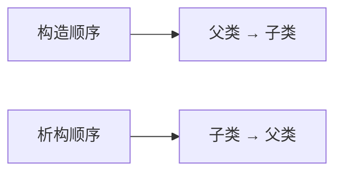
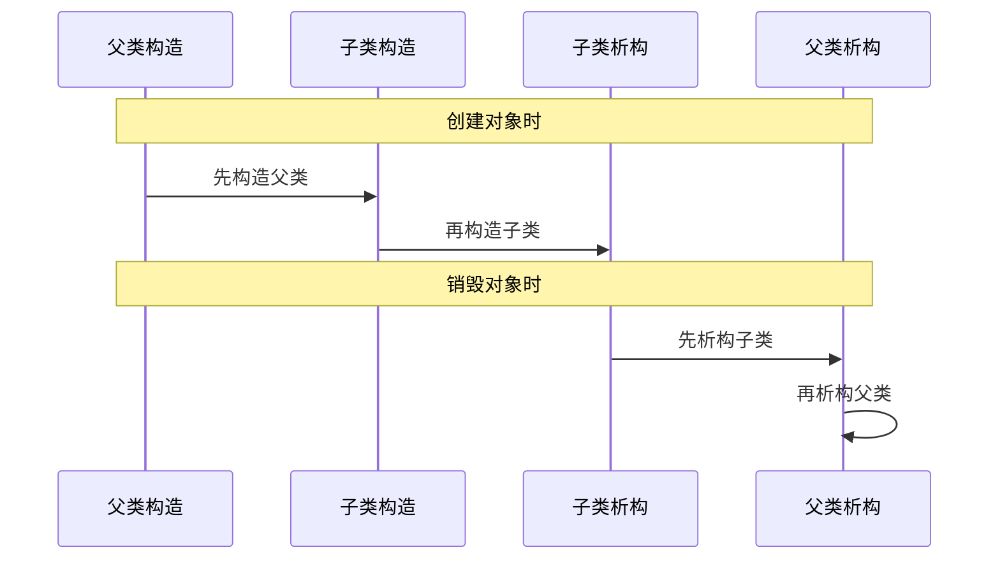
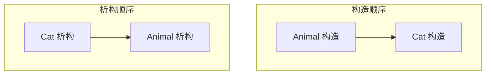
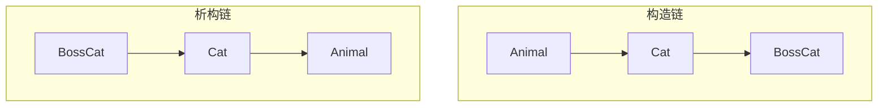
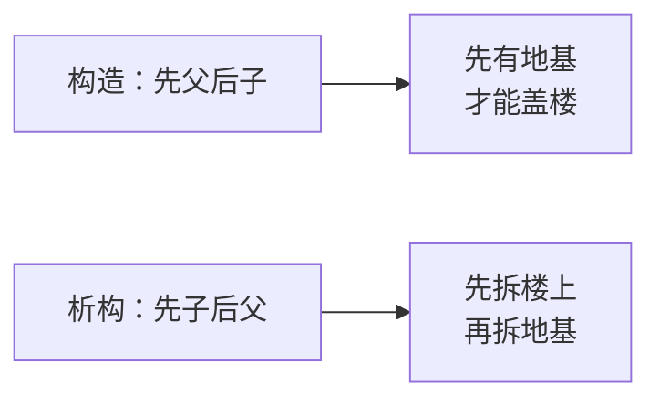

## 本节概述：先有爹才有儿子

继承的时候，构造函数和析构函数是按什么顺序调用的？

答案很简单：**先构造父类，再构造子类；先析构子类，再析构父类**。

一句话记就是——**先构造的后析构**。





## 我们来做个实验

写三代类：Animal（动物）→ Cat（猫）→ BossCat（波斯猫），每个类的构造函数和析构函数都打印一句话，看看调用顺序。

```cpp
#include <iostream>
using namespace std;

// 爷爷类：动物
class Animal
{
public:
    Animal()
    {
        cout << "Animal 构造函数" << endl;
    }

    ~Animal()
    {
        cout << "Animal 析构函数" << endl;
    }
};

// 父类：猫，继承自动物
class Cat : public Animal
{
public:
    Cat()
    {
        cout << "Cat 构造函数" << endl;
    }

    ~Cat()
    {
        cout << "Cat 析构函数" << endl;
    }
};

// 子类：波斯猫，继承自猫
class BossCat : public Cat
{
public:
    BossCat()
    {
        cout << "BossCat 构造函数" << endl;
    }

    ~BossCat()
    {
        cout << "BossCat 析构函数" << endl;
    }
};
```

### 测试单个类：Animal

先从最简单的开始，只实例化一个 Animal：

```cpp
void test01()
{
    Animal a;
}
```

运行结果：
```
Animal 构造函数
Animal 析构函数
```

没什么好说的——创建时构造，销毁时析构。

### 测试两代继承：Cat

```cpp
void test02()
{
    Cat c;
}
```

运行结果：
```
Animal 构造函数
Cat 构造函数
Cat 析构函数
Animal 析构函数
```

看到了吗？
- **构造**：先父类（Animal），再子类（Cat）
- **析构**：先子类（Cat），再父类（Animal）



为什么先构造父类？因为子类继承了父类的东西——得先把"爹"造出来，儿子才能继承他的东西啊。

析构反过来——儿子先走，爹断后。

### 测试三代继承：BossCat

```cpp
void test03()
{
    BossCat bc;
}
```

运行结果：
```
Animal 构造函数
Cat 构造函数
BossCat 构造函数
BossCat 析构函数
Cat 析构函数
Animal 析构函数
```

三代也是一样的规律：
- **构造**：爷爷 → 爸爸 → 孙子（从上到下）
- **析构**：孙子 → 爸爸 → 爷爷（从下到上）



整个过程像一个回文——构造顺着来，析构倒着来。

## 为什么是这个顺序？

道理很简单：

**构造时先父后子**：子类继承了父类的成员，得先把父类的部分构造好，子类才能在这个基础上继续构造自己的部分。就像盖房子——得先打地基，再盖上面的楼层。

**析构时先子后父**：析构是释放资源，子类可能还在用父类的东西，所以得先把儿子的东西收拾完，再收拾爹的。反过来的话，爹都没了儿子找谁去？



## 一句话记忆

这节课内容不多，记住一句话就行：

> **构造链中，先构造的后析构。**

什么意思？把整个继承关系想成一条链——D 继承 C，C 继承 B，B 继承 A。

构造顺序：A → B → C → D
析构顺序：D → C → B → A

A 最先构造，最后析构；D 最后构造，最先析构。

> 也可以联想数据结构里的"栈"——后进先出，最后构造的最先析构。

## 本章小结

**继承中的构造和析构顺序**：

- **构造顺序**：父类 → 子类（先有爹，才有儿子）
- **析构顺序**：子类 → 父类（儿子先走，爹断后）
- **规律**：**先构造的后析构**（像栈一样，后进先出）

三代继承示例：Animal → Cat → BossCat
- 构造：Animal → Cat → BossCat
- 析构：BossCat → Cat → Animal

