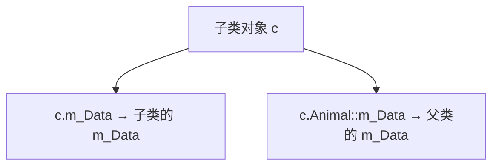
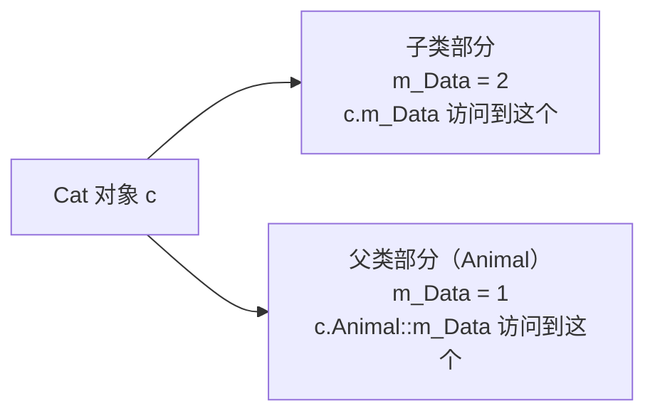
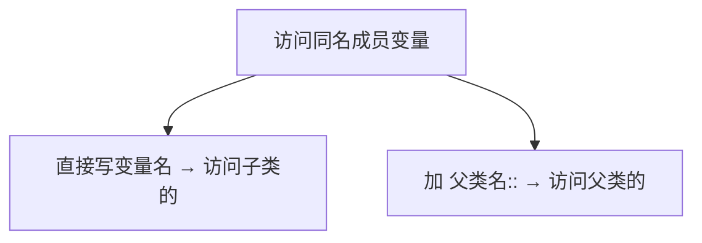

## 本节概述：同名不会覆盖，只是藏起来了

父类和子类有同名的成员变量，会发生什么？子类的会把父类的覆盖掉吗？

答案是：**不会覆盖，两个变量同时存在——默认访问子类的，要访问父类的需要加作用域。**



## 同名属性的现象

我们来做个实验：Animal 父类有个 `m_Data`，Cat 子类也有个 `m_Data`，看看访问的时候拿到的是谁的。

```cpp
#include <iostream>
using namespace std;

// 父类
class Animal
{
public:
    Animal()
    {
        m_Data = 1;  // 父类的 m_Data 初始化为 1
    }

    int m_Data;
};

// 子类
class Cat : public Animal
{
public:
    Cat()
    {
        m_Data = 2;  // 子类的 m_Data 初始化为 2
    }

    int m_Data;  // 跟父类同名的变量
};
```

### 默认访问到的是子类的

```cpp
void test()
{
    Cat c;
    cout << c.m_Data << endl;  // 输出什么？
}
```

运行结果：
```
2
```

默认情况下，`c.m_Data` 访问到的是**子类**的 `m_Data`，值是 2。

你可能会想——父类的那个被覆盖了？消失了？

## 父类的并没有消失

并没有消失——它还在，只是默认不直接显示出来而已。

想访问父类的同名成员，加个**作用域分辨符** `::` 就行：

```cpp
cout << c.Animal::m_Data << endl;  // 访问父类的 m_Data
```

完整代码：

```cpp
void test()
{
    Cat c;

    cout << "子类的 m_Data = " << c.m_Data << endl;
    cout << "父类的 m_Data = " << c.Animal::m_Data << endl;
}
```

运行结果：
```
子类的 m_Data = 2
父类的 m_Data = 1
```

两个值都在——父类的是 1，子类的是 2，**互不影响**。



## 用地址证明：两块独立内存

口说无凭，我们打印地址来证明它们是两个独立的变量：

```cpp
void test()
{
    Cat c;

    cout << "子类 m_Data 的地址：" << &c.m_Data << endl;
    cout << "父类 m_Data 的地址：" << &c.Animal::m_Data << endl;
}
```

运行结果（地址是示意）：
```
子类 m_Data 的地址：0x...1234
父类 m_Data 的地址：0x...1238
```

两个地址不一样——证明它们是**两块独立的内存**，谁也没覆盖谁。

> [!TIP]
> **为什么不是覆盖？**
>
> 你可以把继承想成"套娃"——子类对象里面包含了一个完整的父类对象，然后再加上自己的东西。
>
> 所以父类的 `m_Data` 和子类的 `m_Data` 其实是在不同的位置，各有各的内存。名字相同只是巧合，互不干扰。

## 访问同名成员的规则

总结一下：



| 写法 | 访问的是 |
|---|---|
| `c.m_Data` | **子类**的 m_Data |
| `c.Animal::m_Data` | **父类**的 m_Data |

默认子类优先——因为"就近原则"嘛，自己的先用。要找爷爷辈的，就得带上路名（类名 + `::`）。

> 注意：如果有多层继承（爷爷、父亲、孙子都有同名变量），想访问爷爷的，就加爷爷类的作用域：`c.Animal::m_Data`；想访问父亲的，就加父亲类的作用域：`c.Cat::m_Data`（虽然直接写也行）。

## 同名函数也是一样的道理

不只是成员变量，**成员函数同名也是同样的规则**：
- 直接调用 → 调用子类的
- 加 `父类名::` → 调用父类的

下一节我们会专门讲同名函数的情况。

## 本章小结

**继承中同名属性的访问规则**：

1. **不会覆盖** — 父类和子类的同名成员是两个独立的变量，各有各的内存
2. **默认访问子类的** — 直接写变量名，拿到的是子类的（就近原则）
3. **访问父类的加作用域** — `对象名.父类名::变量名`，比如 `c.Animal::m_Data`

**一句话记忆**：同名不覆盖，默认用子类的，要访问父类的加 `父类::` 作用域。

