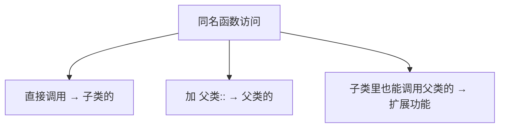
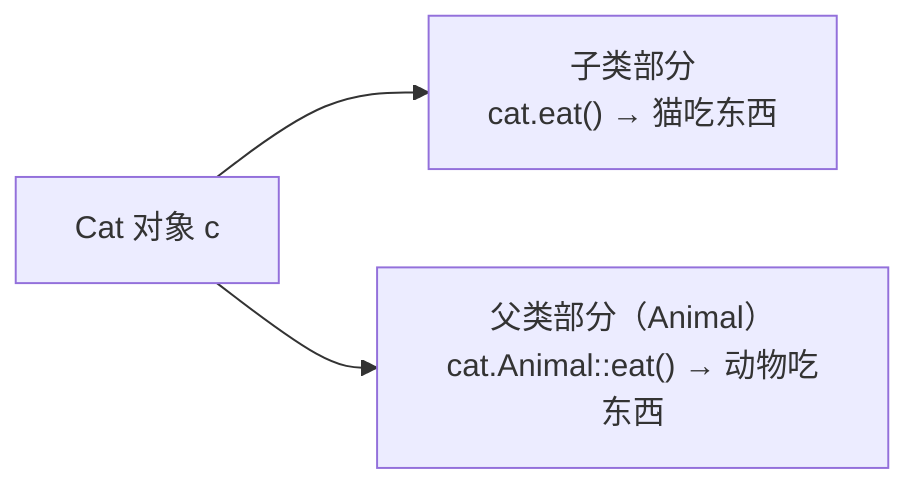
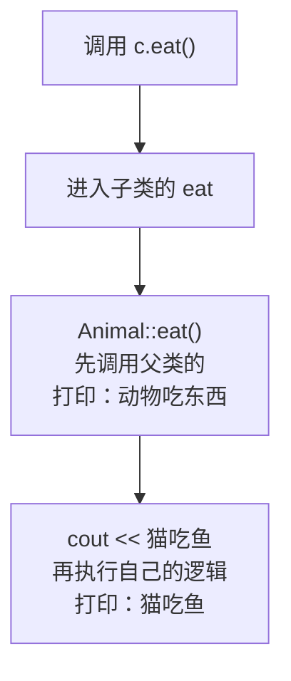

## 本节概述：同名函数的规则跟同名变量一样

上一节我们学了同名属性的访问——父类子类有同名变量，默认访问子类的，要访问父类的加作用域。

那**同名函数**呢？规则完全一样！

直接调用 → 调用子类的
加 `父类名::` → 调用父类的



## 默认调用子类的

父类 Animal 有个 `eat` 函数，子类 Cat 也有个 `eat` 函数，看看调用的是谁的：

```cpp
#include <iostream>
using namespace std;

// 父类
class Animal
{
public:
    void eat()
    {
        cout << "动物吃东西" << endl;
    }
};

// 子类
class Cat : public Animal
{
public:
    void eat()
    {
        cout << "猫吃东西" << endl;
    }
};
```

调用一下：

```cpp
void test()
{
    Cat c;
    c.eat();  // 输出什么？
}
```

运行结果：
```
猫吃东西
```

跟同名变量一样——**默认调用子类的**，就近原则。

## 想调用父类的，加作用域

父类的 `eat` 并没有消失，只是被"藏起来了"。想调用父类的，加作用域分辨符 `::`：

```cpp
c.Animal::eat();  // 调用父类的 eat
```

完整代码：

```cpp
void test()
{
    Cat c;

    c.eat();           // 调用子类的 → 猫吃东西
    c.Animal::eat();   // 调用父类的 → 动物吃东西
}
```

运行结果：
```
猫吃东西
动物吃东西
```

两个函数都在，各干各的，互不影响。



## 在子类函数里调用父类的

还有一种常见用法：**在子类的同名函数里，先调用父类的函数，再加上自己的逻辑**。

相当于"扩展"父类的功能——父类干的活保留，再加点自己的。

```cpp
class Cat : public Animal
{
public:
    void eat()
    {
        Animal::eat();        // 先调用父类的 eat（动物吃东西）
        cout << "猫吃鱼" << endl;  // 再加上自己的逻辑
    }
};
```

调用一下：

```cpp
void test()
{
    Cat c;
    c.eat();
}
```

运行结果：
```
动物吃东西
猫吃鱼
```

看到了吗？先打印"动物吃东西"（父类的活），再打印"猫吃鱼"（子类加的活）。



> [!TIP]
> **什么时候用这种写法？**
>
> 当你想在父类功能的基础上"加点料"的时候——不想完全重写父类的逻辑，只是想扩展一下。
>
> 比如父类的构造函数已经做了一半初始化，子类只需要补自己那部分。或者像这个例子，父类已经写了"吃东西"的通用逻辑，子类只需要加一句"吃什么"。

## 同名变量 vs 同名函数，规则对比

| 情况 | 默认访问 | 访问父类的方式 |
|---|---|---|
| **同名成员变量** | 子类的变量 | `对象.父类::变量名` |
| **同名成员函数** | 子类的函数 | `对象.父类::函数名()` |
| **子类内部访问父类** | — | `父类::成员` |

规则是一模一样的——**同名不覆盖，默认用子类的，找父类的加作用域**。

> [!NOTE]
> **注意：函数重载和同名函数是两回事**
>
> 函数重载是在**同一个作用域**里，函数名相同但参数不同。
>
> 同名函数是在**不同的作用域**（父类和子类），函数名相同（参数可以相同也可以不同）。
>
> 子类的同名函数会**隐藏**父类所有同名的函数（不管参数一不一样），想调用父类的都得加作用域。

## 本章小结

**继承中同名函数的访问规则**，跟同名变量完全一样：

1. **不会覆盖** — 父类和子类的同名函数是两个独立的函数
2. **默认调用子类的** — 直接 `对象.函数()` 调用的是子类的
3. **调用父类的加作用域** — `对象.父类::函数()`
4. **子类里扩展父类** — 在子类函数里调用 `父类::函数()`，先干父类的活再加自己的

**一句话记忆**：同名函数跟同名变量规则一样——默认子类优先，找父类加 `::`，子类里还能扩展父类的功能。

