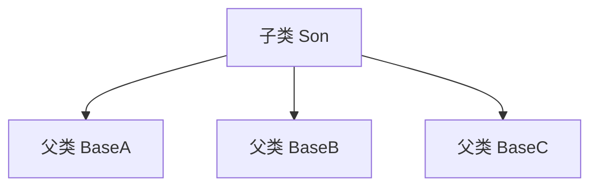
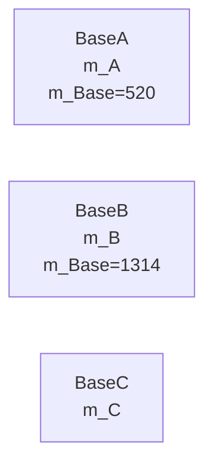
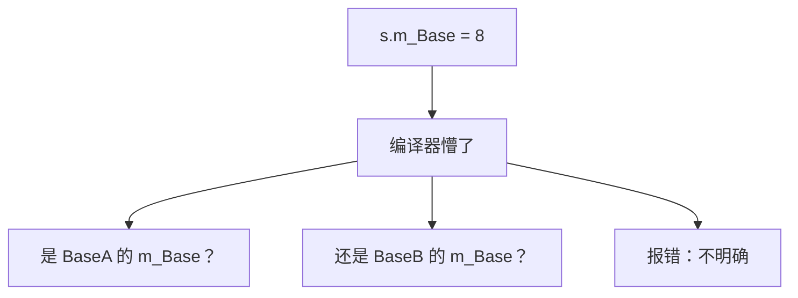
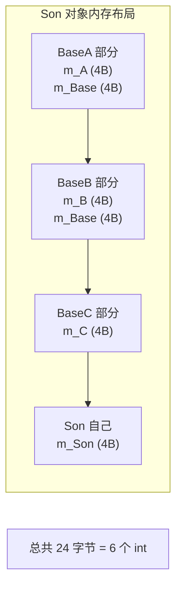

## 本节概述：一个儿子多个爹

**多继承**就是一个子类可以同时继承多个父类——一个儿子好几个爹。

单继承是一个子类只继承一个父类，多继承是一个子类继承多个父类。



C++ 支持多继承——语法上就是在继承列表里用逗号隔开多个父类。

## 多继承的语法

```cpp
class 子类 : 继承方式 父类1, 继承方式 父类2, 继承方式 父类3 ...
{
    // 子类自己的成员
};
```

每个父类前面都要写继承方式，用逗号隔开。想继承几个就写几个。

## 我们来写代码验证

先写三个父类：BaseA、BaseB、BaseC。

BaseA 和 BaseB 都有一个叫 `m_Base` 的同名变量，BaseC 没有（故意的，后面用来对比）。

```cpp
#include <iostream>
using namespace std;

// 父类 A
class BaseA
{
public:
    BaseA()
    {
        m_A = 0;
        m_Base = 520;
    }

    int m_A;
    int m_Base;
};

// 父类 B
class BaseB
{
public:
    BaseB()
    {
        m_B = 0;
        m_Base = 1314;
    }

    int m_B;
    int m_Base;
};

// 父类 C
class BaseC
{
public:
    BaseC()
    {
        m_C = 0;
    }

    int m_C;
};
```



### 子类继承三个父类

```cpp
class Son : public BaseA, public BaseB, public BaseC
{
public:
    Son()
    {
        m_Son = 100;
    }

    int m_Son;
};
```

就是用逗号隔开，每个父类前面都要写继承方式（这里全是 public）。

## 访问不同父类的成员

先访问那些名字不冲突的，没问题：

```cpp
void test()
{
    Son s;

    s.m_A = 1;   // BaseA 的
    s.m_B = 2;   // BaseB 的
    s.m_C = 3;   // BaseC 的

    cout << "m_A = " << s.m_A << endl;
    cout << "m_B = " << s.m_B << endl;
    cout << "m_C = " << s.m_C << endl;
}
```

运行正常，三个变量各归各的。

## 同名成员的问题

问题来了——BaseA 和 BaseB 都有 `m_Base`，那 `s.m_Base` 访问的是谁的？

```cpp
s.m_Base = 8;  // ❌ 编译报错：不明确
```

编译器直接报错——它不知道你想访问哪个爹的 `m_Base`。



### 解决方案：加作用域

跟之前单继承的同名成员一样——**加作用域分辨符 `::`**，告诉编译器你要哪个爹的：

```cpp
s.BaseA::m_Base = 8;  // ✅ 访问 BaseA 的 m_Base
s.BaseB::m_Base = 9;  // ✅ 访问 BaseB 的 m_Base
```

完整代码：

```cpp
void test()
{
    Son s;

    s.BaseA::m_Base = 8;
    s.BaseB::m_Base = 9;

    cout << "BaseA 的 m_Base = " << s.BaseA::m_Base << endl;
    cout << "BaseB 的 m_Base = " << s.BaseB::m_Base << endl;
}
```

运行结果：
```
BaseA 的 m_Base = 8
BaseB 的 m_Base = 9
```

两个值不一样——说明它们是**两块独立的内存**。

## 用地址证明

打印地址，眼见为实：

```cpp
cout << "BaseA 的 m_Base 地址：" << &s.BaseA::m_Base << endl;
cout << "BaseB 的 m_Base 地址：" << &s.BaseB::m_Base << endl;
```

运行结果（地址是示意）：
```
BaseA 的 m_Base 地址：0x...F91C
BaseB 的 m_Base 地址：0x...F9F4
```

两个地址不一样——证明是两个独立的变量，各有各的存储空间。

## 用 sizeof 验证

再用 `sizeof` 看看整个对象有多大：

```cpp
cout << "sizeof(s) = " << sizeof(s) << endl;
```

我们来算一下：
- BaseA：m_A（4 字节）+ m_Base（4 字节）= 8 字节
- BaseB：m_B（4 字节）+ m_Base（4 字节）= 8 字节
- BaseC：m_C（4 字节）= 4 字节
- Son 自己：m_Son（4 字节）= 4 字节
- 总共：8 + 8 + 4 + 4 = **24 字节**

运行结果：
```
sizeof(s) = 24
```

刚好 24 字节——两个 `m_Base` 各占 4 字节，加起来就是 8 字节，进一步证明它们是各自独立存储的。



## 多继承的优缺点

| 优点 | 缺点 |
|---|---|
| 代码复用率更高，可以同时继承多个类的功能 | 同名成员容易产生二义性 |
| 功能组合更灵活 | 继承关系复杂，维护成本高 |
| | 菱形继承等更复杂的问题 |

> [!WARNING]
> **多继承要慎用**
>
> 多继承虽然功能强大，但也会让代码变得复杂。实际开发中，多继承用得并不多——很多语言（比如 Java）干脆就不支持多继承。
>
> 能用单继承解决的就别用多继承，实在需要组合多个功能，优先考虑组合（一个类里放其他类的对象）而不是继承。

## 本章小结

**多继承**就是一个子类可以继承多个父类。

1. **语法** — `class Son : public BaseA, public BaseB, public BaseC`，多个父类用逗号隔开
2. **同名成员有二义性** — 多个父类有同名成员时，直接访问会报错（不明确）
3. **解决方案** — 加作用域 `对象.父类名::成员名`，指定访问哪个父类的
4. **每个父类都有独立空间** — 同名成员各存各的，地址不同，sizeof 也能验证

**一句话记忆**：多继承逗号隔开，同名成员加作用域分辨，好用但别滥用。

