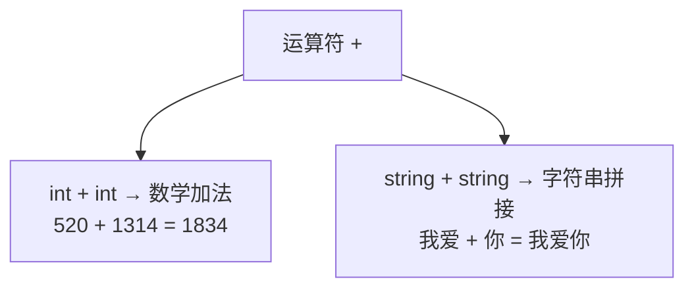
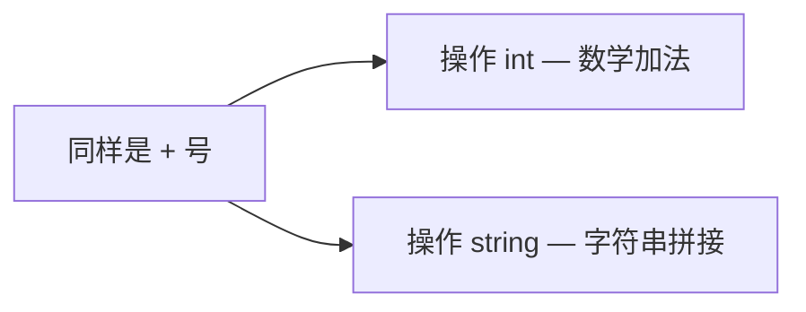
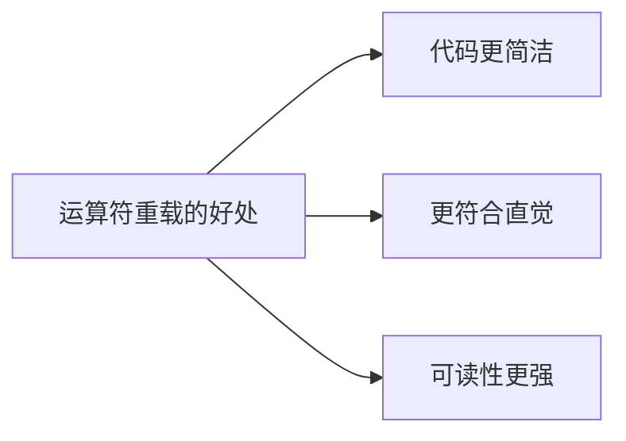
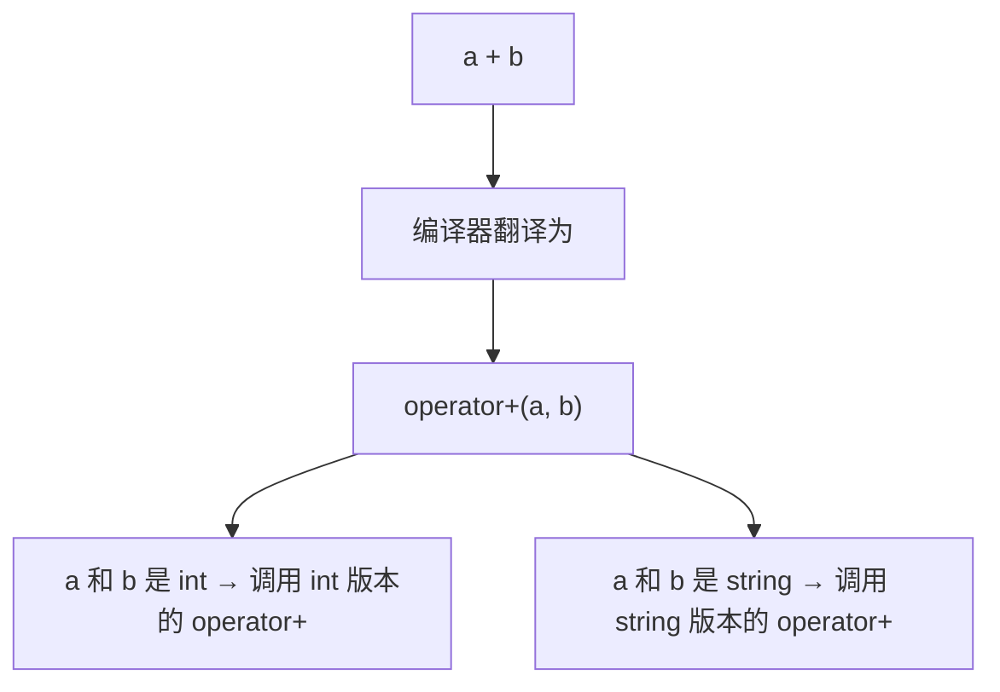

## 本节概述：给运算符赋予新的含义

运算符重载，顾名思义——**对已有的运算符进行重新定义**，让它对不同的数据类型做不同的事情。

说人话就是：同一个加号 `+`，加数字是数学加法，加字符串是拼接。同样的符号，不同的操作——这就是运算符重载。



## 从我们熟悉的例子说起

先看两段代码，你肯定都见过：

### 例子一：int 的加法

```cpp
int a = 520;
int b = 1314;
cout << a + b << endl;  // 输出：1834
```

这个很简单——两个数字相加，结果是数学上的和。小学就学过。

### 例子二：string 的"加法"

```cpp
string c = "520";
string d = "1314";
cout << c + d << endl;  // 输出：5201314
```

哎？同样是加号，这次不是 1834 了，而是把两个字符串拼在一起了。

再举个更直观的：

```cpp
string e = "我爱";
string f = "你";
cout << e + f << endl;  // 输出：我爱你
```



同一个加号，为什么表现不一样？

答案就是：**string 类对加号进行了运算符重载**。

## 为什么需要运算符重载

你可能会想：直接写个函数不就行了吗，比如 `add()`、`concat()`，干嘛非要重载运算符？

因为运算符写起来更**直观、更简洁、更符合人的习惯**。

想象一下，如果没有运算符重载，字符串拼接得这么写：

```cpp
// 没有运算符重载的世界
string result = concat(concat(a, b), c);  // 又丑又难读
```

有了运算符重载之后：

```cpp
// 有了运算符重载
string result = a + b + c;  // 清爽直观
```



后面我们学 STL 的时候，会看到大量的运算符重载——比如 `string` 的 `+` 和 `+=`、`vector` 的 `[]`、智能指针的 `->` 和 `*`，都是用运算符重载实现的。

## 运算符重载的本质

运算符重载的本质，其实就是**函数重载的一种特殊形式**。

你写 `a + b` 的时候，编译器会偷偷把它翻译成类似 `operator+(a, b)` 这样的函数调用。不同的参数类型，调用不同版本的 `operator+` 函数——这就是为什么同一个加号能做不同的事。



> 你可以这么理解：运算符只是函数名长得比较特别而已——`operator+` 就是个函数名，只是调用的时候可以写成 `+` 号。

## 接下来要学什么

运算符重载有很多种，后面我们会一个一个学：

- **加号重载** — 让两个对象也能相加
- **左移运算符重载** — 让自定义类型也能用 `cout` 直接打印
- **递增运算符重载** — 让自定义类型也能 `++`
- **赋值运算符重载** — 深拷贝的问题就靠它解决
- **关系运算符重载** — 让对象也能比大小
- **函数调用运算符重载** — 像函数一样调用对象（仿函数）

每个运算符的重载写法略有不同，但核心思想都是一样的——**给运算符赋予新的含义，让自定义类型也能用运算符来操作**。

## 本章小结

**运算符重载**就是对已有的运算符重新定义，让它对不同的数据类型做不同的操作。

**一个最直观的例子**：
- `int + int` → 数学加法（520 + 1314 = 1834）
- `string + string` → 字符串拼接（"我爱" + "你" = "我爱你"）

**为什么要运算符重载**：让代码更简洁、更符合直觉、可读性更强。

**本质**：运算符重载本质上就是函数重载，`a + b` 会被编译器翻译成 `operator+(a, b)` 的函数调用。

