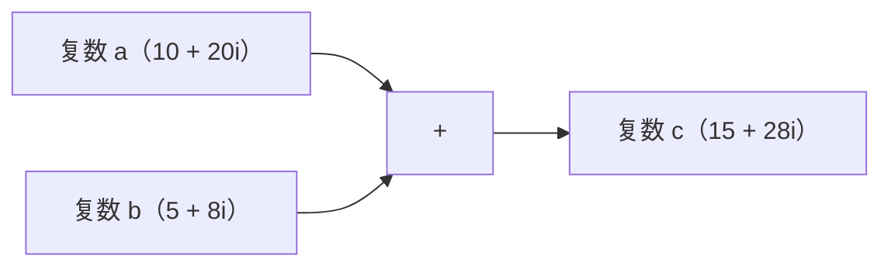
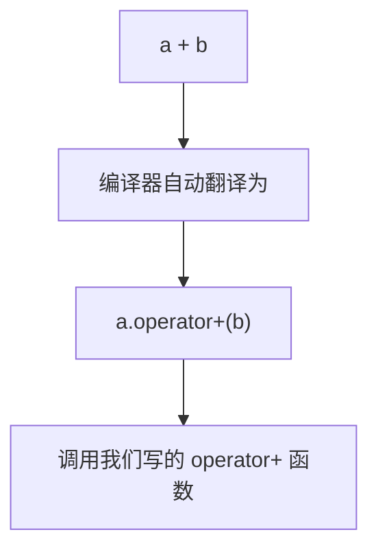
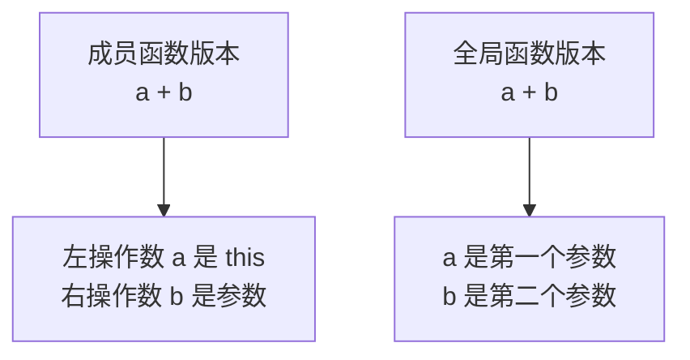

## 本节概述：让自定义类型也能相加

上一节我们知道了运算符重载的概念——同一个运算符对不同类型做不同的事。

这一节我们来动手实现第一个运算符重载：**加号运算符**。

我们用一个经典的例子：**复数类**。复数有实部和虚部，两个复数相加就是实部加实部、虚部加虚部。我们来让复数对象也能用 `+` 号直接相加。



## 第一步：先写一个普通的 add 函数

在学运算符重载之前，我们先写一个最朴素的版本——用普通成员函数来实现复数相加。

### 复数类的定义

```cpp
#include <iostream>
using namespace std;

class Complex
{
public:
    // 默认构造函数（初始化列表）
    Complex() : m_real(0), m_image(0) {}

    // 有参构造函数（参数名和成员变量同名，用 this 解决命名冲突）
    Complex(int real, int image)
    {
        this->m_real = real;
        this->m_image = image;
    }

    // 打印复数：格式为 real + image i
    void print()
    {
        cout << m_real << " + " << m_image << "i" << endl;
    }

private:
    int m_real;   // 实部
    int m_image;  // 虚部
};
```

### 普通的 add 函数

```cpp
// 成员函数：两个复数相加
Complex add(Complex other)
{
    Complex result;
    result.m_real = this->m_real + other.m_real;    // 实部相加
    result.m_image = this->m_image + other.m_image;  // 虚部相加
    return result;
}
```

> 注意：`this` 是指针，所以用 `->` 访问成员；`other` 是对象，所以用 `.` 访问成员。

### 测试一下

```cpp
int main()
{
    Complex a(10, 20);  // 10 + 20i
    Complex b(5, 8);    // 5 + 8i

    Complex c = a.add(b);  // 调用 add 函数相加
    c.print();             // 输出：15 + 28i

    return 0;
}
```

运行结果：
```
15 + 28i
```

没毛病——实部 10+5=15，虚部 20+8=28，结果正确。

但是！调用方式是 `a.add(b)`，写起来有点丑。我们想要的效果是直接写 `a + b`，跟 int 一样自然。

## 第二步：改成运算符重载

怎么改？非常简单——把函数名 `add` 改成 `operator+` 就行了。

```cpp
// 把函数名从 add 改成 operator+
Complex operator+(Complex other)
{
    Complex result;
    result.m_real = this->m_real + other.m_real;
    result.m_image = this->m_image + other.m_image;
    return result;
}
```

就改了个函数名，别的什么都没变。

但神奇的事情发生了——现在你可以直接这么写：

```cpp
Complex c = a + b;  // ✅ 可以直接用 + 号了！
```

编译器看到 `a + b`，会自动翻译成 `a.operator+(b)` —— 也就是调用我们写的这个 `operator+` 函数。



### 完整代码（成员函数版本）

```cpp
#include <iostream>
using namespace std;

class Complex
{
public:
    Complex() : m_real(0), m_image(0) {}

    Complex(int real, int image)
    {
        this->m_real = real;
        this->m_image = image;
    }

    // 加号运算符重载（成员函数版本）
    Complex operator+(Complex other)
    {
        Complex result;
        result.m_real = this->m_real + other.m_real;
        result.m_image = this->m_image + other.m_image;
        return result;
    }

    void print()
    {
        cout << m_real << " + " << m_image << "i" << endl;
    }

private:
    int m_real;
    int m_image;
};

int main()
{
    Complex a(10, 20);
    Complex b(5, 8);

    Complex c = a + b;  // 直接用 + 号！
    c.print();          // 输出：15 + 28i

    return 0;
}
```

运行结果：
```
15 + 28i
```

完美！`a + b` 看起来就像内置类型一样自然——这就是运算符重载的魅力。

## 另一种实现方式：全局函数版本

加号重载除了用成员函数实现，还可以用**全局函数**实现。

成员函数版本里，左操作数是 `this` 指向的对象（`a`），右操作数是参数（`b`）。

全局函数版本呢？两个操作数都作为参数传进来：

```cpp
// 全局函数版本：两个参数
Complex operator+(Complex a, Complex b)
{
    Complex result;
    result.m_real = a.m_real + b.m_real;
    result.m_image = a.m_image + b.m_image;
    return result;
}
```

但是有个问题——`m_real` 和 `m_image` 是私有成员，全局函数访问不到，编译器会报错。

### 怎么解决？用友元！

全局函数想访问类的私有成员？这不就是我们上一章学的友元吗！

在 Complex 类里加一行友元声明：

```cpp
class Complex
{
    // 声明全局的 operator+ 是友元
    friend Complex operator+(Complex a, Complex b);

public:
    // ...
};
```

加上之后，全局函数就能访问私有成员了。

### 完整代码（全局函数版本）

```cpp
#include <iostream>
using namespace std;

class Complex
{
    // 全局函数版的加号重载声明为友元
    friend Complex operator+(Complex a, Complex b);

public:
    Complex() : m_real(0), m_image(0) {}

    Complex(int real, int image)
    {
        this->m_real = real;
        this->m_image = image;
    }

    void print()
    {
        cout << m_real << " + " << m_image << "i" << endl;
    }

private:
    int m_real;
    int m_image;
};

// 全局函数版本的加号重载
Complex operator+(Complex a, Complex b)
{
    Complex result;
    result.m_real = a.m_real + b.m_real;
    result.m_image = a.m_image + b.m_image;
    return result;
}

int main()
{
    Complex a(10, 20);
    Complex b(5, 8);

    Complex c = a + b;
    c.print();  // 输出：15 + 28i

    return 0;
}
```

运行结果一模一样。

## 两种方式对比

成员函数和全局函数都能实现运算符重载，有什么区别呢？

| | 成员函数版本 | 全局函数版本 |
|---|---|---|
| 参数个数 | 1 个（右操作数） | 2 个（左右操作数） |
| 左操作数 | this 指向的对象 | 第一个参数 |
| 访问私有成员 | 直接访问 | 需要友元声明 |
| 调用形式 | `a.operator+(b)` | `operator+(a, b)` |



两种方式都能用，实际开发中成员函数版本用得更多一些——写起来方便，不需要友元。

> [!TIP]
> **那减号呢？乘号呢？**
>
> 套路是一样的——把 `+` 换成 `-` 就是减号重载，换成 `*` 就是乘号重载。
>
> 不过要注意：加减只要把运算符符号换一下就行，但乘除法的运算规则不一样（比如复数乘法就不是简单的实部乘实部、虚部乘虚部），所以函数体内的实现要跟着改。
>
> 运算符重载只是换了个调用方式，具体怎么算还是你自己写的。

## 本章小结

**加号运算符重载**就是给 `+` 号赋予新的含义，让自定义类型也能相加。

**两种实现方式**：
1. **成员函数版本** — `返回类型 operator+(右操作数)`，左操作数是 this
2. **全局函数版本** — `返回类型 operator+(左操作数, 右操作数)`，需要友元才能访问私有成员

**核心本质**：运算符重载本质上就是函数重载，`a + b` 会被编译器翻译成 `a.operator+(b)` 或 `operator+(a, b)` 的函数调用。

**语法记忆点**：
- 函数名固定叫 `operator+`
- 返回类型一般是运算结果的类型
- 参数是参与运算的操作数

