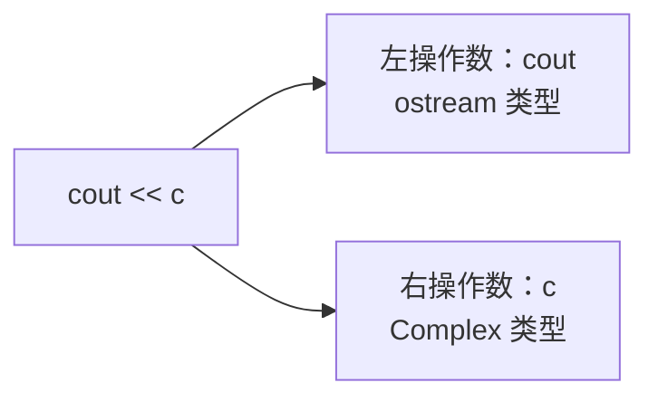
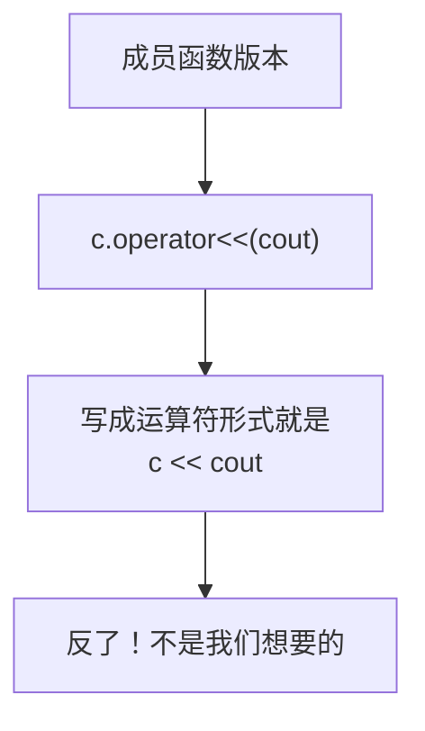
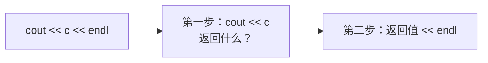
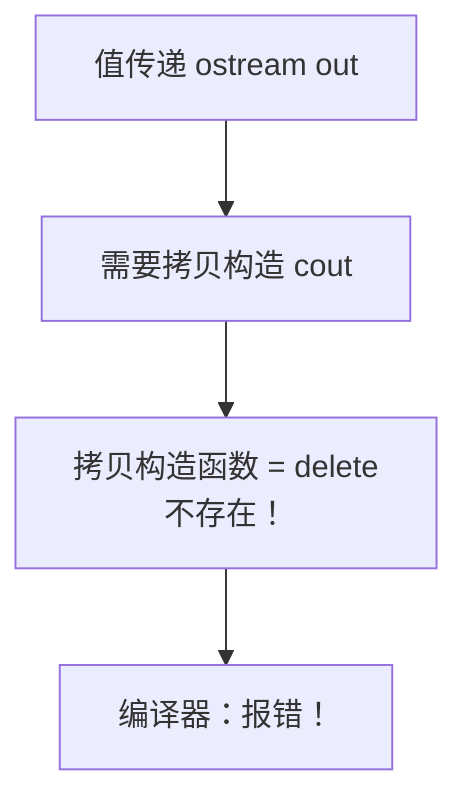
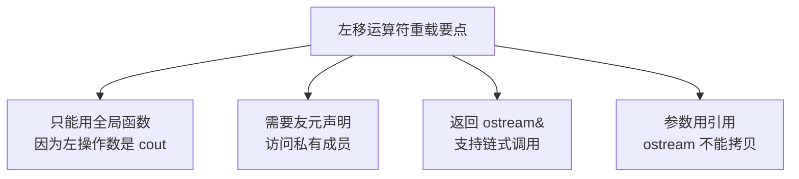

## 本节概述：让自定义类型也能直接 cout

上一节我们让复数类能用 `+` 号相加了。这一节我们来搞定另一个常用的运算符——**左移运算符 `<<`**。

目标很简单：让我们的复数对象也能像 int 一样，直接用 `cout <<` 打印出来。

```cpp
Complex c(10, 20);
cout << c << endl;  // 直接输出，不用再调用 print() 函数了
```

这就是左移运算符重载要干的事情。

## 为什么不能用成员函数实现

加号重载我们用了成员函数的方式，那左移运算符能不能也用成员函数呢？

答案是：**不行**。

### 原因：左操作数必须是 cout

我们想要的效果是 `cout << c`，也就是：
- 左操作数是 `cout`（ostream 类型的对象）
- 右操作数是 `c`（我们的 Complex 对象）



如果用成员函数来实现运算符重载，左操作数必须是这个类的对象——也就是 `c.operator<<(cout)`，对应的写法是 `c << cout`。

这完全反了！我们要的是 `cout << c`，不是 `c << cout`。



`cout` 是标准库的 `ostream` 类的对象，我们没法去改标准库的代码——所以左移运算符重载**只能用全局函数**来实现。

## 全局函数版本的实现

### 第一步：写出函数框架

```cpp
// 左移运算符重载（全局函数版本）
void operator<<(ostream &out, Complex &c)
{
    out << c.m_real << " + " << c.m_image << "i";
}
```

两个参数：
- 第一个：`ostream &out` —— 就是 cout，用引用传
- 第二个：`Complex &c` —— 要输出的对象

函数体里把实部、加号、虚部、i 依次输出出去。

### 第二步：用友元访问私有成员

等等，`m_real` 和 `m_image` 是私有成员，全局函数访问不到——编译器会报错。

怎么办？老办法，**友元声明**：

```cpp
class Complex
{
    // 声明左移运算符重载函数为友元
    friend void operator<<(ostream &out, Complex &c);

public:
    // ...

private:
    int m_real;
    int m_image;
};
```

加上 friend 声明之后，全局函数就能访问私有成员了。

### 测试一下

```cpp
int main()
{
    Complex c(10, 20);
    cout << c;  // 直接用 cout 输出！

    return 0;
}
```

运行结果：
```
10 + 20i
```

成功了！但是等等——如果我想加个 `endl` 呢？

```cpp
cout << c << endl;  // 报错！
```

这么写会报错，为什么？

## 为什么要返回 ostream

我们来想一下链式调用的原理：

```cpp
cout << c << endl;
```

这行代码的执行顺序是这样的：

1. 先执行 `cout << c`，得到一个返回值
2. 再用这个返回值 `<< endl`



如果我们的函数返回值是 `void`，那第一步执行完什么都不返回——第二步拿什么去 `<< endl`？

所以**必须返回 ostream 对象本身**，这样才能继续链式调用。

### 修改：返回 ostream 引用

```cpp
// 返回 ostream&，支持链式调用
ostream& operator<<(ostream &out, Complex &c)
{
    out << c.m_real << " + " << c.m_image << "i";
    return out;  // 返回 cout 本身
}
```

友元声明也要跟着改：

```cpp
friend ostream& operator<<(ostream &out, Complex &c);
```

改完之后，链式调用就没问题了：

```cpp
Complex c(10, 20);
cout << c << endl;                // ✅ 可以加 endl
cout << c << "  " << c << endl;  // ✅ 可以连续输出多个
```

运行结果：
```
10 + 20i
10 + 20i  10 + 20i
```

完美！想怎么连就怎么连，跟内置类型一模一样。

## 一个容易踩的坑：为什么必须用引用

你可能注意到了，我们的参数写的是 `ostream &out`，是引用。如果写成值传递 `ostream out` 会怎么样？

编译器直接报错：**尝试引用已删除的函数**。

### 为什么值传递不行

因为 `ostream`（也就是 cout 的类型）的**拷贝构造函数被删除了**。

什么叫"被删除"？C++11 之后，可以用 `= delete` 来标记某个函数——意思是这个函数**不存在、不能调用**。

```cpp
// 标准库大概是这么写的
ostream(const ostream&) = delete;  // 拷贝构造函数被删除了
```

为什么要删除拷贝构造？因为 `cout` 全局只有一个，不允许拷贝——如果能拷贝出好几个 cout，那输出到底往哪走？



值传递需要先把实参拷贝一份给形参，但 cout 的拷贝构造被删了，拷不了——所以必须用引用。引用是别名，不需要拷贝，自然就不会调用拷贝构造函数了。

> [!NOTE]
> **`= delete` 是什么？**
>
> `= delete` 是 C++11 引入的语法，用来显式删除某个函数。
>
> 跟设成 private 不一样：
> - private — 类外面不能用，类里面还能用
> - = delete — 谁都不能用，彻底消失
>
> 对于像 cout 这种"全局只能有一个"的对象，就需要用 `= delete` 把拷贝构造删掉，防止任何人拷贝它。

## 完整代码

把上面说的全部整合起来，完整代码长这样：

```cpp
#include <iostream>
using namespace std;

class Complex
{
    // 左移运算符重载声明为友元
    friend ostream& operator<<(ostream &out, Complex &c);

public:
    Complex() : m_real(0), m_image(0) {}

    Complex(int real, int image)
    {
        this->m_real = real;
        this->m_image = image;
    }

private:
    int m_real;
    int m_image;
};

// 左移运算符重载（全局函数版本）
ostream& operator<<(ostream &out, Complex &c)
{
    out << c.m_real << " + " << c.m_image << "i";
    return out;  // 返回 ostream 对象，支持链式调用
}

int main()
{
    Complex a(10, 20);
    Complex b(5, 8);

    cout << a << endl;       // 输出单个
    cout << a << b << endl;  // 链式输出多个

    return 0;
}
```

运行结果：
```
10 + 20i
10 + 20i5 + 8i
```

## 左移重载的要点总结



四个要点，一个都不能少：
1. **全局函数实现** — 成员函数会搞反左右操作数
2. **友元声明** — 访问私有成员必须的
3. **返回 ostream&** — 支持 `cout << a << b << endl` 链式调用
4. **参数用引用** — ostream 的拷贝构造被删除了，不能值传递

## 本章小结

**左移运算符重载**就是让自定义类型也能用 `cout <<` 直接输出。

**为什么只能用全局函数**：因为左操作数是 cout（ostream 类型），我们没法在 ostream 类里加成员函数，所以只能用全局函数。

**四个关键要点**：
1. **全局函数实现** — 两个参数：ostream& 和 自定义类型
2. **友元声明** — 访问私有成员需要 friend
3. **返回 ostream&** — 返回 cout 本身，才能链式调用
4. **参数用引用** — ostream 的拷贝构造被 `= delete` 删除了，不能值传递

**核心好处**：自定义类型也能像内置类型一样，用 `cout <<` 直接打印，代码更直观、更符合习惯。

