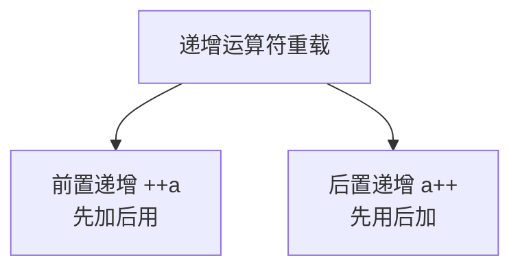
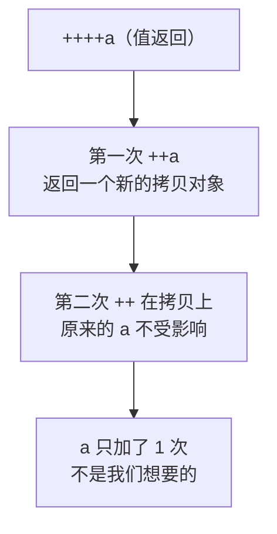
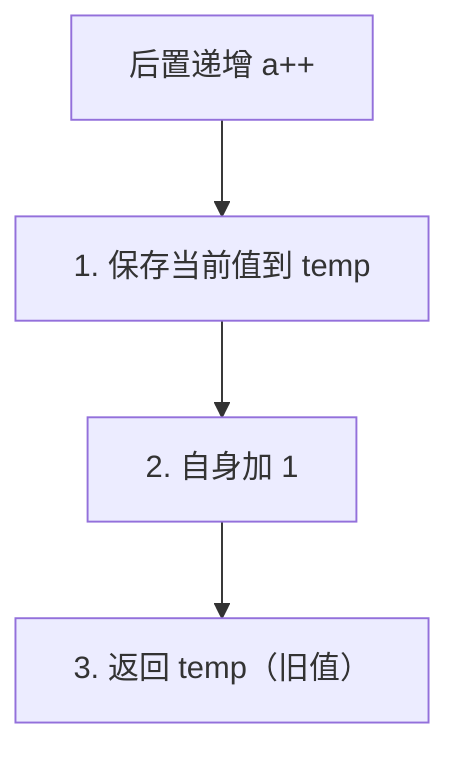
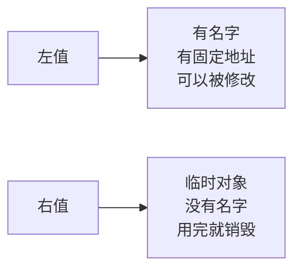
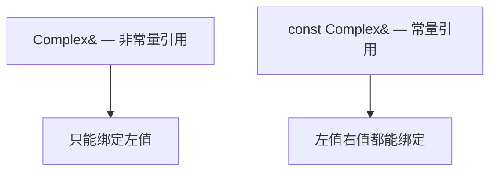

## 本节概述：让自定义类型也能 ++

递增运算符 `++` 有两种写法：**前置递增**（`++a`）和**后置递增**（`a++`）。

这一节我们来给复数类也加上 `++` 运算符，让它也能像 int 一样自增。



还是用我们熟悉的复数类来演示，`++` 操作让实部加 1。

## 前置递增

先看前置递增——`++a`，先加 1，再用加完之后的值。

### 第一步：先写一个朴素版本

```cpp
class Complex
{
public:
    Complex(int real, int image)
    {
        this->m_real = real;
        this->m_image = image;
    }

    // 前置递增（朴素版）
    void operator++()
    {
        m_real++;  // 实部加 1
    }

private:
    int m_real;
    int m_image;
};
```

这样写的话，`++a` 能调用成功，a 的实部确实加了 1。

但是有个问题——如果我想这么写：

```cpp
cout << ++a << endl;  // 报错！
```

不行，因为返回值是 `void`，什么都没返回——`cout` 没东西可输出。

### 第二步：返回对象本身

我们需要返回递增之后的对象，这样才能链式使用。

返回谁呢？返回自己——用 `*this`。

```cpp
// 前置递增（返回对象）
Complex operator++()
{
    m_real++;
    return *this;  // 返回自身
}
```

这样 `++a` 就有返回值了，可以用来输出。

但是等等——这样写还有一个隐藏的坑。

### 第三步：为什么要返回引用

我们来做个实验：

```cpp
int x = 1;
++++x;  // int 的前置递增可以连续调用
```

int 的 `++++x` 是没问题的——先加一次变成 2，再加一次变成 3。

那我们的复数呢？

```cpp
Complex a(10, 10);
++++a;  // 行不行？
```

如果返回值是 `Complex`（值返回），那 `++a` 返回的是一个**新的拷贝对象**，再 `++` 是在拷贝上递增，跟原来的 a 没关系了——a 只加了一次，不是两次。



int 的前置递增为什么能连续调用？因为它返回的是**引用**——返回的就是原来那个变量本身，不是拷贝。

所以我们也要返回引用：

```cpp
// 前置递增（最终版：返回引用）
Complex& operator++()
{
    m_real++;
    return *this;  // 返回自身的引用
}
```

返回 `Complex&`（引用），这样 `++a` 返回的就是 a 本身，再 `++` 还是在 a 上加——连续递增就正确了。

> [!TIP]
> **前置递增要点**：
> - 返回类型是引用（`类名&`）
> - 返回 `*this`（对象本身）
> - 这样才能支持连续递增 `++++a`

## 后置递增

后置递增——`a++`，先用原来的值，用完再加 1。

### 怎么区分前置和后置

问题来了：前置和后置都叫 `operator++`，编译器怎么区分？

C++ 规定了一个特殊的约定：**后置递增的参数里加一个 `int` 占位符**。

```cpp
// 前置递增：没有参数
Complex& operator++()

// 后置递增：多一个 int 参数（占位符，不用传值）
Complex operator++(int)
```

这个 `int` 参数没有任何实际意义，就是用来区分前置和后置的——编译器看到有 int 参数，就知道这是后置版本。

> 注意：必须是 `int` 类型，写 `double`、`float` 都不行，编译器会报错。

### 后置递增的实现

后置递增的逻辑是"先用后加"，所以步骤是：

1. 先把当前的值存起来（待会儿要返回这个旧值）
2. 然后给自己加 1
3. 最后返回之前存的那个旧值

```cpp
// 后置递增
Complex operator++(int)
{
    Complex temp = *this;  // 1. 先存一份旧值
    m_real++;              // 2. 给自己加 1
    return temp;           // 3. 返回旧值
}
```



### 为什么后置不返回引用

前置返回引用，后置为什么返回值呢？

因为后置返回的是一个**临时对象**（temp）——函数结束后 temp 就销毁了，返回引用的话就成了野引用，会出大问题。

而且从语义上讲，后置递增返回的是"加之前的旧值"——本来就应该是一个独立的拷贝，不应该和原对象有关系。

> 这也是为什么 `a++++` 不合法的原因——后置递增返回的是一个临时值（右值），不能再对它调用后置递增（递增运算符需要左值）。

## 左值和右值

刚才提到了"左值"和"右值"，这里简单解释一下：

- **左值** — 有名字、有固定内存地址的东西，可以放在赋值号左边，比如变量 `a`
- **右值** — 临时的、没有名字的东西，只能放在赋值号右边，比如 `a++` 的返回值、函数返回的临时对象



后置递增返回的是临时对象，是右值，所以不能再 `++` 了——`a++++` 是非法的。

而前置递增返回的是引用，是左值，所以可以连续 `++`——`++++a` 是合法的。

## 补充：左移运算符的参数规范

上一节我们写左移重载的时候，参数是 `Complex &c`。但有个问题——如果把后置递增的结果传给它：

```cpp
cout << a++ << endl;  // 报错！
```

为什么报错？因为 `a++` 返回的是临时对象（右值），而 `Complex &c` 是**非常量引用**——C++ 规定：**非常量引用不能绑定到右值**。

### 怎么解决

加个 `const` 就好了：

```cpp
// 左移运算符重载（规范写法：const 引用）
ostream& operator<<(ostream &out, const Complex &c)
{
    out << c.m_real << " + " << c.m_image << "i";
    return out;
}
```

把参数改成 `const Complex &c`——常量引用可以绑定到右值（临时对象）。



这也是左移运算符重载的**规范写法**——右边的对象我们不会修改它，所以加 const 更安全，同时也能接收临时对象，适用范围更广。

> [!NOTE]
> **为什么常量引用能绑定右值？**
>
> 因为常量引用承诺"我不会改这个东西"——既然不会改，那是临时的还是持久的就不重要了，反正只读嘛。
>
> 而非常量引用是"我可能会改"——改一个用完就销毁的临时对象没有意义，所以编译器干脆禁止这么干。

## 完整代码

把上面所有内容整合起来，完整代码长这样：

```cpp
#include <iostream>
using namespace std;

class Complex
{
    // 左移运算符重载（参数用 const 引用，规范写法）
    friend ostream& operator<<(ostream &out, const Complex &c);

public:
    Complex(int real, int image)
    {
        this->m_real = real;
        this->m_image = image;
    }

    // 前置递增：返回引用，支持连续调用
    Complex& operator++()
    {
        m_real++;
        return *this;
    }

    // 后置递增：int 占位符，返回值（旧值的拷贝）
    Complex operator++(int)
    {
        Complex temp = *this;  // 存旧值
        m_real++;              // 加 1
        return temp;           // 返回旧值
    }

private:
    int m_real;
    int m_image;
};

// 左移运算符重载
ostream& operator<<(ostream &out, const Complex &c)
{
    out << c.m_real << " + " << c.m_image << "i";
    return out;
}

int main()
{
    Complex a(10, 10);

    cout << "原始值：" << a << endl;

    // 前置递增测试
    cout << "++a = " << ++a << endl;
    cout << "a = " << a << endl;

    // 后置递增测试
    cout << "a++ = " << a++ << endl;
    cout << "a = " << a << endl;

    return 0;
}
```

运行结果：
```
原始值：10 + 10i
++a = 11 + 10i
a = 11 + 10i
a++ = 11 + 10i
a = 12 + 10i
```

验证一下：
- `++a`：先加后用，输出 11（正确）
- `a++`：先用后加，输出 11，用完之后 a 变成 12（正确）

## 前置 vs 后置 对比

最后用一张表把前置和后置的区别说清楚：

| | 前置递增 `++a` | 后置递增 `a++` |
|---|---|---|
| 参数 | 无参数 | 有一个 `int` 占位符 |
| 返回值 | 返回引用 `类名&` | 返回值 `类名`（拷贝） |
| 语义 | 先加后用 | 先用后加 |
| 能否连续调用 | 可以，`++++a` | 不可以，`a++++` 报错 |
| 返回的是 | 原对象本身 | 旧值的临时拷贝 |

## 本章小结

**递增运算符重载**分前置和后置两种，写法不一样。

**前置递增 `++a`**：
- 没有参数
- 返回引用（`类名&`）
- 返回 `*this`（原对象本身）
- 支持连续调用 `++++a`

**后置递增 `a++`**：
- 参数里加一个 `int` 占位符（用来区分前置）
- 返回值（旧值的拷贝）
- 先存旧值 → 自身加 1 → 返回旧值
- 不支持连续调用（返回的是临时对象，是右值）

**左移重载的规范写法**：右边的参数用 `const 类名&`（常量引用），这样左值右值都能接收，更安全也更通用。

