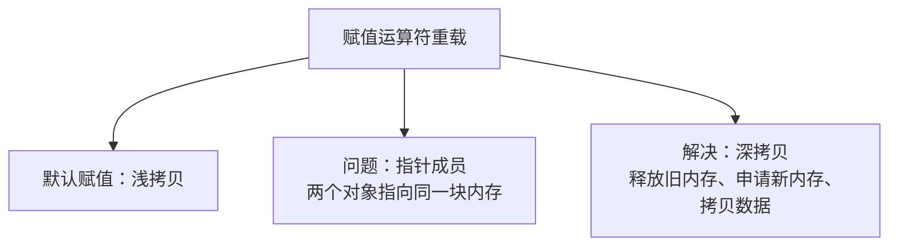
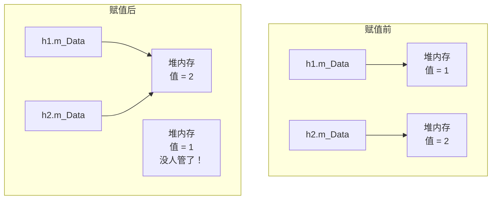
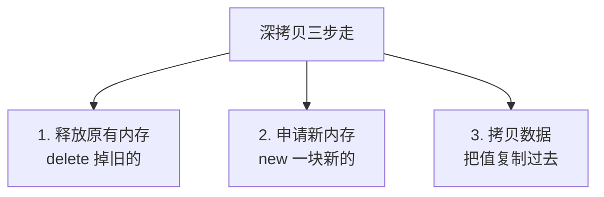

## 本节概述：深拷贝的另一个场景

赋值运算符 `=` 也能重载。你可能会想——赋值不是本来就有吗？为什么还要重载？

默认的赋值运算符做的是**浅拷贝**——把每个成员变量一个一个复制过去。对于普通变量没问题，但如果类里面有指针成员、指向堆内存，浅拷贝就会出大问题。

这一节我们就来看看这个经典的 **double free** 问题，以及怎么用赋值运算符重载解决它。



## 先搭一个有指针成员的类

还是用英雄类，里面加一个指针成员 `m_Data`，指向堆上的 int 数据：

```cpp
#include <iostream>
using namespace std;

class Hero
{
public:
    // 默认构造函数
    Hero() : m_Data(NULL) {}

    // 有参构造函数
    Hero(int data)
    {
        // 在堆上申请内存
        m_Data = new int;
        *m_Data = data;  // 解引用后赋值
    }

    // 析构函数：释放堆内存
    ~Hero()
    {
        if (m_Data != NULL)
        {
            delete m_Data;
            m_Data = NULL;
        }
    }

    int* m_Data;  // 指针成员，指向堆内存
};
```

> 这里先把 `m_Data` 设成 public 的，方便后面打印地址做测试。

## 默认赋值的坑一：内存泄漏

我们实例化两个英雄，然后把 h2 赋值给 h1：

```cpp
int main()
{
    Hero h1(1);  // h1 的 m_Data 指向值为 1 的堆内存
    Hero h2(2);  // h2 的 m_Data 指向值为 2 的堆内存

    cout << "赋值前：" << endl;
    cout << "h1 的地址：" << h1.m_Data << endl;
    cout << "h2 的地址：" << h2.m_Data << endl;

    h1 = h2;  // 默认的赋值运算符

    cout << "赋值后：" << endl;
    cout << "h1 的地址：" << h1.m_Data << endl;
    cout << "h2 的地址：" << h2.m_Data << endl;

    return 0;
}
```

运行结果：
```
赋值前：
h1 的地址：0x...1234
h2 的地址：0x...5678
赋值后：
h1 的地址：0x...5678
h2 的地址：0x...5678
```

赋值之后，h1 和 h2 的 `m_Data` 指向了**同一个地址**。



发现问题了吗？h1 原来指向的那块内存（值为 1 的），赋值之后再也没人指向它了——**内存泄漏**了。这块内存就这么丢了，程序不结束就一直占着。

## 默认赋值的坑二：double free

内存泄漏还只是"悄悄浪费"，更严重的在后面——加上析构函数之后，程序直接崩溃。

为什么？因为两个对象的 `m_Data` 指向同一块内存：

1. h2 先析构 → delete 掉这块内存
2. h1 再析构 → 又 delete 一次同一块内存

同一块内存释放两次，这就是经典的 **double free** 错误，程序直接崩给你看。


> 这个错误的名字叫 `is_valid_heap_pointer` 之类的，不用管它叫啥——只要你的类里有指针成员，然后做了赋值操作，崩了基本就是 double free。

## 解决方案：赋值运算符重载（深拷贝）

问题找到了，怎么解决？很简单——**我们自己来写赋值运算符，做深拷贝**。

深拷贝的思路分三步：

1. **释放自己原来的内存** — 防止内存泄漏
2. **重新申请一块新内存** — 跟对方的大小一样
3. **把数据拷贝过来** — 拷贝内容，不是拷贝地址



### 代码实现

```cpp
// 赋值运算符重载
Hero& operator=(Hero &h)
{
    // 第一步：释放自己原来的内存
    if (m_Data != NULL)
    {
        delete m_Data;
        m_Data = NULL;
    }

    // 第二步：申请新内存
    m_Data = new int;

    // 第三步：拷贝数据
    *m_Data = *h.m_Data;  // 解引用，拷贝值

    return *this;  // 返回自身，支持连续赋值
}
```

> 注意：`h.m_Data` 是指针，要取值的话需要解引用 `*h.m_Data`。

### 为什么要返回引用

你看返回值是 `Hero&`——引用。为什么不直接返回 `Hero`？

因为要支持**连续赋值**：

```cpp
h3 = h2 = h1;  // 连续赋值
```

这行代码的执行顺序是从右往左：
1. 先算 `h2 = h1`，返回 h2
2. 再算 `h3 = h2`（其实是 `h3 = h2 = h1` 的返回值）

如果返回值是 `void`，那第一步算完什么都不返回——第二步就没法继续赋值了。

而且如果返回的是值（`Hero`），返回的是个拷贝，不是 h2 本身——连续赋值也不对。必须返回引用，返回原对象本身。

## 完整代码

```cpp
#include <iostream>
using namespace std;

class Hero
{
public:
    Hero() : m_Data(NULL) {}

    Hero(int data)
    {
        m_Data = new int;
        *m_Data = data;
    }

    // 赋值运算符重载（深拷贝）
    Hero& operator=(Hero &h)
    {
        // 1. 释放原有内存
        if (m_Data != NULL)
        {
            delete m_Data;
            m_Data = NULL;
        }

        // 2. 申请新内存
        m_Data = new int;

        // 3. 拷贝数据
        *m_Data = *h.m_Data;

        return *this;  // 返回自身引用
    }

    ~Hero()
    {
        if (m_Data != NULL)
        {
            delete m_Data;
            m_Data = NULL;
        }
    }

    int* m_Data;
};

int main()
{
    Hero h1(1);
    Hero h2(2);

    cout << "赋值前：" << endl;
    cout << "h1: " << h1.m_Data << "  值：" << *h1.m_Data << endl;
    cout << "h2: " << h2.m_Data << "  值：" << *h2.m_Data << endl;

    h1 = h2;

    cout << "赋值后：" << endl;
    cout << "h1: " << h1.m_Data << "  值：" << *h1.m_Data << endl;
    cout << "h2: " << h2.m_Data << "  值：" << *h2.m_Data << endl;

    // 测试连续赋值
    Hero h3(3);
    h3 = h2 = h1;
    cout << "连续赋值后 h3 的值：" << *h3.m_Data << endl;

    return 0;
}
```

运行结果：
```
赋值前：
h1: 0x...1234  值：1
h2: 0x...5678  值：2
赋值后：
h1: 0x...9ABC  值：2
h2: 0x...5678  值：2
连续赋值后 h3 的值：2
```

赋值之后，h1 和 h2 的地址不一样了——各自有各自的内存，但是值是一样的。析构的时候各释放各的，不会 double free。

## 浅拷贝 vs 深拷贝 对比

最后用一张表说清楚：

| | 浅拷贝（默认） | 深拷贝（自己重载） |
|---|---|---|
| 做什么 | 直接复制指针的值（地址） | 申请新内存，拷贝指针指向的数据 |
| 结果 | 两个指针指向同一块内存 | 两个指针各指各的内存 |
| 内存泄漏 | ✅ 有（旧内存没人管） | ❌ 没有（先释放再申请） |
| double free | ✅ 有（两个对象释放同一块） | ❌ 没有（各释放各的） |
| 适用场景 | 没有指针成员的类 | 有指针成员的类 |


## 本章小结

**赋值运算符重载**主要解决的是类里有指针成员时的浅拷贝问题。

**默认赋值的两个坑**：
1. **内存泄漏** — 赋值覆盖了指针，原来的内存没人管了
2. **double free** — 两个对象指向同一块内存，析构时释放两次导致崩溃

**深拷贝三步走**：
1. **释放原有内存** — `delete` 掉旧的，防止泄漏
2. **申请新内存** — `new` 一块新的
3. **拷贝数据** — 把值复制过去（不是复制地址）

**返回引用** — 返回 `*this`，支持连续赋值 `h3 = h2 = h1`。

