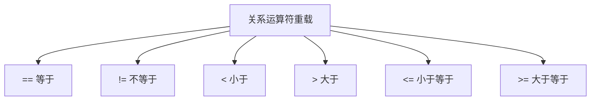
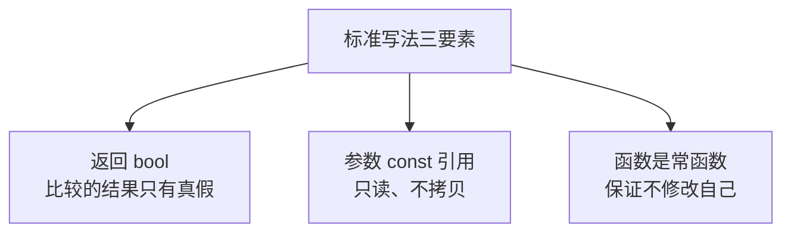
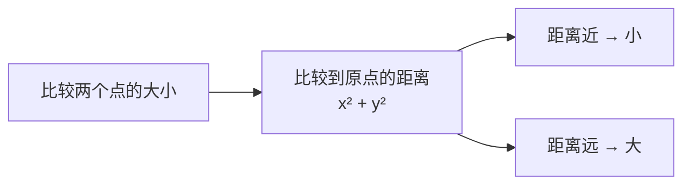
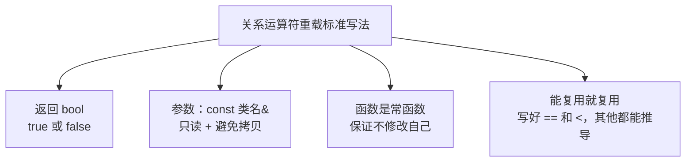

## 本节概述：让自定义类型也能比大小

关系运算符就是 `==`、`!=`、`<`、`>`、`<=`、`>=` 这些比较符号。

对于 int、double 这些内置类型，编译器知道怎么比大小。但对于我们自己写的类——比如一个点（Point）——怎么判断两个点是否相等、谁大谁小，编译器就不知道了，得我们自己来定义。



这一节我们用 Point（点）类作为例子，实现几个常用的关系运算符。

## 先定义 Point 类

一个点有 x 坐标和 y 坐标：

```cpp
#include <iostream>
using namespace std;

class Point
{
public:
    // 构造函数（初始化列表）
    Point(int x, int y) : m_X(x), m_Y(y) {}

private:
    int m_X;  // x 坐标
    int m_Y;  // y 坐标
};
```

现在我想判断两个点是否相等：

```cpp
Point a(1, 6);
Point b(2, 5);

if (a == b)  // 报错！
{
    cout << "相等" << endl;
}
```

编译器直接报错——它不知道两个 Point 怎么比。

怎么办？**重载 == 运算符**。

## 等于运算符 ==

### 基本写法

关系运算符的返回值一定是 `bool`（布尔类型）——要么 true 要么 false。

```cpp
// 等于运算符重载
bool operator==(Point other)
{
    // x 相等 并且 y 相等，两个点才相等
    return m_X == other.m_X && m_Y == other.m_Y;
}
```

这样写能用，但不够规范——我们来优化一下。

### 优化一：参数用 const 引用

参数 `Point other` 是值传递，会调用拷贝构造函数——没必要，我们只是比较一下，又不改它。

改成引用能省掉一次拷贝。再加个 const 保证不会修改对方的数据：

```cpp
bool operator==(const Point &other)
{
    return m_X == other.m_X && m_Y == other.m_Y;
}
```

### 优化二：函数设为常函数

比较操作是只读的，不会修改自己的数据——所以函数本身也应该是常函数（const 成员函数）。

```cpp
bool operator==(const Point &other) const
{
    return m_X == other.m_X && m_Y == other.m_Y;
}
```



这样就是一个**标准的关系运算符重载写法**了——比较的和被比较的都是只读的，安全又高效。

## 小于运算符 <

光有等于还不够，我还想知道谁大谁小。

对于点来说，"大小"怎么定义？通常我们用**到原点的距离**来比——距离近的就"小"，距离远的就"大"。

> 两点到原点距离的比较，其实就是比较 x² + y²（不用开方，省得有精度问题）。

```cpp
// 小于运算符重载
bool operator<(const Point &other) const
{
    // 计算自己到原点距离的平方
    int d1 = m_X * m_X + m_Y * m_Y;
    // 计算对方到原点距离的平方
    int d2 = other.m_X * other.m_X + other.m_Y * other.m_Y;

    return d1 < d2;
}
```



## 大于运算符 >

大于号怎么写？你可能会想——直接把小于号的逻辑反过来不就行了？

可以，但其实有更聪明的写法：**复用已经写好的 == 和 <**。

大于 = 既不等于，也不小于。

```cpp
// 大于运算符重载（复用 == 和 <）
bool operator>(const Point &other) const
{
    if (*this == other)  // 相等的话肯定不大于
        return false;
    if (*this < other)   // 小于的话也不大于
        return false;
    return true;         // 既不等于也不小于，那就是大于
}
```

> `*this` 就是自己本身。用 `*this == other` 调用我们已经写好的等于运算符。

这么写的好处是——如果以后比较规则变了（比如不比距离了，改成比 x 坐标），你只需要改 `==` 和 `<` 的实现，`>` 自动跟着变，不用到处改。

> [!TIP]
> **其他关系运算符呢？**
>
> `!=`（不等于）、`<=`（小于等于）、`>=`（大于等于）套路是一样的——都可以复用已经写好的 `==` 和 `<`：
>
> - `!=` → `!(*this == other)`
> - `<=` → `*this == other || *this < other`
> - `>=` → `*this == other || *this > other`
>
> 只要写好了 `==` 和 `<`，其他的都能推导出来，不需要重复写比较逻辑。

## 完整代码

```cpp
#include <iostream>
using namespace std;

class Point
{
public:
    Point(int x, int y) : m_X(x), m_Y(y) {}

    // 等于运算符
    bool operator==(const Point &other) const
    {
        return m_X == other.m_X && m_Y == other.m_Y;
    }

    // 小于运算符（比较到原点的距离）
    bool operator<(const Point &other) const
    {
        int d1 = m_X * m_X + m_Y * m_Y;
        int d2 = other.m_X * other.m_X + other.m_Y * other.m_Y;
        return d1 < d2;
    }

    // 大于运算符（复用 == 和 <）
    bool operator>(const Point &other) const
    {
        if (*this == other)
            return false;
        if (*this < other)
            return false;
        return true;
    }

private:
    int m_X;
    int m_Y;
};

int main()
{
    Point a(1, 6);  // 1 + 36 = 37
    Point b(2, 5);  // 4 + 25 = 29

    if (a == b)
    {
        cout << "a 和 b 相等" << endl;
    }
    else if (a < b)
    {
        cout << "a 离原点更近（a 小）" << endl;
    }
    else if (a > b)
    {
        cout << "b 离原点更近（b 小）" << endl;
    }

    return 0;
}
```

运行结果：
```
b 离原点更近（b 小）
```

验证一下：a 的距离平方是 1+36=37，b 的是 4+25=29——b 更近，所以 a > b，走第三个分支，正确。

## 关系运算符的标准写法

不管是哪个关系运算符，标准写法都是一个套路：



四个要点：
1. **返回 bool** — 比较的结果只有真和假
2. **参数是 const 引用** — 只读、不拷贝、高效安全
3. **函数是常函数** — 保证比较操作不修改自己的数据
4. **尽量复用** — 写好 `==` 和 `<`，其他运算符可以复用它们

## 本章小结

**关系运算符重载**就是告诉编译器，自定义类型怎么比较大小、怎么判断相等。

**三个核心要点**：
1. **返回值是 bool** — 比较的结果只有 true 和 false
2. **参数用 const 引用** — 只读不修改，还能避免拷贝构造
3. **函数是常函数** — 保证比较操作不会修改自己的数据

**复用技巧**：
- 只要写好了 `==` 和 `<`，其他的（`!=`、`>`、`<=`、`>=`）都可以通过它们推导出来，不用重复写比较逻辑
- 用 `*this` 来调用自己已经写好的运算符

