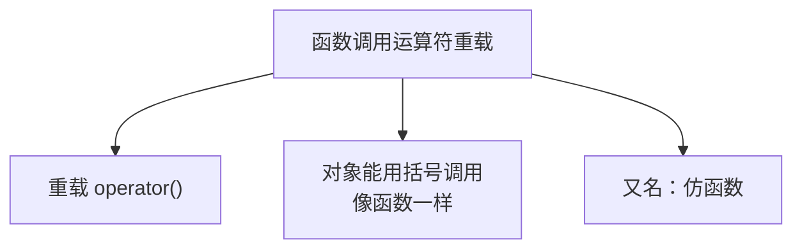
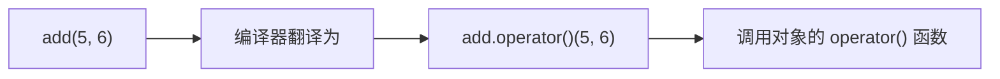
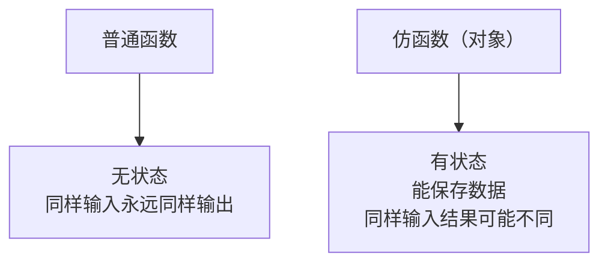

## 本节概述：让对象也能像函数一样调用

函数调用运算符——就是这对圆括号 `()`。

我们平时调用函数的时候用的就是它——`add(5, 6)`。那如果我们对一个类重载了 `()` 运算符，会发生什么？

答案是：**这个类的对象，用起来就跟函数一模一样了**。

我们叫这种对象 **仿函数**——模仿函数的意思。



## 先写一个最简单的仿函数

我们来做一个加法仿函数——`AddFactor`，调用它的时候传两个数，返回它们的和。

```cpp
#include <iostream>
using namespace std;

class AddFactor
{
public:
    // 函数调用运算符重载
    int operator()(int a, int b)
    {
        return a + b;
    }
};
```

> 注意语法：`operator()` —— 第一个括号是运算符的名字，第二个括号是参数列表。

### 怎么用？

```cpp
int main()
{
    AddFactor add;  // 实例化一个对象

    cout << add(5, 6) << endl;  // 像函数一样调用！

    return 0;
}
```

运行结果：
```
11
```

`add` 明明是个对象，但是 `add(5, 6)` 写起来跟调用函数一模一样——这就是仿函数。



## 仿函数 vs 普通函数

既然用起来一样，那仿函数和普通函数有啥区别？

### 先看普通函数

```cpp
// 普通的加法函数
int Add(int a, int b)
{
    return a + b;
}
```

普通函数是个"纯函数"——同样的输入，永远得到同样的输出。你调用 `Add(5, 6)` 一百次，每次都是 11。

### 再看仿函数

仿函数的本质是**对象**——对象可以有成员变量，成员变量可以保存**状态**。

啥意思？来看个例子：

```cpp
class AddFactor
{
public:
    AddFactor() : m_Acc(0) {}  // 构造函数，初始化为 0

    int operator()(int a, int b)
    {
        m_Acc++;              // 每次调用，计数器 +1
        return a + b + m_Acc; // 结果里加上计数器
    }

private:
    int m_Acc;  // 保存状态的成员变量
};
```

我们加了一个 `m_Acc` 计数器，每次调用都加 1，然后加到结果里。

```cpp
int main()
{
    AddFactor add;

    // 每次传的都是 5 和 6，但结果不一样
    cout << add(5, 6) << endl;  // 第一次：5+6+1 = 12
    cout << add(5, 6) << endl;  // 第二次：5+6+2 = 13
    cout << add(5, 6) << endl;  // 第三次：5+6+3 = 14

    return 0;
}
```

运行结果：
```
12
13
14
```

同样的参数 `add(5, 6)`，每次结果都不一样——因为仿函数"记住"了之前调用了多少次。



这就是仿函数和普通函数最核心的区别：**仿函数可以保存状态**。

> [!TIP]
> **仿函数有什么用？**
>
> 你可能会想——"我为啥要搞个对象假装成函数？直接写函数不行吗？"
>
> 简单的场景确实用普通函数就行。但仿函数因为能保存状态，在一些高级场景里特别有用，比如：
> - 计数器：统计函数被调用了多少次
> - 累加器：每次调用都往上面加
> - STL 里的排序、查找算法，经常需要传一个"比较规则"进去，用仿函数传比用函数传更灵活
>
> 后面学 STL 的时候会大量见到仿函数，先混个脸熟就行。

## 完整代码

把普通函数和仿函数放一起对比着看：

```cpp
#include <iostream>
using namespace std;

// 普通函数
int Add(int a, int b)
{
    return a + b;
}

// 仿函数（函数调用运算符重载）
class AddFactor
{
public:
    AddFactor() : m_Acc(0) {}

    int operator()(int a, int b)
    {
        m_Acc++;
        return a + b + m_Acc;
    }

private:
    int m_Acc;  // 保存状态
};

int main()
{
    // 普通函数调用
    cout << "普通函数：" << endl;
    cout << Add(5, 6) << endl;  // 11
    cout << Add(5, 6) << endl;  // 11
    cout << Add(5, 6) << endl;  // 11

    // 仿函数调用
    cout << "仿函数：" << endl;
    AddFactor add;
    cout << add(5, 6) << endl;  // 12
    cout << add(5, 6) << endl;  // 13
    cout << add(5, 6) << endl;  // 14

    return 0;
}
```

运行结果：
```
普通函数：
11
11
11
仿函数：
12
13
14
```

对比很明显：普通函数多少次结果都一样，仿函数因为有状态，结果会变。

## 本章小结

**函数调用运算符重载**就是重载 `()`，让对象能像函数一样被调用——也叫**仿函数**。

**语法**：`返回类型 operator()(参数列表) { ... }`

**仿函数 vs 普通函数**：
- **普通函数** — 没有状态，同样输入永远同样输出
- **仿函数** — 本质是对象，有成员变量，可以保存状态，同样输入结果可能不同

**为什么叫仿函数**：用起来跟函数一模一样（都是 `名字(参数)` 的形式），但本质是个对象，所以叫"仿"函数。

