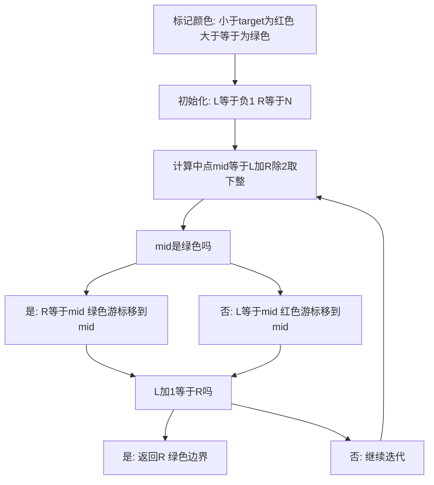

## 本节概述：二分查找

二分查找无论是 ACM 还是蓝桥杯都是必学算法，面试时也有很大概率被问到。本节介绍一种非常普适的方法——红绿灯标记法，通过颜色标记将问题抽象为寻找红绿边界，用一个通用模板解决各种二分查找问题。

---

### 核心概念

**二分查找的难点**：用迭代方式写二分查找时，左区间有时要加一有时不用，右区间有时要减一有时不用，迭代终止条件到底是等于还是小于也不确定，写不好还会产生死循环。

**红绿灯标记法**：

1. 将数组中所有元素标记颜色：满足条件的标记为绿色（代表通行/好的），不满足的标记为红色（代表禁止/不好的）
2. 引入两个虚拟空间：-1（一定是红色）和 N（一定是绿色）
3. 定义两个游标：左边的红色游标始终指向红色区域，右边的绿色游标始终指向绿色区域
4. 计算中点（黄色游标），看中点对应格子的颜色，将对应颜色的游标替换为黄色游标
5. 不断迭代，区间不断缩小，直到红色游标加一等于绿色游标（区间长度为 2）
6. 返回绿色游标的位置

```cpp
// 伪代码：找到最小的满足条件的绿色下标
int find_min_green_index(arr[], length, target) {
    int L = -1;       // 红色游标，始终指向红色区域
    int R = length;   // 绿色游标，始终指向绿色区域
    while (L + 1 < R) {            // 当区间长度大于2时继续
        int mid = (L + R) / 2;     // 取下整
        if (is_green(arr, mid, target)) {
            R = mid;    // 中点是绿色，绿色游标移到mid
        } else {
            L = mid;    // 中点是红色，红色游标移到mid
        }
    }
    return R;           // 返回绿色边界
}

// 判绿函数：根据不同问题修改此函数
bool is_green(arr[], mid, target) {
    return arr[mid] >= target;  // 大于等于target为绿色
}
```

### 算法步骤



**细节剖析**：

1. **迭代过程**：不断向红绿边界逼近，红色游标始终指向红色元素，绿色游标始终指向绿色元素
2. **迭代结束条件**：L+1 等于 R（区间长度为 2）时结束；L+1 小于 R 时继续迭代
3. **初始值**：红色游标必须为 -1，绿色游标必须为 N。若初始化为 0 和 N-1，当所有元素都是绿色或红色时会违背不变量
4. **中点位置安全性**：mid = (L+R)/2 取下整。L 最小为 -1，R 最小为 L+2，所以 mid 最小为 0；R 最大为 N，L 最大为 R-2，所以 mid 最大为 N-1。mid 始终在 0 到 N-1 范围内，不会越界
5. **不会死循环**：区间长度为 2 时循环结束；长度为 3 时一定能变成 2；长度为 4 时能变成 2 或 3。任何情况区间长度都会减小，最终等于 2 时结束

### 复杂度分析

- 线性查找：O(N)
- 二分查找：每次区间缩小一半，O(log N)

> [!TIP]
> 可以通过修改 is_green 函数来解决不同问题，二分查找的核心代码不需要修改。模板并非万能，只是这三道题正好能套用，遇到新问题需要不断优化和迭代模板。

## 本章小结

- 红绿灯标记法：红色代表不满足条件，绿色代表满足条件，寻找红绿边界
- 初始值：红色游标为 -1，绿色游标为 N（不能用 0 和 N-1）
- 迭代结束条件：L+1 等于 R（区间长度为 2）
- 中点公式：(L+R)/2 取下整，始终在 0 到 N-1 范围内
- 不会死循环：区间长度一定减小，最终为 2 时结束
- 通过修改 is_green 函数适配不同问题
