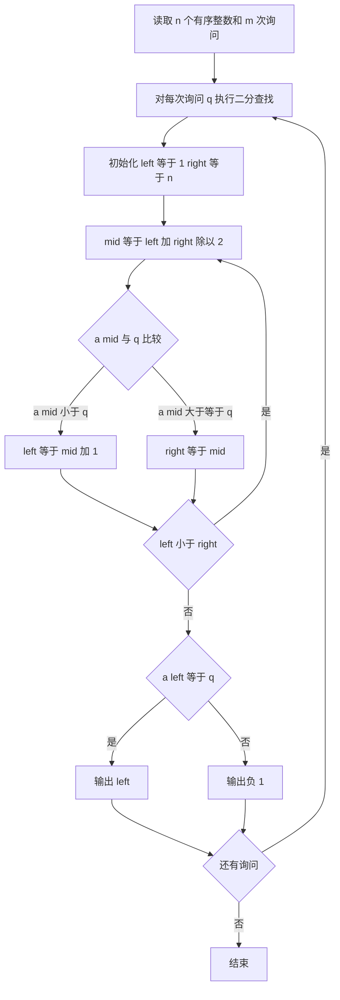

## 本节概述：二分查找 实战

本节选用洛谷 P2249「查找」——这是二分查找最经典的模板题，要求在单调序列中查找元素首次出现的位置，完美展示了二分查找中「找第一个满足条件的位置」这一核心模式。

---

### 题目描述

**查找** | 洛谷 P2249 | 难度：普及-

输入 n 个单调不减的非负整数 a1, a2, ..., an，然后进行 m 次询问。对于每次询问，给出一个整数 q，要求输出这个数字在序列中第一次出现的编号，如果没有找到的话输出 -1。

**输入格式**：第一行 2 个整数 n 和 m，表示数字个数和询问次数。第二行 n 个整数，表示待查询的数字。第三行 m 个整数，表示询问的数字的编号，从 1 开始编号。

**输出格式**：输出一行，m 个整数，以空格隔开，表示答案。

**数据范围**：1 <= n <= 10^6，0 <= ai, q <= 10^9，1 <= m <= 10^5。本题输入输出量较大，请使用较快的 IO 方式。

**示例**：
输入：
```
11 3
1 3 3 3 5 7 9 11 13 15 15
1 3 6
```
输出：
```
1 2 -1
```

### 解题思路

**核心思想**：在有序序列中用二分查找定位元素首次出现的位置，即「找第一个大于等于目标值的位置，再判断该位置是否等于目标值」。

由于序列单调不减，相同元素相邻排列。要找第一次出现的位置，可以用「二分查找左边界」的方法：
- 如果中间值 `a[mid] < q`，目标一定在右半部分，`left = mid + 1`
- 如果中间值 `a[mid] >= q`，目标可能在 mid 或左半部分，`right = mid`
- 最终 `left == right`，检查 `a[left]` 是否等于 `q`



### 代码实现

```cpp
#include <iostream>
using namespace std;

const int MAXN = 1000010;
int a[MAXN];

int main() {
    ios::sync_with_stdio(false);
    cin.tie(nullptr);
    
    int n, m;
    cin >> n >> m;
    
    // 读取有序序列，下标从 1 开始
    for (int i = 1; i <= n; i++) {
        cin >> a[i];
    }
    
    // 处理 m 次询问
    for (int i = 0; i < m; i++) {
        int q;
        cin >> q;
        
        // 二分查找：找第一个大于等于 q 的位置
        int left = 1, right = n;
        while (left < right) {
            int mid = (left + right) / 2;
            if (a[mid] < q) {
                left = mid + 1;   // mid 及左边都不可能是答案
            } else {
                right = mid;       // mid 可能是答案，继续往左找
            }
        }
        
        // 检查是否真的等于 q
        if (a[left] == q) {
            cout << left;
        } else {
            cout << -1;
        }
        
        if (i < m - 1) cout << " ";
    }
    cout << endl;
    
    return 0;
}
```

### 代码解析

1. **`ios::sync_with_stdio(false); cin.tie(nullptr);`**：快读优化。由于数据量可达 10^6，关闭 C++ 与 C 标准流的同步可以显著提升输入速度

2. **二分查找的循环条件 `while (left < right)`**：这是「找左边界」的标准写法。循环结束时 `left == right`，指向第一个大于等于 `q` 的位置

3. **`a[mid] < q` 时 `left = mid + 1`**：mid 位置的值小于目标值，mid 及其左边都不可能是答案，直接跳过

4. **`a[mid] >= q` 时 `right = mid`**：mid 位置的值大于等于目标值，mid 可能就是答案，所以 `right = mid` 而非 `mid - 1`，保留 mid 作为候选

5. **最终检查 `a[left] == q`**：二分找到的是「第一个大于等于 q 的位置」，但这个位置的值可能不等于 q（比如 q 不在序列中），需要额外验证

### 复杂度分析

- 时间复杂度：O(m log n)，每次询问二分查找 O(log n)，共 m 次询问
- 空间复杂度：O(n)，存储有序序列

> [!TIP]
> 二分查找有两个关键细节：一是 `mid = (left + right) / 2` 防止溢出可以用 `left + (right - left) / 2`；二是循环条件 `left < right` 配合 `right = mid`（而非 `mid - 1`）可以避免死循环。当 `left == right` 时循环自然终止。

## 本章小结

- 二分查找适用于有序序列，时间复杂度 O(log n)
- 「找左边界」是二分查找最常见的变体：找第一个满足条件的位置
- 关键写法：`while (left < right)`，当 `a[mid] >= q` 时 `right = mid`，保留候选
- 数据量大时注意快读优化：`ios::sync_with_stdio(false)`
