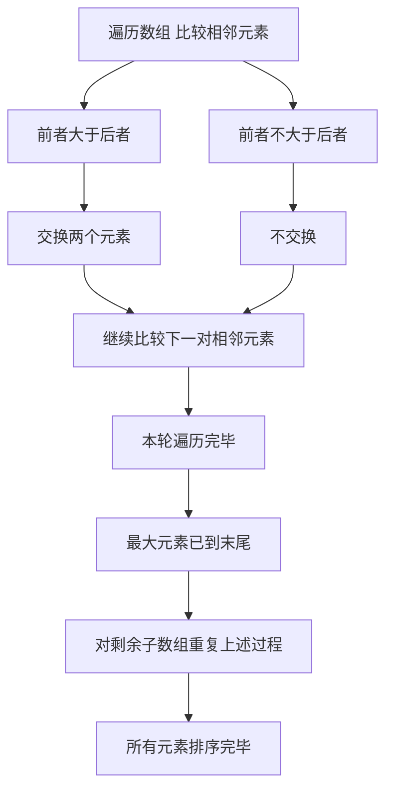

## 本节概述：冒泡排序

冒泡排序是一种简单的排序算法，通过多次比较和交换相邻的元素，将数组元素按升序或降序排列。之所以叫冒泡排序，是因为最大的元素像冒泡一样冒到最上面来，次大的元素冒到第二个位置，以此类推。

---

### 核心概念

**算法思想**：每次遍历数组，比较相邻的两个元素，如果顺序错误就进行交换，直到数组中所有元素都被遍历过。

**具体步骤**：
1. 遍历数组第一个元素到最后一个元素
2. 对于每个元素和它后面的元素进行比较，如果顺序错误就交换
3. 重复这个过程，直到所有元素都被遍历至少一次

**执行过程**（以数组 85643712 为例）：
- 第一轮：比较 8 和 5，8 大于 5 交换；8 和 6 比较，交换；8 和 4 交换；8 和 3 交换；8 和 7 交换；8 和 1 不交换（8 小于 10）；继续比较 10 和 2，10 大于 2 交换。这样最大的元素 10 被冒泡到最后一个位置
- 第二轮：对剩余子数组继续同样的过程，第二大的元素 8 冒到倒数第二个位置
- 每次比较相邻的数，大的元素一定往后跑，最后最大的元素一定在最后面
- 数组从 8 个元素变成 7 个、6 个......最后变成一个有序数组

**总结**：首先将第一个元素和第二个元素比较，前者大于后者则交换，再比较第二个和第三个，以此类推直到最大的元素被移动到最后。进行第二轮比较直到次大元素被移动到倒数第二的位置，最后一定保证所有元素升序排列。

### 算法步骤

### 复杂度分析

**时间复杂度**：假设比较和交换的时间复杂度是大 O 1（仅当系统内置类型时成立，因为有可能比较的两个元素是不定长数组）。冒泡排序中有两个嵌套循环，外循环运行 N 减 1 次迭代，内部循环越来越短。当 I 等于 0 时内部循环 N 减 1 次比较，I 等于 1 时 N 减 2 次，I 等于 N 减 1 时 0 次。总共是 0 到 N 减 1 的等差数列求和，时间复杂度为**大 O N 方**。

**空间复杂度**：算法执行过程中只有交换变量时采用了临时变量，没有其他额外空间，空间复杂度为**大 O 1**。

**算法优点**：
- 简单易懂，实现起来非常简单
- 是一种稳定排序，不会改变相同元素的相对顺序

**算法缺点**：
- 进行多次比较和交换，处理大规模数据时效率低

**优化方案**：外层循环可以提前终止。如果第一轮比较时没有发生任何交换，说明数组已经有序，直接跳出内层循环，算法提前终止。通过内部循环当不出现交换时就停止算法。

> [!TIP]
> 冒泡排序是一种稳定排序。优化思路是：当内部循环不发生交换时，说明数组已排好序，可以提前终止算法。建议结合动图理解整个过程，再自己写一遍代码。

## 本章小结

- 冒泡排序通过比较和交换相邻元素，将大的元素冒泡到末尾
- 时间复杂度为大 O N 方，空间复杂度为大 O 1
- 是稳定排序，不会改变相同元素的相对顺序
- 优化方案：当某轮遍历没有发生交换时提前终止算法
