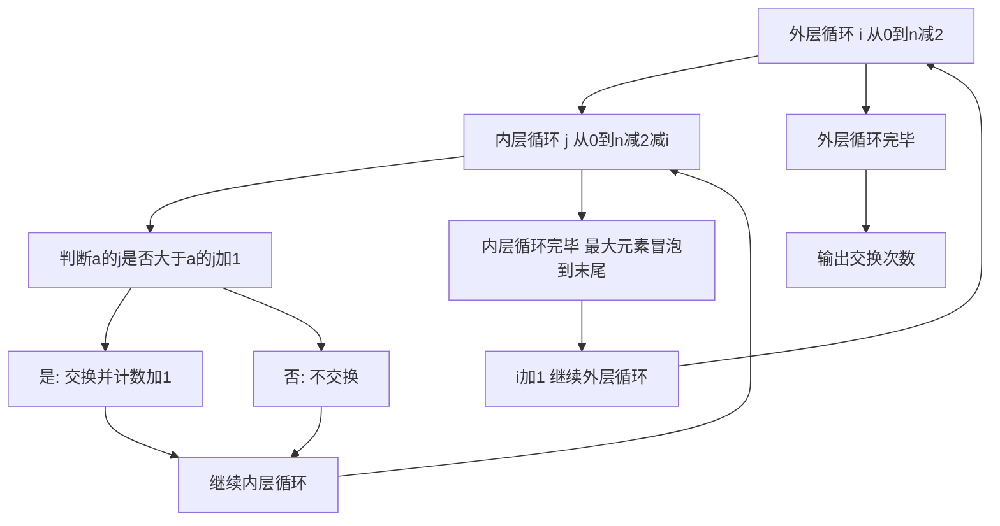

## 本节概述：冒泡排序 实战

本节选用洛谷 P1116"车厢重组"，这是冒泡排序最经典的实战题。题目要求计算将车厢排序所需的最少交换次数，本质上就是求逆序对的数量，而冒泡排序每次交换相邻元素正好对应一次逆序的消除。通过这道题，读者可以深刻理解冒泡排序的过程和逆序对的关系。

---

### 题目描述

**题目名称**：车厢重组

**来源平台**：洛谷

**题目编号**：P1116

在一个旧式的火车站旁边有一座桥，其桥面可以绕河中心的桥墩水平旋转。一个车站的职工发现桥的长度最多能容纳两节车厢，如果将桥旋转 180 度，则可以把相邻两节车厢的位置交换，用这种方法可以重新排列车厢的顺序。于是他就负责用这座桥将进站的车厢按车厢号从小到大排列。他退休后，火车站决定将这一工作自动化，其中一项重要的工作是编一个程序，输入初始的车厢顺序，计算最少用多少步就能将车厢排序。

**输入格式**：共两行。第一行是车厢总数 N。第二行是 N 个不同的数表示初始的车厢顺序。（注：实际上数据中并不都在同一行，有可能分行输入）

**输出格式**：一个整数，最少的旋转次数。

**数据范围**：N <= 1000。

**示例**：
输入：
4
4 3 2 1

输出：6

解释：将 4 3 2 1 排序为 1 2 3 4，每次只能交换相邻两节车厢，最少需要 6 次交换。这恰好等于序列中的逆序对数量：4 与 3 2 1 构成 3 个逆序对，3 与 2 1 构成 2 个，2 与 1 构成 1 个，共 3 加 2 加 1 等于 6。

### 解题思路

这道题的本质是求序列中逆序对的数量。逆序对是指下标 i 小于 j 但 a 中 i 大于 a 中 j 的数对。每次交换相邻的两个逆序元素可以消除一个逆序对，而冒泡排序的每次交换恰好消除一个逆序对。因此，最少交换次数就等于逆序对的总数。

用冒泡排序解决：在执行冒泡排序的过程中，每次发生交换时计数加 1。排序完成后，交换次数就是答案。

为什么冒泡排序的交换次数等于逆序对数量？因为冒泡排序每次只交换相邻的两个逆序元素，消除恰好一个逆序对，不会创建新的逆序对。所以总交换次数等于初始的逆序对总数。



### 代码实现

```cpp
#include <iostream>
using namespace std;

int main() {
    int n;
    cin >> n;
    int a[1005];
    for (int i = 0; i < n; i++) {
        cin >> a[i];
    }
    
    int count = 0;  // 记录交换次数
    // 冒泡排序，每次交换时计数
    for (int i = 0; i < n - 1; i++) {
        for (int j = 0; j < n - 1 - i; j++) {
            if (a[j] > a[j + 1]) {
                swap(a[j], a[j + 1]);
                count++;  // 每次交换计数加1
            }
        }
    }
    
    cout << count << endl;
    return 0;
}
```

### 代码解析

**冒泡排序框架**：外层循环 i 从 0 到 n 减 2，控制排序轮数。内层循环 j 从 0 到 n 减 2 减 i，每轮比较相邻元素。减 i 是因为每轮结束后最大的 i 加 1 个元素已经排好，不需要再比较。

**交换计数**：当 a 中 j 大于 a 中 j 加 1 时，交换这两个元素并将计数加 1。每次交换恰好消除一个逆序对，所以最终的交换次数就是逆序对总数。

**关键理解**：冒泡排序每次只交换相邻元素，这保证不会产生新的逆序对。其他排序方式（如选择排序）可能一次交换消除多个或产生新的逆序对，所以不能用选择排序来计算逆序对。

### 复杂度分析

- 时间复杂度：大 O N 方。双重循环，外层 n 减 1 次，内层递减，总共约 N 乘 N 减 1 除以 2 次比较。
- 空间复杂度：大 O 1。原地排序，只使用常数个临时变量。

> [!TIP]
> 车厢重组的本质是求逆序对数量。冒泡排序每次交换相邻元素恰好消除一个逆序对，所以交换次数等于逆序对总数。注意：只有冒泡排序的交换次数等于逆序对数，其他排序方式不一定。当数据规模很大时（如 N 达到 10 的 5 次方），可以用归并排序在 O N 乘 log N 时间内计算逆序对。

## 本章小结

- 车厢重组是冒泡排序最经典的实战题，本质是求逆序对数量
- 冒泡排序每次交换相邻元素，恰好消除一个逆序对，交换次数等于逆序对总数
- 时间复杂度为大 O N 方，空间复杂度为大 O 1
- 大规模数据可用归并排序在 O N 乘 log N 时间内计算逆序对
