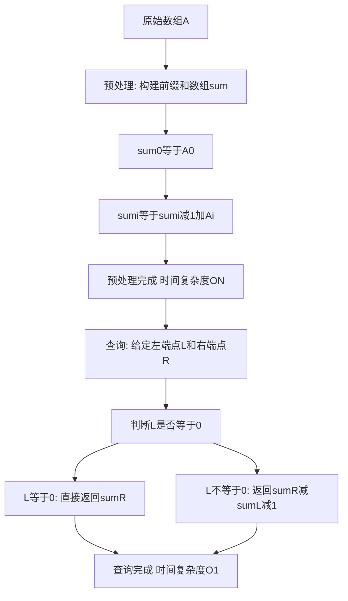

## 本节概述：前缀和

前缀和就是一个数组的前 N 项的和。前缀和分为两步：第一步是预处理，把前 N 项的和求出来，时间复杂度 O(N)；第二步是查询，求任意区间的元素和，时间复杂度 O(1)。通过预处理将朴素算法 O(M*N) 的区间求和优化为 O(N) 预处理加 O(1) 查询。

---

### 核心概念

**朴素算法**：给定一个左区间端点和右区间端点，要求这段区间里元素的和（部分和）。朴素做法是从左端点开始遍历，逐个累加到右端点。最坏时间复杂度为 O(N)，若有 M 次询问，总时间复杂度为 O(M*N)。当 M 和 N 都在 1 万量级时，10 的 8 次方无法接受。

**预处理**：准备一个新的数组 sum，sum[i] 代表 A 数组的前 i 项的和（即 A[0] 到 A[i] 的累加）。

预处理公式推导：

```cpp
// 数学公式推导
// S[i] = A[0] + A[1] + ... + A[i]  （求和符号表示）
// 将 i-1 代入：S[i-1] = A[0] + ... + A[i-1]
// S[i] - S[i-1] = A[i]
// 移项得：S[i] = S[i-1] + A[i]

// 分情况讨论：
// 当 i = 0 时：sum[0] = A[0]
// 当 i > 0 时：sum[i] = sum[i-1] + A[i]
```

预处理每次遍历只执行一个加法操作（O(1)），遍历为 O(N)，总时间复杂度 O(N)。

**查询**：给定左区间端点 L 和右区间端点 R，求区间元素和。

利用容斥原理（也叫差分思想）：sum[R] 代表 0 到 R 的元素和（绿色部分），sum[L-1] 代表 0 到 L-1 的元素和（红色部分），绿色减去红色得到的就是 L 到 R 的元素和（黄色部分）。

```cpp
// 查询公式
// 区间和 = sum[R] - sum[L-1]
// 将原本 O(N) 的遍历求和变为 O(1) 的减法
```

### 算法步骤



**代码分析**：

- **预处理函数**：传入数组首地址、元素个数、求和数组 sum。先 sum[0]=A[0]，然后从 1 到 size-1 遍历，sum[i] = sum[i-1] + A[i]。
- **查询函数**：传入前缀和数组 sum、左端点 L、右端点 R。当 L 等于 0 时直接返回 sum[R]；否则返回 sum[R] - sum[L-1]。先判断 L=0 是因为 L-1 会变成 -1，导致数组下标越界。

### 复杂度分析

- 朴素算法：每次查询 O(N)，M 次询问总时间复杂度 O(M*N)
- 前缀和：预处理 O(N)，每次查询 O(1)，M 次询问总时间复杂度 O(N + M)

> [!TIP]
> 可以优化内存：去掉 sum 数组，直接将前缀和存储在原数组 A 中，还可以反向求出原始元素值。另外可以将所有元素下标加一（下标从 1 开始），这样就不需要考虑 L=0 时数组下标越界的问题，因为即使 L=1，L-1=0，sum[0] 默认为 0 即可。

## 本章小结

- 前缀和通过预处理将区间求和从 O(N) 降为 O(1)
- 预处理公式：sum[0]=A[0]，sum[i]=sum[i-1]+A[i]
- 查询公式：区间[L,R]的和 = sum[R] - sum[L-1]
- 可以通过原地存储和下标从 1 开始两种方式优化细节
