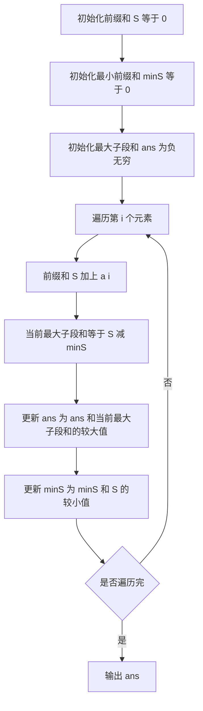

## 本节概述：前缀和 实战

本节选用洛谷 P1115「最大子段和」——这是前缀和思想最经典的应用题，通过维护前缀和的最小值，在 O(n) 时间内求出最大子段和，完美展示了前缀和的威力。

---

### 题目描述

**最大子段和** | 洛谷 P1115 | 难度：普及-

给出一个长度为 n 的序列 a，选出其中连续且非空的一段使得这段和最大。

**输入格式**：第一行是一个整数，表示序列的长度 n。第二行有 n 个整数，第 i 个整数表示序列的第 i 个数字 ai。

**输出格式**：输出一行一个整数表示答案。

**数据范围**：1 <= n <= 2*10^5，-10^4 <= ai <= 10^4。

**示例**：
输入：
```
7
2 -4 3 -1 2 -4 3
```
输出：
```
4
```
解释：选取 [3,5] 子段 {3,-1,2}，其和为 4。

### 解题思路

**核心思想**：子段和 = 前缀和之差。维护前缀和的最小值，当前前缀和减去最小前缀和即为以当前位置结尾的最大子段和。

设前缀和 `S[i]` 表示前 i 个元素之和，则子段 a[l..r] 的和为 `S[r] - S[l-1]`。

要使子段和最大，就是要找到 `S[r] - S[l-1]` 的最大值（其中 l <= r）。对于固定的 r，要使这个值最大，需要 `S[l-1]` 最小。

因此，我们一边计算前缀和，一边维护前面出现过的前缀和的最小值 `minS`，当前前缀和 `S[i]` 减去 `minS` 就是以 i 结尾的最大子段和。取所有位置的最大值即为答案。



### 代码实现

```cpp
#include <iostream>
#include <algorithm>
using namespace std;

int main() {
    int n;
    cin >> n;
    
    long long prefixSum = 0;       // 前缀和
    long long minPrefixSum = 0;   // 前缀和的最小值，初始为 0（空前缀）
    long long ans = -1e18;        // 最大子段和，初始为极小值
    
    for (int i = 0; i < n; i++) {
        int a;
        cin >> a;
        
        prefixSum += a;  // 计算前缀和
        
        // 当前位置结尾的最大子段和 = 前缀和 - 前面的最小前缀和
        ans = max(ans, prefixSum - minPrefixSum);
        
        // 更新最小前缀和
        minPrefixSum = min(minPrefixSum, prefixSum);
    }
    
    cout << ans << endl;
    
    return 0;
}
```

### 代码解析

1. **`prefixSum`**：当前的前缀和，即 a[0] + a[1] + ... + a[i]

2. **`minPrefixSum`**：到目前为止出现过的前缀和的最小值。初始为 0，表示「空前缀」S[0] = 0，这样当所有元素都为正时也能正确选择从第一个元素开始的子段

3. **`ans = max(ans, prefixSum - minPrefixSum)`**：以当前位置 i 结尾的最大子段和 = S[i] - min(S[0], S[1], ..., S[i-1])。遍历所有位置取最大值即为全局最大子段和

4. **更新顺序**：先计算当前最大子段和（用当前的 `prefixSum` 减去之前的 `minPrefixSum`），再更新 `minPrefixSum`。这保证了子段长度至少为 1（不会用 S[i] 减去 S[i] 本身）

5. **`long long` 类型**：n 最大 2*10^5，每个元素最大 10^4，前缀和最大可达 2*10^9，超出 `int` 范围

### 复杂度分析

- 时间复杂度：O(n)，只需一次遍历
- 空间复杂度：O(1)，只用了几个变量，无需存储整个前缀和数组

> [!TIP]
> 这道题也可以用动态规划解：`dp[i] = max(a[i], dp[i-1] + a[i])`，但前缀和的视角更加直观——子段和本质就是两个前缀和的差。注意 `minPrefixSum` 初始为 0 而非无穷大，因为可以选择空前缀 S[0]=0，表示子段从第一个元素开始。

## 本章小结

- 前缀和是处理区间求和问题的利器：子段和 = S[r] - S[l-1]
- 「最大子段和」通过维护前缀和的最小值，将问题从 O(n^2) 优化到 O(n)
- 前缀和技巧常与「维护最值」结合使用，如最小前缀和、最大前缀和
- 注意前缀和可能超出 `int` 范围，需要使用 `long long` 类型
