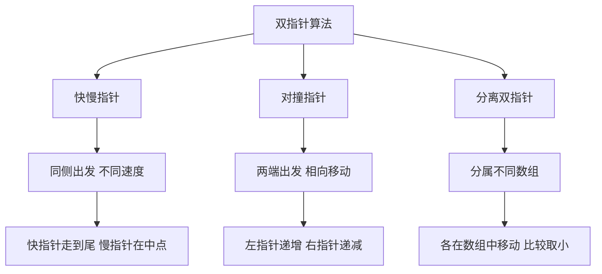

## 本节概述：双指针

双指针是算法中常用的技巧，这里的"指针"与 C/C++ 中的指针不是同一概念，可以理解为游标或下标。通过使用两个游标来同时遍历数据结构（如数组或链表）来解决一些问题。常见的双指针有三种类型：快慢指针、对撞指针、分离指针。

---

### 核心概念

**三种双指针类型**：

**1. 快慢指针**：两个指针从同一侧开始遍历序列，移动的步长一个快一个慢。移动快的称为快指针，移动慢的称为慢指针。两个指针以不同速度移动，直到快指针移动到数组尾端，或者两个指针相交，或者满足其他特殊条件时结束。

应用场景：
- 链表的判环（快慢指针一起走，如果有环迟早会相交）
- 获取链表的中间节点（快指针走到尽头时，慢指针正好在中间）
- 删除有序数组中的重复项

```cpp
// 求链表中点伪代码
slow = head  // 慢指针
fast = head  // 快指针
while fast.next != null:
    slow = slow.next       // 慢指针走一步
    fast = fast.next.next  // 快指针走两步
// 当快指针到达末尾时，慢指针在链表中点
return slow
```

**2. 对撞指针**：两个指针分别指向序列的第一个元素和最后一个元素，相向移动（一个递增，一个递减），直到两个指针相撞（左指针等于或大于右指针）或满足其他特殊条件时结束。

应用场景：两数之和、回文串判定、字符串反转等。

```cpp
// 数组中移除元素伪代码
L = 0           // 左指针指向第0个元素
R = N - 1       // 右指针指向最后一个元素
while L <= R:
    if A[L] == value:
        A[L] = A[R]  // 用最后一个元素覆盖要删除的元素
        R--           // 右指针左移，减小数组大小
    else:
        L++           // 左指针右移
// L 即为剩余不为 value 的元素个数
```

**3. 分离双指针**：两个指针分别属于不同的数组或链表，两个指针分别在两个数组或链表中移动。

应用场景：合并两个有序数组（归并排序中的合并步骤）、求两个数组的交集或并集。

```cpp
// 合并两个有序数组伪代码
i = 0  // 数组1的指针
j = 0  // 数组2的指针
while i < len1 and j < len2:
    if A[i] <= B[j]:
        取出 A[i]，i++
    else:
        取出 B[j]，j++
// 直到两个指针都到达数组尾部
```

### 算法步骤



### 复杂度分析

双指针的优点在于能够降低算法的时间复杂度。相比于暴力解法中需要嵌套循环来遍历所有可能的组合，双指针通常只需要线性的时间复杂度，即 O(N) 的时间复杂度就能完成相同的任务。

> [!TIP]
> 双指针的"指针"不是 C/C++ 中的指针概念，应理解为游标或下标。对撞指针的结束条件要考虑序列的奇偶性，当序列为奇数和偶数时情况不同。

## 本章小结

- 双指针的"指针"是游标或下标概念，不同于 C/C++ 指针
- 快慢指针：同侧出发，不同速度，适用于链表判环、找中点、去重
- 对撞指针：两端相向移动，适用于两数之和、回文判定、字符串反转
- 分离双指针：分属不同数组，适用于有序数组合并、交集并集
- 双指针通常只需 O(N) 时间复杂度，优于暴力解法的嵌套循环
