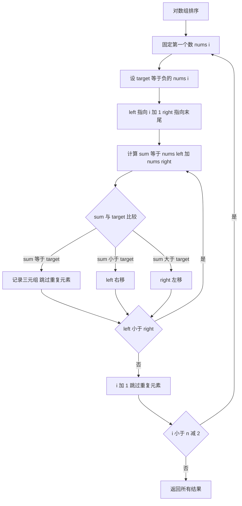

## 本节概述：双指针 实战

本节选用 LeetCode 第 15 题「三数之和」——这是双指针最经典的题目，在有序数组上用左右双指针寻找满足条件的三元组，完美展示了「排序 + 双指针」这一经典模式。

---

### 题目描述

**三数之和** | LeetCode 15 | 难度：中等

给你一个整数数组 `nums`，判断是否存在三元组 `[nums[i], nums[j], nums[k]]` 满足 i != j、i != k 且 j != k，同时还满足 `nums[i] + nums[j] + nums[k] == 0`。请你返回所有和为 0 且不重复的三元组。

注意：答案中不可以包含重复的三元组。

**输入格式**：一个整数数组 `nums`

**输出格式**：所有和为 0 且不重复的三元组列表

**数据范围**：
- 3 <= nums.length <= 3000
- -10^5 <= nums[i] <= 10^5

**示例**：
输入：nums = [-1,0,1,2,-1,-4]
输出：[[-1,-1,2],[-1,0,1]]
解释：
- nums[0] + nums[1] + nums[2] = (-1) + 0 + 1 = 0
- nums[1] + nums[2] + nums[4] = 0 + 1 + (-1) = 0
- 不同的三元组是 [-1,0,1] 和 [-1,-1,2]

### 解题思路

**核心思想**：先排序，然后固定第一个数，用左右双指针在剩余部分寻找两数之和等于目标值。

暴力法是三重循环 O(n^3)，通过排序后使用双指针可以将内层两重循环优化为一重，降到 O(n^2)。

具体步骤：
1. 将数组排序
2. 固定第一个数 `nums[i]`，设目标 `target = -nums[i]`
3. 在 `nums[i+1..n-1]` 范围内用左右双指针 `left` 和 `right` 寻找两数之和等于 `target`
4. 如果 `nums[left] + nums[right] == target`，找到一个三元组
5. 如果和小于 target，`left` 右移（增大）；如果和大于 target，`right` 左移（减小）
6. 注意去重：跳过相同的 `nums[i]`，找到答案后也要跳过相同的 `nums[left]` 和 `nums[right]`



### 代码实现

```cpp
#include <iostream>
#include <vector>
#include <algorithm>
using namespace std;

class Solution {
public:
    vector<vector<int>> threeSum(vector<int>& nums) {
        vector<vector<int>> result;
        int n = nums.size();
        
        // 第一步：排序
        sort(nums.begin(), nums.end());
        
        for (int i = 0; i < n - 2; i++) {
            // 如果最小的数已经大于 0，不可能凑出 0
            if (nums[i] > 0) break;
            
            // 去重：跳过相同的第一个数
            if (i > 0 && nums[i] == nums[i - 1]) continue;
            
            // 双指针
            int left = i + 1;
            int right = n - 1;
            
            while (left < right) {
                int sum = nums[i] + nums[left] + nums[right];
                
                if (sum == 0) {
                    // 找到一个三元组
                    result.push_back({nums[i], nums[left], nums[right]});
                    
                    // 跳过重复的 left
                    while (left < right && nums[left] == nums[left + 1]) left++;
                    // 跳过重复的 right
                    while (left < right && nums[right] == nums[right - 1]) right--;
                    
                    left++;
                    right--;
                } else if (sum < 0) {
                    left++;   // 和太小，左指针右移增大
                } else {
                    right--;  // 和太大，右指针左移减小
                }
            }
        }
        
        return result;
    }
};

int main() {
    Solution sol;
    vector<int> nums = {-1, 0, 1, 2, -1, -4};
    
    vector<vector<int>> result = sol.threeSum(nums);
    
    cout << "[";
    for (int i = 0; i < result.size(); i++) {
        cout << "[" << result[i][0] << "," << result[i][1] << "," << result[i][2] << "]";
        if (i < result.size() - 1) cout << ",";
    }
    cout << "]" << endl;
    // 输出: [[-1,-1,2],[-1,0,1]]
    
    return 0;
}
```

### 代码解析

1. **`sort(nums.begin(), nums.end())`**：先排序，这是双指针的前提。排序后相同元素相邻，便于去重

2. **`if (nums[i] > 0) break`**：剪枝优化。排序后如果第一个数已经大于 0，三个正数之和不可能为 0

3. **去重 `if (i > 0 && nums[i] == nums[i-1]) continue`**：如果当前数和上一个数相同，跳过，避免产生重复的三元组

4. **双指针移动逻辑**：当 `sum < 0` 时左指针右移（增大和），当 `sum > 0` 时右指针左移（减小和）。因为数组有序，这个移动方向是正确的

5. **找到答案后的去重**：`while (left < right && nums[left] == nums[left+1]) left++` 跳过所有相同的左指针值，右指针同理。然后再各移动一步，确保下一轮从不同值开始

### 复杂度分析

- 时间复杂度：O(n^2)，排序 O(n log n)，外层循环 O(n)，内层双指针 O(n)
- 空间复杂度：O(1)（不计结果数组），排序可能需要 O(log n) 的栈空间

> [!TIP]
> 去重是这道题最大的坑。必须在三个层面去重：第一个数 `nums[i]` 去重、找到答案后 `nums[left]` 和 `nums[right]` 去重。去重时注意先移动到最后一个相同位置，再各移动一步。

## 本章小结

- 双指针在有序数组上威力巨大：可以将「寻找两数之和」从 O(n^2) 优化到 O(n)
- 「排序 + 双指针」是处理多元素求和问题的经典模式
- 去重是三数之和的核心难点：每层指针都要跳过重复元素
- 剪枝优化很重要：当最小值已经超过目标时可以直接终止
